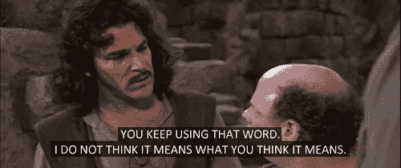

# JS 里没有“否则如果”

> 原文：<https://dev.to/genta/theres-no-else-if-in-js--24f9>

# 语法不是笑话...

确切地说，在 Javascript 的语法**中没有** `else if`语句。

你以前用过几次？为什么它还在工作？

我们总是这样编码:

```
 function wow(arg){

  if(arg === "dog"){
    return "LOVELY";
  }
  else if(arg === "cat"){
    return "CUTE";
  }
  else return "gimme an animal";
}

wow("cat");
//-> "CUTE" 
```

Enter fullscreen mode Exit fullscreen mode

但是真正发生的是这样的:

```
 function wow(arg){

  if(arg === "dog"){
    return "LOVELY";
  }
  else {
    if(arg === "cat"){
        return "CUTE";
    }
    else return "gimme an animal";
  }
}

wow("cat"); 
```

Enter fullscreen mode Exit fullscreen mode

这里发生了什么事？

从字面上看，我们使用了一些关于`{}`用途的隐式 JS 行为。

当我们使用`else if`语句时，我们省略了`{}`,但是 Javascript 仍然工作，因为在这种情况下不需要括号，就像在许多其他情况下一样！

## ...那又怎样？

我不写这篇文章，只是因为这是一件很想知道的事情。

我写这篇文章是为了让你思考所有*好的部分*或*正确的编码方式*，这迫使你以某种方式编写代码，有时这并不是真正的**最佳方式**。

关于*隐式*和*显式*声明，有很多东西需要讨论:强制、括号、分号...

但是真实永远站在中间！。

如果你只是遵循一些特定的规则在*如何...*你不明白**为什么**写那些*规则*，这个`else if`应该让你好好想想。

有多少次你写代码，因为有人告诉你*这么做*但是你对此完全视而不见？

我敢打赌，**很多**。

我并不是说我们不应该关心所有的规则，我们应该了解所有的 JS 文档。

我只是说，现在，你的职责是写好代码，让其他人能够理解，并且这样做...*有些*规则可以，但是你要知道**为什么**。

因为某人擅长编码，并不意味着你**必须**遵循他的*黄金法则*。

对他来说什么是*含蓄*，也许对你和其他很多人来说*露骨*。

如果你没有相同的知识，关于那个特定的参数(不可能在代码的每一个部分都有完全相同的*知识水平*),你有两个选择:

1.  照他说的做...如果成功的话。
2.  出去看看**为什么**

永远关心好的部分，但首先，永远关心你的知识，不要只按规则编码。

<center>Best-practices must be accepted by many people</center>

<center></center>