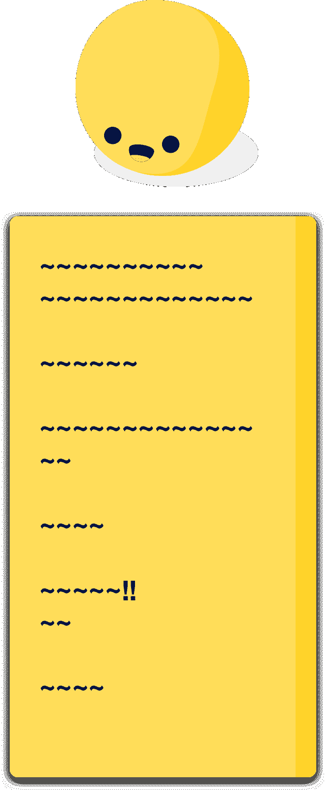
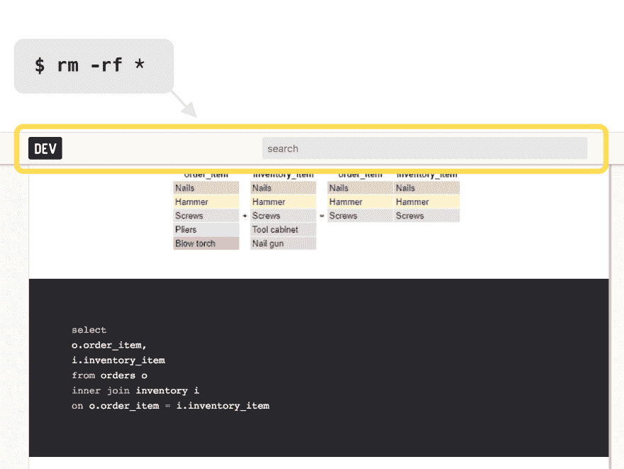
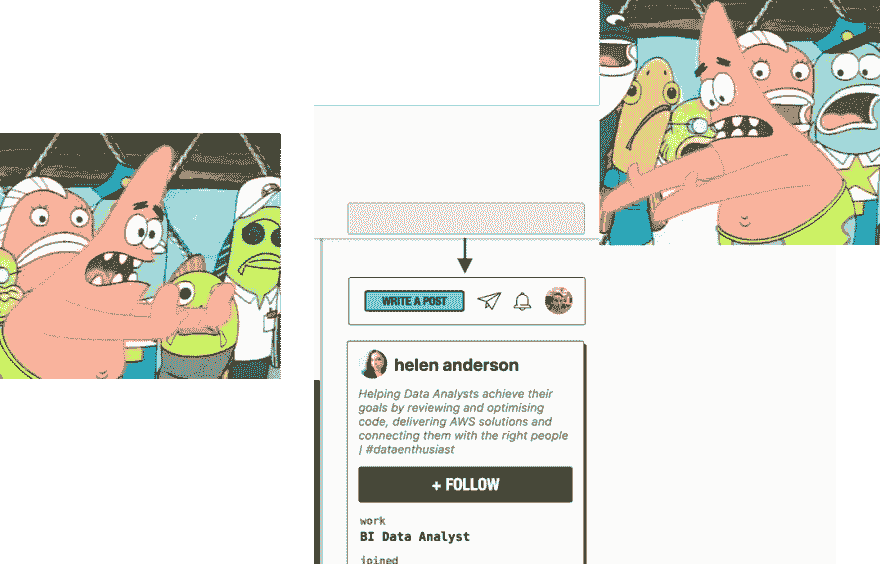
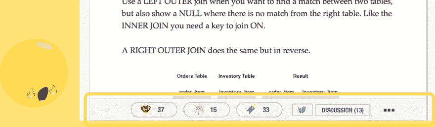

# 这篇文章很难读

> 原文：<https://dev.to/flaque/this-article-is-hard-to-read-2kgg>

我不是想挑戴夫的毛病。我喜欢戴夫。

我是一个潜伏者，我以前只在这里写过一篇文章，但是相信我，我们是最好的朋友。

但是这篇文章很难读。作为一个主要阅读的人，你可以看到这对我们持续的友谊是一个怎样的问题。

# 电脑是被我们骗去思考的长方形

当设计在互联网上阅读的文章时，我们遇到了计算机的一个基本问题。我们的屏幕是长方形的。特别是我们的笔记本电脑屏幕，是被反过来的矩形。

出于重要的代码原因，我们不可能都是办公室里那个带着[垂直显示器的家伙。](http://i.imgur.com/X7mDp.jpg)

设计网站的一部分是计算出你希望你的矩形向哪个方向旋转。弄清楚这一点最简单的方法是问一问手机上的人会用什么方向。

如果有人真的费了很大的劲关掉了手机上的旋转锁，这样你的网站就可以是水平的，那么你可能就可以拥有一个水平聚焦的网站了。

Youtube 将成为一个水平网站，但 Github 需要垂直。那是因为 Github 的主要目的是*读取*。

Dev 非常需要一个幼稚的 Gambino 翻盖手机的时刻。

[T2】](https://res.cloudinary.com/practicaldev/image/fetch/s--E24SKu8g--/c_limit%2Cf_auto%2Cfl_progressive%2Cq_auto%2Cw_880/https://thepracticaldev.s3.amazonaws.com/i/3lr6zrj1x0lll2l50b3o.png)

# 一路走到这一步？

如果你有，那是因为你的心智模型知道 Dev 上的内容是自上而下组织的。作为读者，你的工作是向下滚动并找到其余的内容。

但是我们桌面屏幕的方向意味着我们有很宽的周边视觉，但是没有视觉深度。作为设计师，我们需要通过消除自上而下视觉高速公路上的任何其他障碍来弥补这一弱点。

我的浏览器上的书签和我没用过的 Macbook touch bar 之间的任何东西都不是✨的内容 ✨需要删除。

上面的搜索栏？

[T2】](https://res.cloudinary.com/practicaldev/image/fetch/s--5Np0ZLMd--/c_limit%2Cf_auto%2Cfl_progressive%2Cq_auto%2Cw_880/https://thepracticaldev.s3.amazonaws.com/i/93y4xacynjhwp09bz9lx.png)

是啊。不要再跟踪你了。

```
.top-bar {
  position: absolute
} 
```

Enter fullscreen mode Exit fullscreen mode

你知道如何搜索。你进门就看到搜索栏了！你不会失去它的，对吗？

戴夫没事的。他们不会失去搜索栏的。

## 好的，那么右上角的信息应该放在哪里？

那个“写文章”按钮和其他的？这很简单。

[T2】](https://res.cloudinary.com/practicaldev/image/fetch/s--Y2pNwvnb--/c_limit%2Cf_auto%2Cfl_progressive%2Cq_auto%2Cw_880/https://thepracticaldev.s3.amazonaws.com/i/nl1av8irnxtwqzr8xukx.png)

把它放在`.primary-sticky-nav`里。它仍然可以跟随用户，所以你只需点击一下鼠标就可以发布关于`date.Now()`的新 CSS in JS 解决方案。

## 还有那个底部的动作条什么的？

我想你知道。

[T2】](https://res.cloudinary.com/practicaldev/image/fetch/s--8LmHS3T_--/c_limit%2Cf_auto%2Cfl_progressive%2Cq_auto%2Cw_880/https://thepracticaldev.s3.amazonaws.com/i/nphm6ir6tmxqb0uzuxk5.png)

最起码不应该在主阅垂直公路。如果我们让它跟着我们，把它放在一边。中号就可以了。

否则，我们应该把它和其他动作一起放在文章的底部，也许可以把它在 html 中上移几行。

```
.article-actions {
  position: absolute;
} 
```

Enter fullscreen mode Exit fullscreen mode

# 但是为什么呢😬

Dev.to 不应该是一些随机的互联网网站。它有潜力成为一个伟大的资源，产生有趣的文章，并激励整整一代程序员。

但是现在，Dev 正在回避读者，这使得我们很难保持最好的朋友关系。