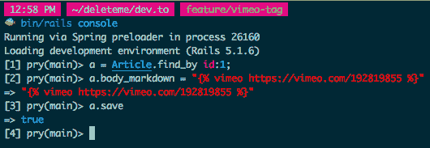

# 这个网站是开源的

> 原文：<https://dev.to/joshcheek/this-website-is-open-source-3db4>

## dev.to 是开源！

这意味着当你对此感到烦恼时，你可以做些什么。当你觉得它有 bug 的时候，你就可以修复它。当你认为它缺少一个特性时，你可以添加这个特性。当你对它的工作原理感到困惑时，你可以去参考它的实现。当它做一些很酷的事情时，你可以去看看他们是怎么做的。

这是一件大事！使用闭源工具，我们只是遭受同样愚蠢的狗屎多年！斯莱克和吉拉，我说的是你们。

## 添加一个特征

所以，我知道有一个 youtube 标签([链接](https://dev.to/jess/comment/4739))，但我在 Vimeo 上主持。我克隆了回购协议([链接](https://github.com/thepracticaldev/dev.to))。遵循自述文件中的设置说明，并通过引用 youtube 标签中的代码，能够提交一个 pull 请求来添加一个 vimeo 标签([链接](https://github.com/thepracticaldev/dev.to/pull/409))。

所以，现在如果你输入其中任何一个:

```

 
```

Enter fullscreen mode Exit fullscreen mode

你会看到:

[https://player.vimeo.com/video/193110695](https://player.vimeo.com/video/193110695)

## 你也可以这样！

虽然不是很完美，但我还是完成了。以下是我得到的一些高层次的收获:

*   首先浏览自述文件中关于如何设置的相关部分。如果你平时不怎么做 Ruby，他们推荐 [rbenv](https://github.com/rbenv/rbenv) ，这是个不错的选择(我用的是 [ruby-install](https://github.com/postmodern/ruby-install#readme) 、 [chruby](https://github.com/postmodern/chruby) 和 [chruby-fish](https://github.com/JeanMertz/chruby-fish) )。不确定您是否需要一个漂亮的 JS 环境(我已经默认设置了一个)。如果是这样的话， [nodenv](https://github.com/nodenv/nodenv) 是我找到的最好的，基本和`rbenv`一样，但是对于 Node 来说。特别是，它们跨 shell 工作，您通过设置几个 env 变量而不是评估代码(不影响 shell 启动时间)来放置它们，记住在进行全局安装后运行`nodenv rehash`。
*   测试套件在我的本地机器上没有完全通过，但是我提到的测试通过了。按照自述文件中的说明，我是这样运行的:`$ bin/spring rspec spec/liquid_tags/youtube_tag_spec.rb`
*   它启动起来相当慢(我责怪[这个](https://github.com/rails/rails/blob/2b594b061f34094175fd3efeeb1cd5d245cbabe3/railties/lib/rails/generators/rails/app/templates/config/application.rb.tt#L22))，但我等待它结束，它工作了。
*   我真的很喜欢他们处理环境变量的方式。
*   不久前，我意识到我对春天的看法是错误的，我收回了所有关于春天的愤怒评论！谢天谢地，他们在这个应用程序上使用了 Spring。当你知道如何使用它的时候，当它出问题的时候，它能引起的混乱是值得的，因为它节省了你在启动时间的痛苦。基本上，这意味着你只需要做`bin/rails console`，`bin/rails server`，如果你改变了配置中的任何东西，或者看起来不可靠，你就做`bin/spring stop`
*   我没有弄清楚如何登录，只是从控制台编辑了其中一篇文章:
*   请务必试用您的功能。由于测试不通过 markdown 运行输入，所以当我在控制台中尝试时，它的行为与我的测试中不同(markdown 解析器将输入修改为 liquid 标记)。此外，当我阅读 PR 模板时，他们谈到了文档，我意识到我没有更新 markdown 基础页面，所以我很快添加了一个 commit。

我认为这可能是它的核心。我的公关并不完美(它围绕降价问题工作，而不是修复它)，但对于任何给定的项目，总是有更多的事情要做，它完成了我想要的:现在有一个 vimeo 标签❤️.

## 为首次提交者

FWIW，我的第一个开源提交( [link](https://github.com/rtomayko/tilt/pull/81) )只有一行长。我花了 8 个小时才修复了一个漏洞！我觉得自己非常脆弱，但谢天谢地，Sinatra 的维护者( [Konstantin Haase](https://github.com/rkh) )真的很好，几次给我指了正确的方向，让我的公关顺利通过。非常感谢。德夫·托的行为准则([链接](https://dev.to/code-of-conduct))和欢迎行为的历史表明，他们将同样是优秀的 OSS 牧羊人。