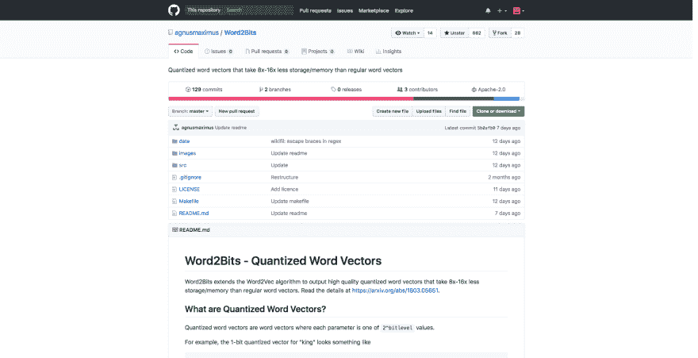
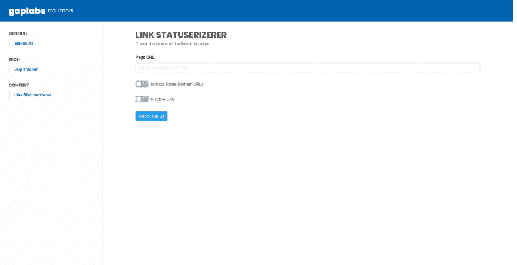
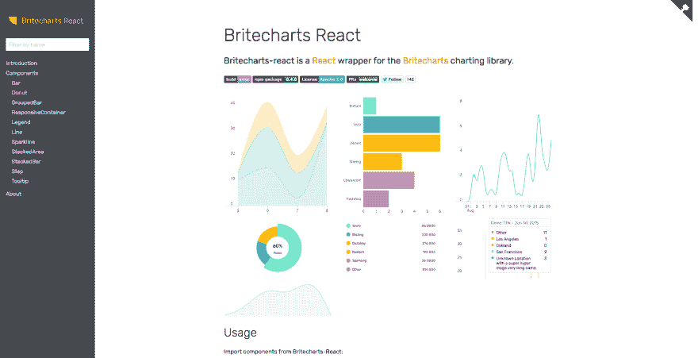
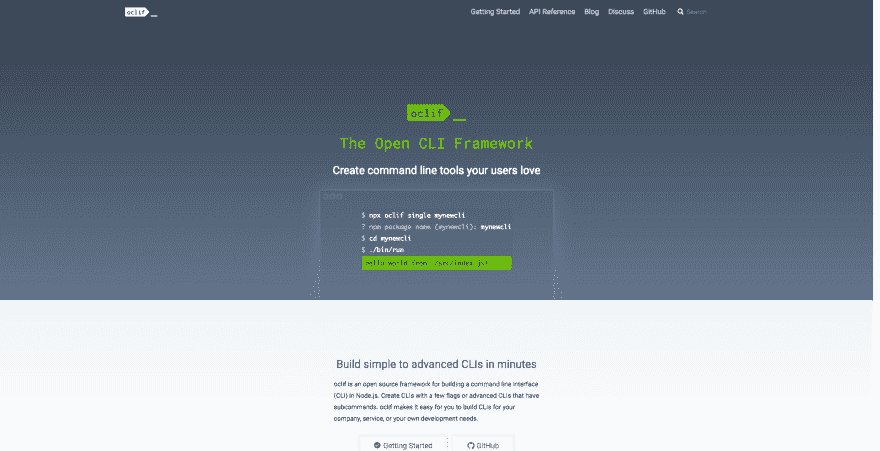
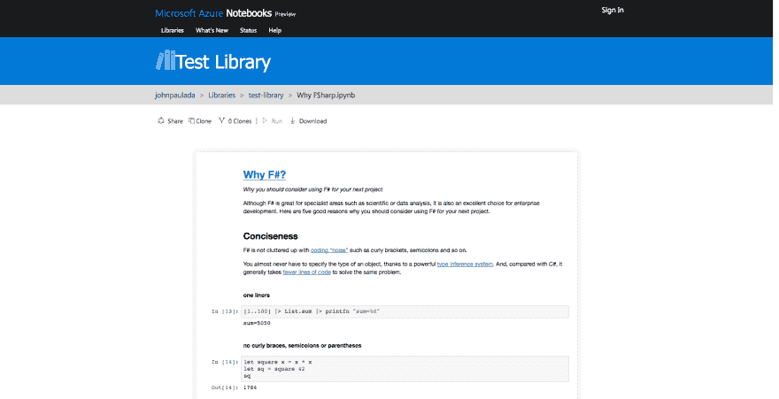

# 本周我学习了第四条

> 原文：<https://dev.to/johnpaulada/this-week-i-learned-4-44ih>

[T2】](https://res.cloudinary.com/practicaldev/image/fetch/s--xC8Vqmfl--/c_limit%2Cf_auto%2Cfl_progressive%2Cq_auto%2Cw_880/https://thepracticaldev.s3.amazonaws.com/i/dwexmcpml0x4ffhyrlij.JPG)

上周我在查的一堆东西！如果你有时间，可以看看我的播客。:D

[T2】](https://res.cloudinary.com/practicaldev/image/fetch/s--n-EmzrYO--/c_limit%2Cf_auto%2Cfl_progressive%2Cq_auto%2Cw_880/https://thepracticaldev.s3.amazonaws.com/i/pi89u5svsf26n5pldsj2.png)

## [概述](https://getoutline.org/en/home)

> 记者需要安全地获取信息来研究问题、与消息来源交流和报道新闻。Outline 让新闻机构能够轻松地为他们的网络提供对开放互联网的更安全的访问。

Outline 是由 Google 的 Jigsaw 团队创建的自托管 VPN 解决方案。

[T2】](https://res.cloudinary.com/practicaldev/image/fetch/s--7a2qsexJ--/c_limit%2Cf_auto%2Cfl_progressive%2Cq_auto%2Cw_880/https://thepracticaldev.s3.amazonaws.com/i/uwtsutqfwj5kk7gfuayw.png)

## [Word2Bits](https://github.com/agnusmaximus/Word2Bits)

> 与常规字向量相比，量化字向量占用的存储空间/内存少 8-16 倍

如果您进入数据科学领域并进行文本分析，Word2Bits 可能会让您感兴趣。它是 word2vec 的更精简的替代方案。去试一试吧！😊

[T2】](https://res.cloudinary.com/practicaldev/image/fetch/s--ImAdUAMu--/c_limit%2Cf_auto%2Cfl_progressive%2Cq_auto%2Cw_880/https://thepracticaldev.s3.amazonaws.com/i/y8mjewfqohkgq3yz28fy.png)

## 网页抓取中的节点

上周我们举行了黑客马拉松。我们试图构建一个应用程序来获取页面上的链接并检查它们的状态(活动/非活动)——我了解到你不能仅仅通过从浏览器请求来获取一个站点的 HTML 内容。所以我在网上搜索寻找解决方案。经过一番研究，我建立了一个我的浏览器可以与之通信的 Express 服务器。该服务器接受一个 URL，从该 URL 获取 HTML 响应，并返回链接列表及其状态。我使用 Axios 从 URL 请求 HTML，使用 Cheerio 从 HTML 获取所有链接。我可能会在 [GAPLabs Engineering](https://medium.com/gaplabs-engineering) 出版物上写一篇关于我是如何做到这一点的文章。

[T2】](https://res.cloudinary.com/practicaldev/image/fetch/s--hOVOYFlO--/c_limit%2Cf_auto%2Cfl_progressive%2Cq_auto%2Cw_880/https://thepracticaldev.s3.amazonaws.com/i/mfkfzcuynpqtrn7by9ey.png)

## Web 数据可视化 X 反应

如果你尝试过 web 上的数据可视化，你将不可避免地遇到 D3.js。我开始学习了一点，然后意识到它会在某种程度上与 React 冲突，因为它直接操纵 DOM，而 React 使用虚拟 DOM。

于是我开始寻找一些将两者有效结合的库，找到了几个。我现在正在看的是 EventBrite 的 Britecharts React，它是基于 D3.js 的现有 Britecharts 库的 React 包装器。

我正在看的另外两个是 Nivo 和 Victory by hardware Labs。

[T2】](https://res.cloudinary.com/practicaldev/image/fetch/s--itYQehpg--/c_limit%2Cf_auto%2Cfl_progressive%2Cq_auto%2Cw_880/https://thepracticaldev.s3.amazonaws.com/i/8ymhy5k8m2a26xhpmow6.png)

## [打开 Heroku 的 CLI 框架](https://oclif.io/)

> oclif 是一个开源框架，用于在 Node.js 中构建命令行界面(CLI)。创建带有几个标志的 CLI 或具有子命令的高级 CLI。oclif 使您可以轻松地为您的公司、服务或您自己的开发需求构建 CLI。

如果您想构建 CLI 而不强调您将使用什么库以及如何构建它，请不要担心！尝试 Heroku 的开放式 CLI 框架，只需担心 CLI 背后的业务逻辑。😊

[T2】](https://res.cloudinary.com/practicaldev/image/fetch/s--R8ChGvn4--/c_limit%2Cf_auto%2Cfl_progressive%2Cq_auto%2Cw_880/https://thepracticaldev.s3.amazonaws.com/i/2okdapvqs2krp21p8p6s.png)

## [蔚蓝笔记本](https://notebooks.azure.com/)

如果您属于以下情况之一:

*   进入数据科学
*   喜欢在任何地方进行实验
*   不喜欢复杂的设置

Azure 笔记本适合您！Azure 笔记本允许您在云上创建和运行 Jupyter 笔记本！无需设置—只需一个 Microsoft 帐户！该平台支持创建 Python、R 和 F#笔记本，这对我特别有帮助，因为我正在试用 F#并且我不喜欢将 F#与 Jupyter 集成在一起的麻烦。所以，如果你对数据科学感兴趣，这绝对是值得一试的。😁