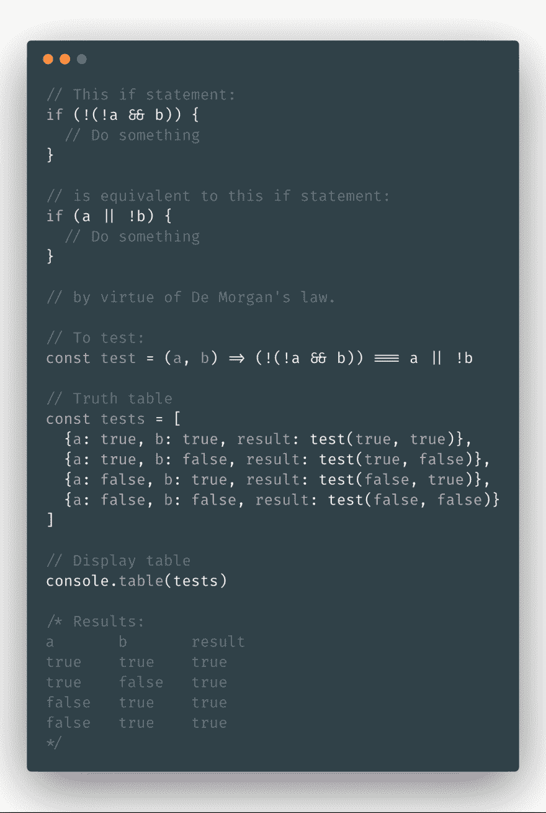
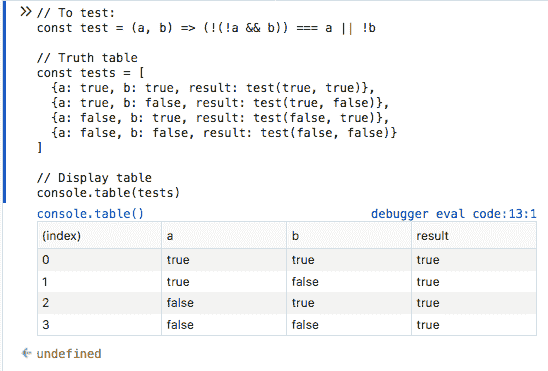
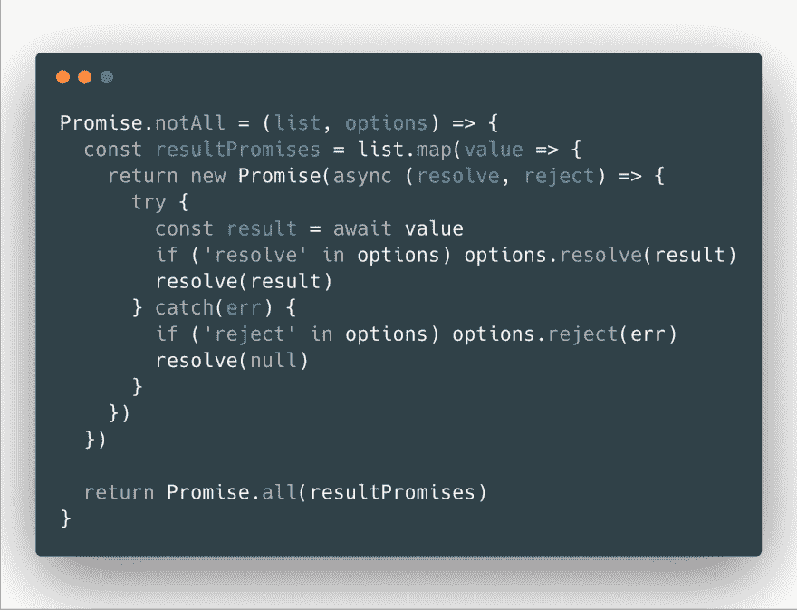
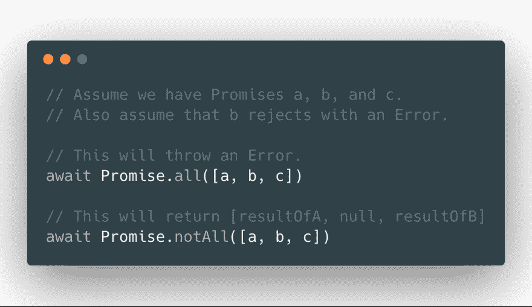
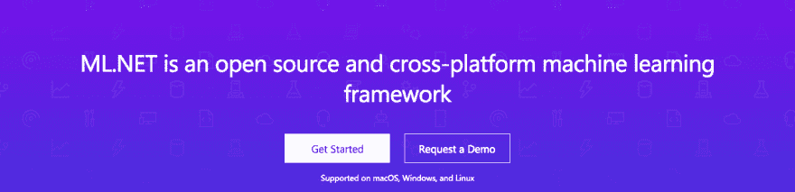
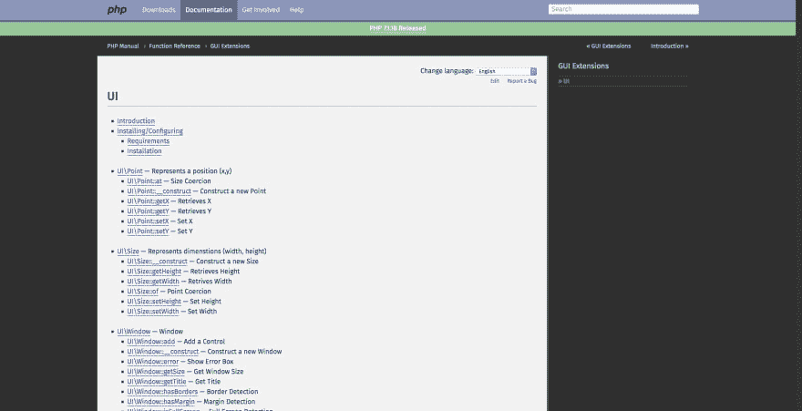

# 本周我学习了第 7 条

> 原文：<https://dev.to/johnpaulada/this-week-i-learned-7-3c6p>

[T2】](https://res.cloudinary.com/practicaldev/image/fetch/s--jjQN83Iz--/c_limit%2Cf_auto%2Cfl_progressive%2Cq_auto%2Cw_880/https://thepracticaldev.s3.amazonaws.com/i/jrmvuir64pudz7uzk3kd.JPG)

> 逻辑、承诺、NPM、PHP、ML，以及一大堆我在这一集中学到的其他缩写词！
> 
> 这最初发布在[媒体](https://medium.com/@jepedesu/this-week-i-learned-7-e1c3c9417029)上。

## [德·摩根定律](https://www.wikiwand.com/en/De_Morgan%27s_laws)

> 这些规则可以用英语表达为:
> 
> *   析取的否定是否定的合取；
> *   合取的否定是否定的析取；

德摩根定律是一套允许我们转换逻辑表达式的规则。我用这些来简化我的布尔表达式。

[T2】](https://res.cloudinary.com/practicaldev/image/fetch/s--b9yBsIDv--/c_limit%2Cf_auto%2Cfl_progressive%2Cq_auto%2Cw_880/https://thepracticaldev.s3.amazonaws.com/i/u8bftpkrkpstvidpcvgg.png)

[T2】](https://res.cloudinary.com/practicaldev/image/fetch/s--F29gdcoy--/c_limit%2Cf_auto%2Cfl_progressive%2Cq_auto%2Cw_880/https://thepracticaldev.s3.amazonaws.com/i/19sidrm1qs1ofsz7wf6e.png)

## 【Promise.notAll/Promise.allMost】T2

有时你需要一个承诺列表，你希望所有的承诺都完成，然后返回带有期望值的数组。在 JavaScript 中你通常会使用 Promise.all，对吗？但是，如果其中一个承诺拒绝了，但你仍然希望得到在各自职位上取得成功的承诺，该怎么办？

我们遇到了这个问题，所以我们建立了`Promise.notAll`！我们也叫它`Promise.allMost`(懂吗？)感谢[科特杰罗姆奥比斯波](https://medium.com/@kurtgerm)的建议。总之，这是它的代码。

[T2】](https://res.cloudinary.com/practicaldev/image/fetch/s--Dt_BTlMn--/c_limit%2Cf_auto%2Cfl_progressive%2Cq_auto%2Cw_880/https://thepracticaldev.s3.amazonaws.com/i/co1sec4jl34xl6ficymd.png)

你可以这样使用它:

[T2】](https://res.cloudinary.com/practicaldev/image/fetch/s---4ZfUxEp--/c_limit%2Cf_auto%2Cfl_progressive%2Cq_auto%2Cw_880/https://thepracticaldev.s3.amazonaws.com/i/76y4iy48mth5quym00eg.png)

## [npm -](https://docs.npmjs.com/cli/run-script#description)

这使您能够在调用 NPM 脚本时添加参数。例如，如果您有一个名为 test 的 npm 脚本，并且想要向它添加一个详细标志，那么您可以:

```
npm run test -- --verbose 
```

Enter fullscreen mode Exit fullscreen mode

## [npm 审计](https://docs.npmjs.com/getting-started/running-a-security-audit)

`npm audit`分析您的依赖关系，并列出易受攻击的软件包及其严重性级别。你甚至可以在易受攻击的软件包上看到安全报告的链接！这使得保护我们的节点应用程序变得更加容易。

## [Ow](https://github.com/sindresorhus/ow)

[T2】](https://res.cloudinary.com/practicaldev/image/fetch/s--PDprmo0c--/c_limit%2Cf_auto%2Cfl_progressive%2Cq_auto%2Cw_880/https://thepracticaldev.s3.amazonaws.com/i/u7y3fp9d95odtm1z27sb.png)

嗷！是由多产的[辛德雷·索胡斯](https://github.com/sindresorhus)建造的用于人类函数参数验证的库。它的电池，包括并有一个伟大的可链接的 API。如果你愿意，你也可以使用创建你自己的验证器！总而言之，这将有助于你的代码远离错误和恶意输入。

## :::占位符

显然你可以设计文本框占位符的样式！我不知道。LOL。但是很明显，您可以使用::placeholder 伪选择器来选择占位符，并用 CSS 样式化它们。

## [毫升。网](https://www.microsoft.com/net/learn/apps/machine-learning-and-ai/ml-dotnet)

[T2】](https://res.cloudinary.com/practicaldev/image/fetch/s--bWAPai-_--/c_limit%2Cf_auto%2Cfl_progressive%2Cq_auto%2Cw_880/https://thepracticaldev.s3.amazonaws.com/i/7v6wfxb0scs0rrv7gj09.png)

只需安装微软。ML 包，并享受机器学习的力量，无论您使用 C#或 F#或任何使用。NET 框架！我对此没有太多的话要说，所以直接跳进去试试吧！😆

## [渲染器](https://github.com/GoogleChrome/rendertron)

> Rendertron 是一个 dockerized，headless 铬渲染解决方案，旨在渲染和串行网页的飞行。

Rendertron 是谷歌对 Prerender 的回答，它允许你渲染你的 spa，这就是为 SEO 和索引目的服务的搜索引擎。所以你基本上启动一个运行 rendertron 服务器的服务器，然后通过 Rendertron 服务器访问网站。服务器将请求您的真实 web 应用程序，并在它完全加载后显示出来。您可以让 Rendertron 决定站点何时加载，也可以显式设置它。要了解更多关于 Rendertron 的信息，请访问他们的 [Github repo](https://github.com/GoogleChrome/rendertron) 。

## [PHP UI](http://php.net/manual/en/book.ui.php)

[T2】](https://res.cloudinary.com/practicaldev/image/fetch/s--p-DVddyq--/c_limit%2Cf_auto%2Cfl_progressive%2Cq_auto%2Cw_880/https://thepracticaldev.s3.amazonaws.com/i/kvas2m5e3zlijtb9gw35.png)

没错。你没看错。你实际上可以用 PHP 构建跨平台的桌面应用程序！这是官方文件，伙计们！在引言中:

> 这个扩展包装了 libui，为跨平台开发原生外观用户界面提供了一个 OO API。

谁说 PHP 只适用于 web？🙊

## Kubernetes 自动缩放

上次我检查你为 Kubernetes 设置水平 Pod 自动缩放时，你使用 CPU 使用率作为度量。现在，您可以使用 RAM 使用情况、HTTP 请求或其他指标来触发自动扩展 Kubernetes 集群的时间。这真是个好消息！