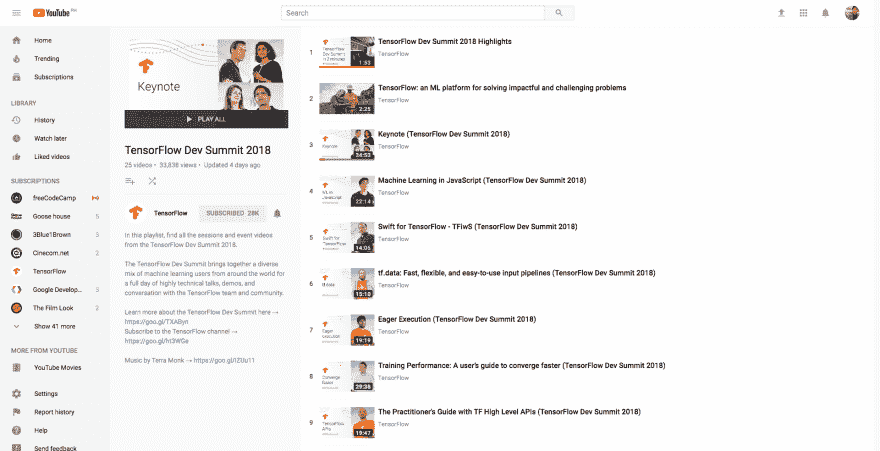
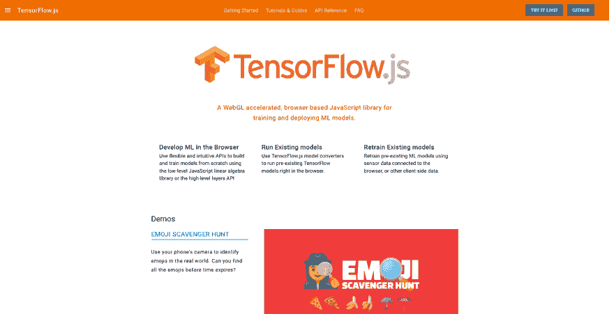
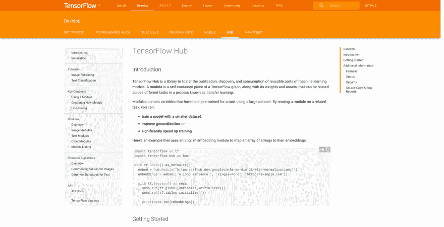
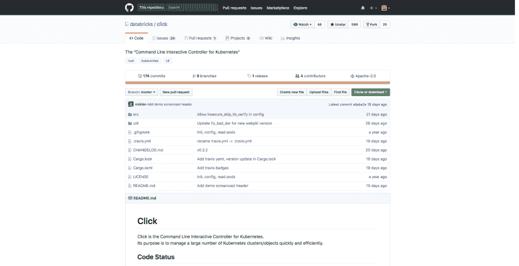
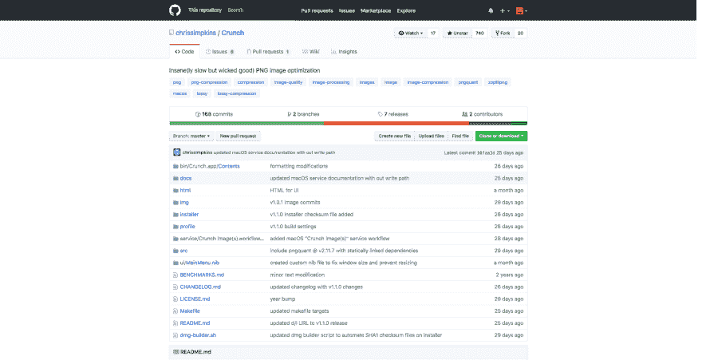
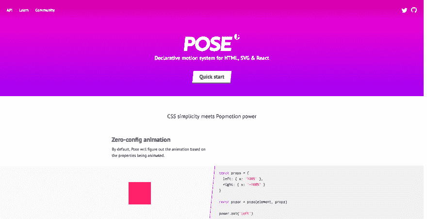
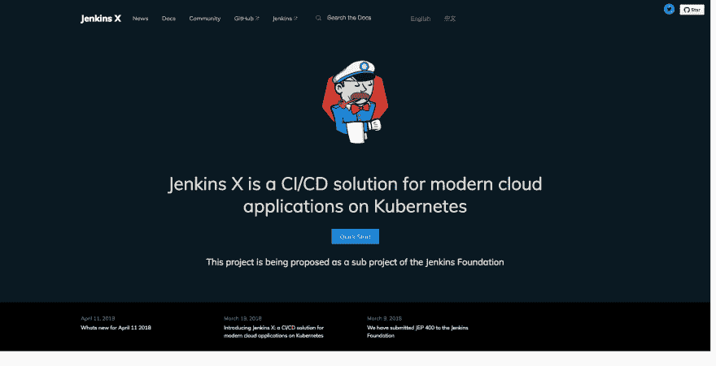

# 本周我学习了第五条

> 原文：<https://dev.to/johnpaulada/this-week-i-learned5-46ja>

[T2】](https://res.cloudinary.com/practicaldev/image/fetch/s--7tU9zmJy--/c_limit%2Cf_auto%2Cfl_progressive%2Cq_auto%2Cw_880/https://thepracticaldev.s3.amazonaws.com/i/1eht9jlh2dw884knfwai.JPG)

> TensorFlow，Kubernetes，以及更多精彩内容！

伙计们，好久不见了！我一直很忙，因为有很多事情正在进行，从在 2018 年马尼拉 tensor flow Dev Summit Extended 2018 上发表演讲到开始新的项目。
所以我打算同时发布两集！希望你准备好了！😉

## 另存为 PDF 到 iBooks

iOS 设备中 Safari 的**保存 PDF 到 iBooks** 分享选项超级牛逼！出乎意料的好！我用它将指南、教程和备忘单等网页保存为 pdf 格式，尤其是因为我不常上网。如果你有 iOS 设备，值得一试。如果你没有 iOS 设备，你可以使用 [SimplePrint](https://pdf.fivefilters.org/simple-print/url.php) 。

[T2】](https://www.youtube.com/playlist?list=PLQY2H8rRoyvxjVx3zfw4vA4cvlKogyLNN)

## [TensorFlow Dev 峰会 2018](https://www.youtube.com/playlist?list=PLQY2H8rRoyvxjVx3zfw4vA4cvlKogyLNN)

今年的 TensorFlow Dev 峰会一如既往的牛逼！已经发布了许多新工具和更新，我很高兴能够试用它们。接下来我们将看看我最喜欢的两个，但如果你想了解更多，这里有一个链接指向 [TensorFlow 博客](https://medium.com/tensorflow)。

[T2】](https://js.tensorflow.org/)

## [T1](#tensorflowjs)[tensor flow . js](https://js.tensorflow.org/)

TensorFlow.js 是 TensorFlow 家族中令人敬畏的新成员之一。TensorFlow.js 支持 TensorFlow Layers API，通过访问低级 Ops API(以前的 Deeplearn.js)进行硬件加速，可以在浏览器中训练模型，并使用导出的 Keras 模型和 TensorFlow SavedModels。

这使得通过 JavaScript 使用机器学习变得更容易，这具有很多含义——因为 JavaScript 几乎可以在任何地方使用:用于移动、桌面甚至 VR 开发。现在我们可以很容易地将机器学习应用到那些领域。此外，几乎每个 web 开发人员都知道 JavaScript，这使得 AI 民主化又进了一步。

[T2】](https://www.tensorflow.org/hub/)

## [TensorFlow Hub](https://www.tensorflow.org/hub/)

类似于 TensorFlow.js 如何导入 Keras 和 TensorFlow 模型，我们现在可以使用 TensorFlow Hub 在一行代码中轻松导入强大的机器学习模型。TensorFlow hub 就像是 Inception 之类的流行 ML 模型的存储库。见鬼，连纳斯特都在。

[T2】](https://github.com/databricks/click)

## [点击](https://github.com/databricks/click)

A.作为一个“Kubernetes 的命令行交互控制器”，Click 通过给命令提供上下文来帮助 Kubernetes 用户更快地完成任务。

[T2】](https://github.com/chrissimpkins/Crunch)

## [嘎吱声](https://github.com/chrissimpkins/Crunch)

Crunch 是一个 macOS 应用程序，它可以很好地压缩 png，但是速度非常慢。如果你想要更好的压缩效果，并且有时间的话，你可以尝试一下。

[T2】](https://popmotion.io/pose/)

## [PopMotion POSE](https://popmotion.io/pose/)

PopMotion POSE 是 PopMotion 的声明版本。声明性基本上意味着你定义某事应该做什么，而不是关心它应该如何以及何时发生。这允许你拥有 PopMotion 的力量，并赋予它简单性。这使得使用 React 非常棒，React 本质上也是声明性的。

[T2】](http://jenkins-x.io/)

## [詹金斯 X](http://jenkins-x.io/)

Jenkins X 为 CI/CD 带来了 Jenkins 的强大功能和灵活性，并将其带到了 Kubernetes。虽然具有相当高的抽象水平，但它仍然没有失去灵活性，因为您仍然可以深入并根据自己的喜好定制一切。