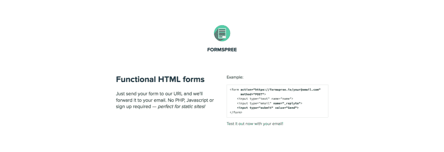
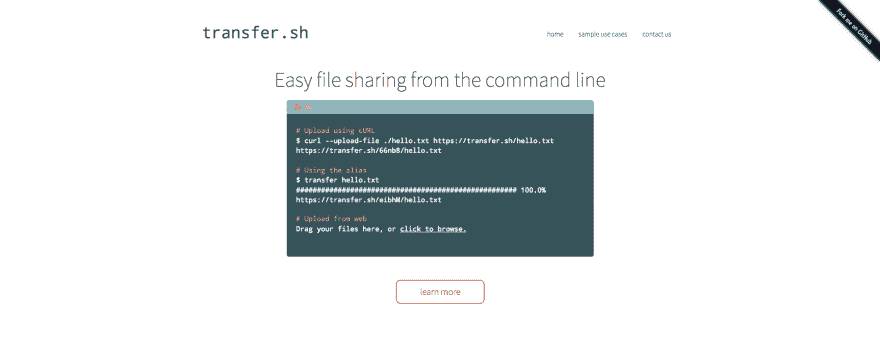
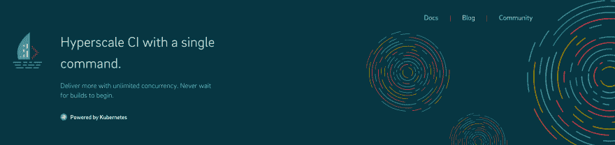
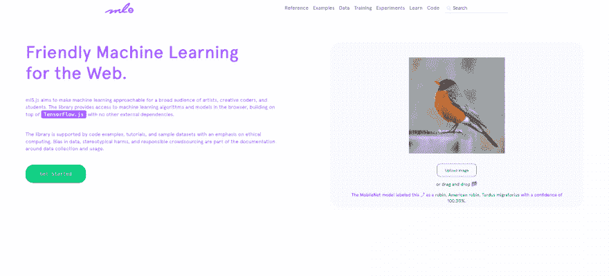

# 本周我学习了第八条

> 原文：<https://dev.to/johnpaulada/this-week-i-learned8-1793>

[T2】](https://res.cloudinary.com/practicaldev/image/fetch/s--cuq6pj7y--/c_limit%2Cf_auto%2Cfl_progressive%2Cq_auto%2Cw_880/https://thepracticaldev.s3.amazonaws.com/i/x6m33rdtnm9n5a3djtvd.JPG)

JavaScript、Python、Reason 等等！有趣的技术值得期待！

## [JavaScript 代理](https://developer.mozilla.org/en-US/docs/Web/JavaScript/Reference/Global_Objects/Proxy)

JavaScript 中的代理允许我们给对象添加钩子。例如，当提取或设置对象中的值时，我们可以执行一些副作用或覆盖返回的值。如果你想做一些简单的发布-订阅操作，例如，如果一个对象的值改变了，通知其他对象，这是很有帮助的。如果您想要进行验证，这也很有帮助，例如，如果对象中的值设置为无效，则该值将保持不变。这是一个非常强大的特性，所以请检查一下，看看您可以用什么创造性的方式来使用 JavaScript 代理！

这里有一个来自 MDN 的基本验证示例:

```
let validator = {
  set: function(obj, prop, value) {
    if (prop === 'age') {
      if (!Number.isInteger(value)) {
        throw new TypeError('The age is not an integer');
      }
      if (value > 200) {
        throw new RangeError('The age seems invalid');
      }
    }

    // The default behavior to store the value
    obj[prop] = value;

    // Indicate success
    return true;
  }
};

let person = new Proxy({}, validator);

person.age = 100;
console.log(person.age); // 100
person.age = 'young'; // Throws an exception
person.age = 300; // Throws an exception 
```

Enter fullscreen mode Exit fullscreen mode

* * *

[T2】](https://res.cloudinary.com/practicaldev/image/fetch/s--UxsyIpfu--/c_limit%2Cf_auto%2Cfl_progressive%2Cq_auto%2Cw_880/https://thepracticaldev.s3.amazonaws.com/i/54p15boc851lqo36w03o.png)

## [表单狂欢](https://formspree.io/)

当你想创建一个登陆页面或者仅仅是一个简单的静态主页时，有一件事会让你感到困惑，那就是表单的问题。如果没有服务器，你会把它们送到哪里？

FormSpree 通过从表单接收数据并将数据转发到您的电子邮件来处理这个问题。它有一个相当不错的免费层，对于无限量的电子邮件，你只需每月支付 10 美元。

```
<form action="https://formspree.io/your@email.com"
      method="POST">
    <input type="text" name="name">
    <input type="email" name="_replyto">
    <input type="submit" value="Send">
</form> 
```

Enter fullscreen mode Exit fullscreen mode

有时将承诺放在一个数组中并遍历它们的解析值会很有帮助，比如当通过`fetch`或`axios`发出大量请求时。当处理一系列承诺时，我们通常使用 Promise.all 来确保它们都得到解决，对吗？这样做的问题是，在我们可以实际处理它们之前，它会先等待所有的承诺都解决。我们想要的是得到每个请求，并在它们解决的时候开始处理它们。我们如何做到这一点？我们可以使用 for-await-of JavaScript 语法。

这里有一个来自阿克塞尔·劳施迈尔博士博客的例子。基本上不用 Promise.all 这样:

```
for (const x of await Promise.all(syncIterableOverPromises)) {
    // Do something with x
}; 
```

Enter fullscreen mode Exit fullscreen mode

我们改为这样做:

```
for await (const x of syncIterableOverPromises) {
    // Do something with x
}; 
```

Enter fullscreen mode Exit fullscreen mode

这将获取`syncIterableOverPromises` iterable 中的每个`x`，然后等待其解析，然后继续执行 for 循环体，以处理已解析的`x`。这让你不用等到所有的承诺都完成了，就可以更容易地开始工作。

* * *

[T2】](https://res.cloudinary.com/practicaldev/image/fetch/s--eVuO2OHc--/c_limit%2Cf_auto%2Cfl_progressive%2Cq_auto%2Cw_880/https://thepracticaldev.s3.amazonaws.com/i/djxhn39zhcotmxnif6wf.png)

## [克莱曼婷](https://in.airdev.co/clementine)

如果你在尝试构建你的应用程序规格和构建应用程序的成本方面有困难，你可以使用克莱曼婷！克莱曼婷指导你建立你的应用程序规格的过程，并在最后，估计建立应用程序的成本。

[T2】](https://res.cloudinary.com/practicaldev/image/fetch/s--AS1R7ZD8--/c_limit%2Cf_auto%2Cfl_progressive%2Cq_auto%2Cw_880/https://thepracticaldev.s3.amazonaws.com/i/lraoffejritvormi03s7.png)

## [弧菌](https://vibora.io/)

如果你喜欢用 Django 或 Flask 用 Python 构建 Web APIs，为什么不带上 Vibora 出去兜兜风呢？Vibora 是一个新的 web 框架，用于构建快速 API，比大多数流行的 Python web 框架都要快。受 Flask 的启发，Vibora 非常容易使用，并且是完全异步的。在他们的网站上查看他们的基准测试，亲自看看！

[T2】](https://res.cloudinary.com/practicaldev/image/fetch/s--5i95MvPD--/c_limit%2Cf_auto%2Cfl_progressive%2Cq_auto%2Cw_880/https://thepracticaldev.s3.amazonaws.com/i/as3yn2zk7i47ewo0vsi4.png)

## [Transfer.sh](https://transfer.sh/)

如果你想在不离开终端的情况下免费分享文件，transfer.sh 就是你要的东西！如果您按照安装说明进行操作，您将得到一个传输二进制文件，您可以运行它来上传文件。上传后，你会看到一个下载链接，你可以把它发送给你的朋友！链接持续 14 天，最大可达 10 GB。最棒的是它是免费的！看看吧！

[T2】](https://res.cloudinary.com/practicaldev/image/fetch/s--wEVgZLmh--/c_limit%2Cf_auto%2Cfl_progressive%2Cq_auto%2Cw_880/https://thepracticaldev.s3.amazonaws.com/i/vuttq3ofd7rstthzcpk6.png)

## [扬帆词](https://sail.sh/)

如果您想要一个便宜、易于使用、免费的托管 CI 解决方案，请查看 Sail CI！你每月有 1000 分钟的构建时间，与大多数托管解决方案相比，这已经足够好了。设置起来也挺好看的！只需转到您的项目目录，运行`sail init`，在`.sail`文件中定义您的管道，您就一切就绪了！

它目前只支持 Github，但是在不久的将来，我们可能会看到对 Gitlab 和 Bitbucket 的支持！

[T2】](https://res.cloudinary.com/practicaldev/image/fetch/s--8ZKw0gY0--/c_limit%2Cf_auto%2Cfl_progressive%2Cq_auto%2Cw_880/https://thepracticaldev.s3.amazonaws.com/i/e5yk3nwb6p925mts1d8y.png)

## [我为什么拖延](https://whydoiprocrastinate.com/)

这个网站会问你一些问题，并找出你拖延的原因。之后，它会给你一些建议，告诉你如何停止拖延并开始工作！

[T2】](https://res.cloudinary.com/practicaldev/image/fetch/s--cmxYeT8Z--/c_limit%2Cf_auto%2Cfl_progressive%2Cq_auto%2Cw_880/https://thepracticaldev.s3.amazonaws.com/i/q6hz4fn155z36mowm0jb.png)

## [ML5.js](https://ml5js.org/)

TensorFlow.js 席卷了网络世界，但有些人仍然觉得即使是普通任务也很复杂。ML5.js 通过一个相对简单的 API 来处理图像分类等常见任务，使这一点变得更加简单。如果你一直渴望在网络上进行机器学习，试试这个吧！

[T2】](https://res.cloudinary.com/practicaldev/image/fetch/s--aQ15pEdJ--/c_limit%2Cf_auto%2Cfl_progressive%2Cq_auto%2Cw_880/https://thepracticaldev.s3.amazonaws.com/i/likr9kswhm1oj68rgzqr.png)

## [Mkcert](https://github.com/FiloSottile/mkcert)

在为 web 开发时，有时我们需要在启用 HTTPS 的情况下测试我们的应用程序。问题是，在大多数情况下，这是困难的——所以需要 HTTPS 工作的特性不能在本地测试。Mkcert 帮助我们解决了这个问题，它是一个为 HTTPS 创建证书的零配置工具。下次您需要 HTTPS 进行本地测试时，请试用 Mkcert！

[T2】](https://res.cloudinary.com/practicaldev/image/fetch/s--vPmIuX6t--/c_limit%2Cf_auto%2Cfl_progressive%2Cq_auto%2Cw_880/https://thepracticaldev.s3.amazonaws.com/i/r16z3cz87n98buqr0awr.png)

## [免费获得 HTTPS](https://gethttpsforfree.com/)

老实说，从 Let's Encrypt 获得证书的过程并不容易。免费获取 HTTPS 可以帮助您创建自己的证书，并使用相对容易理解的说明让我们加密来签名-您所需要的只是一个终端窗口和网站的单个页面。这个网站看起来不太好，但是很有效！
附注:我正试图用另一种设计来重建这个网站——如果你想在这里帮我:[https://github.com/johnpaulada/gethttpsforfree-redesign](https://github.com/johnpaulada/gethttpsforfree-redesign)！

## [面向铁路编程](https://fsharpforfunandprofit.com/rop/)

当开发应用程序时，我们通常关注快乐的路径——关注应用程序应该如何运行，但是仔细想想，错误也是程序的一部分。因此，我们还必须假设错误会发生，并假设会有两条路径:快乐路径和失败路径。这就是面向铁路的编程的全部内容。我们的程序应该总是考虑这两条路径。有兴趣就去看看吧！😄

[T2】](https://res.cloudinary.com/practicaldev/image/fetch/s--S9V-CQut--/c_limit%2Cf_auto%2Cfl_progressive%2Cq_auto%2Cw_880/https://thepracticaldev.s3.amazonaws.com/i/bk2vfyaucji1zokjucld.png)

## [原因 ML 菲](https://www.facebook.com/groups/202735933780478/)

ReasonML 是由 Jordan Walke 创造的一门很棒的语言，他也是在脸书创造 React 的人。自从去年在 ReactConf 2017 上听到程楼的演讲后，我就对它非常感兴趣。我注意到在菲律宾没有很多理性狂热分子——见鬼，甚至没有一个脸书团体！所以我创造了一个！如果你来自菲律宾，或者即使你只是对理性感兴趣，请加入我们的小组！😃