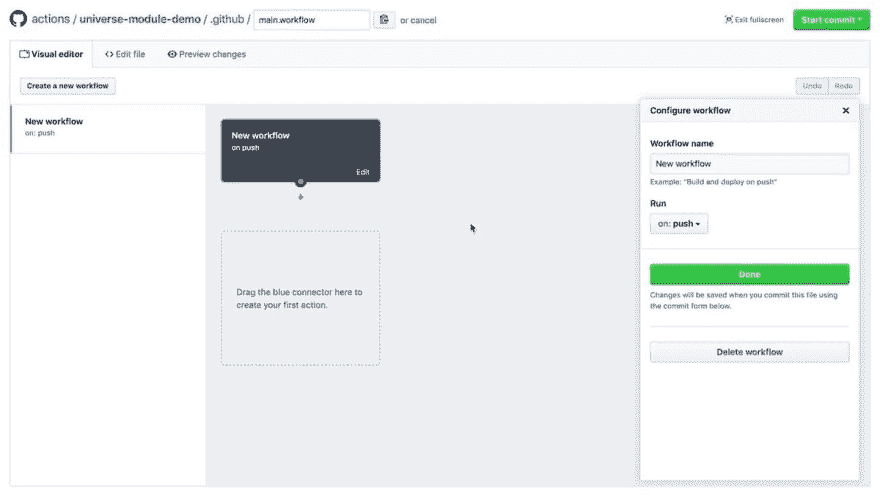

# 关于 GitHub Actions 的想法？

> 原文：<https://dev.to/ben/thoughts-on-github-actions-5g1i>

GitHub 刚刚推出了“行动”

> <video loop="" controls=""><source src="https://video.twimg.com/amplify_video/1052209707266367488/vid/318x180/jsQSOvj5k4xiRiZa.mp4?tag=8" type="video/mp4"></video>GitHub@ GitHub让你的工作流程自动化。
> 
> 迎接 GitHub 的行动👋它可能会改变你的工作方式。
> 
> 2018 年 10 月 16 日下午 17:23

我个人很喜欢这类事情，但我还没有深入研究过。

你有什么想法？