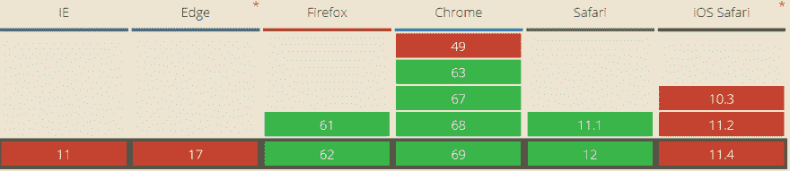

# 三个简洁的 CSS 特性

> 原文：<https://dev.to/mornir/three-neat-css-features-496h>

这里有三个我不知道的 CSS 特性，并且很高兴知道它们的存在。

# 1。插入符号颜色

您可以简单地使用`caret-color`属性来改变输入字段中闪烁条的颜色。

[https://codepen.io/mornir0/embed/BOMQNz?height=600&default-tab=result&embed-version=2](https://codepen.io/mornir0/embed/BOMQNz?height=600&default-tab=result&embed-version=2)

⚠对`caret-color`属性的支持并没有那么大:

# 2。第 n 个孩子(奇数)&第 n 个孩子(偶数)

这些价值观是众所周知的，但是我最近才发现。它们可以派上用场，例如在列表中交替使用背景颜色:

[https://codepen.io/mornir0/embed/wENord?height=600&default-tab=result&embed-version=2](https://codepen.io/mornir0/embed/wENord?height=600&default-tab=result&embed-version=2)

# 3。Flexbox 中的缺口！

这是一个非常棒的功能。在 CSS grid 中，我们可以使用 gap 属性来指定行和列之间的间距。“现在”我们通过 Flexbox 获得了同样的能力！

然而，这一特性只受到 Firefox 63 的支持，在撰写本文时，Firefox 63 还没有向更广泛的公众发布。我希望其他供应商能尽快实现它。

[https://codepen.io/mornir0/embed/qMwqLv?height=600&default-tab=result&embed-version=2](https://codepen.io/mornir0/embed/qMwqLv?height=600&default-tab=result&embed-version=2)

*如果你在上面 codepen 的第二个例子中只看到一个绿色的大块，说明你的浏览器不支持。*