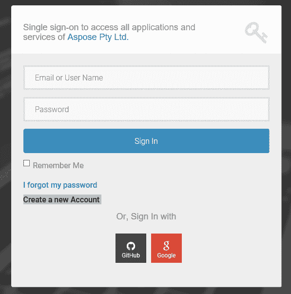
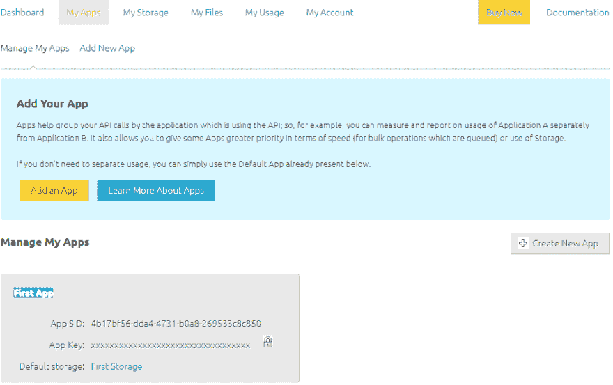
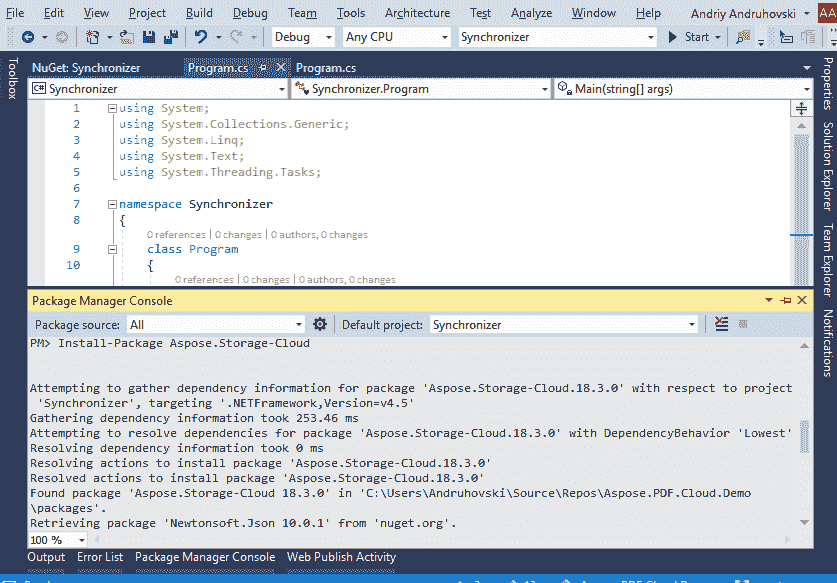

# 开始使用 Aspose 的 3 个简单步骤。云存储

> 原文：<https://dev.to/asposepdf/three-simple-steps-to-start-using-asposecloud-storage-3mmc>

在解决文档处理的问题时，我们经常会遇到从不同的来源和不同的提供者那里获取源文档的问题。阿斯波斯。云存储是 Aspose 的一个组件。云平台，它发布了一个透明的接口，用于访问不同的源。现在做个手势。云存储支持亚马逊、Dropbox、谷歌、微软的流行服务。让我们看看如何使用这个组件。

# 第一步:创建一个 Aspose。云账户

*   我们可以创造一个自由的空间。使用[http://dashboard . aspose . cloud](http://dashboard.aspose.cloud)上的“创建新帐户”链接或使用 GitHub 或 Google 帐户登录云帐户。

[T2】](https://res.cloudinary.com/practicaldev/image/fetch/s--FqlrPTqT--/c_limit%2Cf_auto%2Cfl_progressive%2Cq_auto%2Cw_880/https://thepracticaldev.s3.amazonaws.com/i/a2ki83dnqhvxa06zrbda.PNG)

*   注册时，每个帐户一个 Aspose。云存储被创建。我们稍后添加了另一个存储，现在我们正在尝试使用 C#访问当前的存储。为此，我们需要获得一个应用程序凭证。

# 第二步:获取申请凭证

阿斯波斯。云应用允许我们管理对云 API 的访问。默认情况下，每个帐户都有一个名为“第一应用程序”的应用程序。使用“我的应用程序”选项卡，我们可以看到所有应用程序的列表，更改设置或获取凭证。

[T2】](https://res.cloudinary.com/practicaldev/image/fetch/s--NhRamFUg--/c_limit%2Cf_auto%2Cfl_progressive%2Cq_auto%2Cw_880/https://thepracticaldev.s3.amazonaws.com/i/0mwp4utpbn6x671tozg9.PNG)

应用凭证(应用 SID/应用密钥)直接放在“第一个应用”磁贴上，但如果您想更改“第一个应用”的设置，只需单击磁贴标题。出于测试目的，我们有足够的默认设置，所以我们将继续下一步，编写客户端应用程序。在本例中，我们将使用 Microsoft Visual Studio 2017 中的“控制台应用程序”模板。

# 第三步:创建客户端应用程序

为了演示云存储工作的主要概念，我们将编写一个应用程序，将某个本地文件夹与同名的云文件夹同步。那么，我们开始吧。

1.  创建一个控制台应用程序(在 VS2017 文件->新建->项目> Windows 经典桌面->控制台应用程序中)；
2.  安装 Aspose。云 SDK 的存储(在包管理器控制台:`Install-Package Aspose.Storage-Cloud` ) 

## 步骤 3a:设置 API 客户端

为了能够发出 API 请求，我们必须初始化一个 API 客户端。这非常简单:声明`StorageApi`对象并用`AppKey`和`AppSID`初始化它。