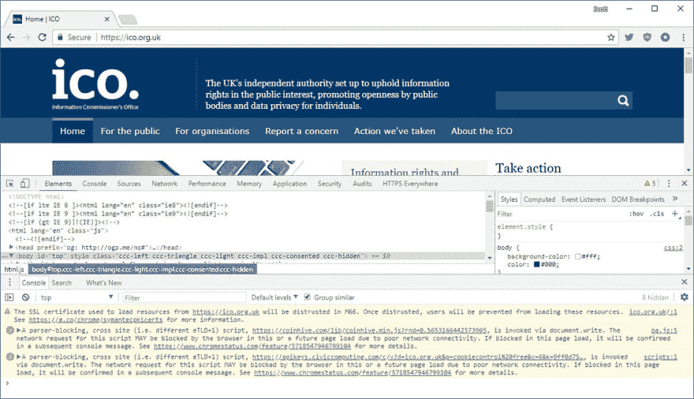

# 提高 Web 应用安全性的三个步骤

> 原文：<https://dev.to/dotnetcoreblog/three-steps-for-increasing-the-security-of-your-web-apps-3clg>

最近和工作的 Slack 群分享了以下二维码:

[T2】](https://res.cloudinary.com/practicaldev/image/fetch/s--6yBNrjQ2--/c_limit%2Cf_auto%2Cfl_progressive%2Cq_auto%2Cw_880/https://thepracticaldev.s3.amazonaws.com/i/3y2owp9y0kcgq45noksd.jpg)

*专业提示:千万不要在没有使用类似[这种](https://online-barcode-reader.inliteresearch.com/)第一*的服务进行检查的情况下，随意扫描二维码

这个二维码没有恶意，它只是链接到我的新播客的网站( [`https://dotnetcore.show/`](https://dotnetcore.show) )，我很高兴地说，工作中的每个人都通过了。也就是说，我没有看到来自我工作地点附近的 IP 地址的新请求。

我想这证明了我将要在文章中提出的一个观点。那就是:我们开发人员是开发方面的专家，我们对开发的意见很重要。

### 真实世界的例子

促成这篇文章的故事是关于 Feedify 和他们所有的客户被黑客攻击的。下面是我第一次看到这个故事的链接:[https://www . bleeping computer . com/news/security/feed ify-hacked-with-mage cart-information-steaming-script/](https://www.bleepingcomputer.com/news/security/feedify-hacked-with-magecart-information-stealing-script/)

阅读这篇博文让我想到了 twitter 上关于 web 应用程序安全性的自以为是的咆哮

> 杰米@ dotnetcoreblog个人对 JS 安全的看法来了是根据这个新闻故事改编的:[bleepingcomputer.com/news/security/…](https://t.co/xRG5Gf4kHM)2018 年 9 月 13 日上午 06:33[](https://twitter.com/intent/tweet?in_reply_to=1040126276932186112)[](https://twitter.com/intent/retweet?tweet_id=1040126276932186112)0[](https://twitter.com/intent/like?tweet_id=1040126276932186112)0

不幸的是，对于 Feedify 来说，我在这次咆哮中选中了他们，但他们远不是第一个受到这种攻击的人。今年早些时候，英国政府不同部门的许多网站都被注入了一个加密矿工:

> Scott Helme@ Scott _ HelmeUmmm，所以耶，这是*坏*。我刚刚让 [@phat_hobbit](https://twitter.com/phat_hobbit) 指出 [@ICOnews](https://twitter.com/ICOnews) 在他们的网站上安装了一个密码挖掘器...😮2018 年 2 月 11 日下午 13:46[](https://twitter.com/intent/tweet?in_reply_to=962684239975272450)[](https://twitter.com/intent/retweet?tweet_id=962684239975272450)870[](https://twitter.com/intent/like?tweet_id=962684239975272450)922

在这两个例子中，一个第三方脚本被入侵，并被另一个第三方(第三方？)被注入其中。或者用另一种方式写:

*   我惊人的电子商务网站包括一个来自 Feedify 的脚本
*   Feedifys 的脚本被破坏了，已经嵌入了一些其他的脚本
*   我的惊人的电子商务网站现在包括妥协的脚本。

但是你怎么能阻止这种事情发生呢？事实证明这非常简单，最多只需要三个步骤。

### 停止使用`unsafe-eval`

最初包含 Feedifys 脚本的方式大致如下:

```
var s = document.createElement('script');
s.type = 'text/javascript';
s.src = 'https://cdn.feedify.net/getjs/feedbackembed-min-1-0.min.js';
document.getElementByTagName('head')[0].appendChild(s); 
```

这应该立即敲响警钟。为什么我们要通过 JS 添加一个脚本？难道我们不能做同样的事情吗

```
<script type='text/javascript'
   src='https://cdn.feedify.net/getjs/feedbackembed-min-1-0.min.js'>
</script> 
```

这是公认的惯例。事实上，第一个代码片段正是这样做的，但是是在运行时而不是设计时。

#### 第一个片段怎么了？

除了速度慢(在将新闻脚本添加到`head`元素之前，必须下载页面并解析所有的 JS)，它还非常不安全。

通过像这样将脚本注入到页面中，在页面被呈现后的之前，没有办法检查实际上添加到页面中的内容。这也意味着您允许浏览器中的 JS 引擎加载和评估来自外部源的脚本，而无需检查它。

使用第二个代码片段加载的脚本也是如此。但是有两个很大的区别:

*   第二个片段是你应该如何去做
*   您可以在运行时使用 SRI 检查脚本是否正确加载

[子资源完整性](https://en.m.wikipedia.org/wiki/Subresource_Integrity)基本上是告诉浏览器对它下载的脚本进行哈希检查。这需要脚本作者给你一个他们脚本的哈希值，但是你可以很容易地在命令行或者使用像[这样的服务来生成一个哈希值](https://report-uri.com/home/sri_hash)

如果提交的 JS 文件的哈希没有通过提供的哈希检查，浏览器将在控制台中引发一个错误，并拒绝解析提交的脚本。

因为 Feedify 交付的原始脚本被修改了，所以它的哈希值不会通过 SRI 检查。

为 JS 文件添加 SRI 检查非常简单，如下所示(显然，每个脚本的哈希值都不同):

```
<script type='text/javascript'
    src='https://cdn.feedify.net/getjs/feedbackembed-min-1-0.min.js'
    integrity='sha256-3edrmyuQ0w65f8gfBsqowzjJe2iM6n0nKciPUp8y+7E='>
</script> 
```

*我在这里使用 jquery 3.1 的 SRI，因为 Feedify 脚本已经从网上消失了*

### CSP

[内容安全策略](https://en.m.wikipedia.org/wiki/Content_Security_Policy)是一个 HTTP 头，它指示浏览器允许从哪里加载资源。因为它是一个 HTTP 头，所以它在页面的 HTML 之前不久被传递，并为当前会话设置规则。

如果该域没有在 CSP 中列出，对该域的所有请求都将引发错误并被阻止。

建立 CSP 需要更多的努力。这是因为它来自服务器，而不是 HTML 本身。但是所有的网络服务器都有添加自定义标题的能力，所以这并不难做到。

困难的部分是把它做好。

因为现代的 web 应用程序从整个网络上加载资源，所以你需要列出你的应用程序加载的每一个域。由于规则适用于所有资源类型(脚本、图像、框架、CSS 等)。)每种资源类型都有自己的规则。这意味着脚本的 CSP 规则应该与 CSS 的 CSP 规则不同。

例如，以下是针对[https://dotnetcore.show/](https://dotnetcore.show/)的 CSP 规则的修订版:

```
upgrade-insecure-requests;
default-src 'self';
connect-src 'self' https://cdn.jsdelivr.net https://api.unsplash.com;
script-src 'self' https://cdnjs.cloudflare.com https://code.jquery.com; 
```

(对浏览器而言)如下所示:

*   http 上的每个请求都应该自动升级到 https
*   除非其他规则中另有规定，否则只允许来自以下位置的资源:
    *   我( [https://dotnetcore.show](https://dotnetcore.show) )
    *   [https://cdn.jsdelivr.net](https://cdn.jsdelivr.net)
    *   [https://api.unsplash.com](https://api.unsplash.com)；
*   仅允许从以下位置加载脚本:
    *   我( [https://dotnetcore.show](https://dotnetcore.show) )
    *   [https://cdnjs.cloudflare.com](https://cdnjs.cloudflare.com)
    *   [https://code.jquery.com](https://code.jquery.com)

在请求生成之前，其他任何内容都将被浏览器阻止。这也包括从这些脚本中请求的资源。

受损的 Feedify 脚本包含注入的 MageCart 脚本使用的请求。请求已发送至`info-stat[.]ws`

(我在“.”两边加了方括号。)char，这样你的浏览器就不会把它变成一个可点击的链接)

将 Feedify CDN 域而不是 info-stat 域列入白名单的 CSP 会导致对该域的请求失败，并在控制台中记录错误。这些错误可能是在开发、质量保证和 UAT 环境中发现的，因此会由开发受影响的 web 应用程序的开发人员修复。

然而，这需要使用包含脚本的标准方法(即删除上面指出的不安全的 eval)。

### 最后

这是帖子的固执己见且略有争议的观点。

4000 个网站受到这次攻击。

这意味着 4000 个开发团队(假设每个站点都是由单独的团队创建的)要么不知道使用不安全的 eval 的安全性问题，要么不知道 CSP 可以用来保护他们的网站。

如果是这样的话，这意味着大量的开发团队或者不知道这些安全措施

...

或者他们确实知道，但当决策者决定不在安全方面投入时间时，他们没有做出足够努力的反击。

我们需要记住，我们是开发领域的专家。我们被专门雇佣*是因为*我们是这方面的专家。因此，我们有责任了解这些事情，并在当权者决定不投资于安全时，尽可能(如果不是更努力的话)予以回击。

当一个漏洞或安全问题发生时，我们会受到威胁，而不是决策者。简单地提出这些观点，把它们记录下来，然后平静地继续前进，这不是解决问题的方法。

把你自己放在那些陷入困境的用户的位置上，想想不得不处理你的身份被盗——更糟糕的是，你一生的积蓄被盗——是什么感觉，因为一些开发人员不想在提出安全漏洞的可能性时感到稍微不舒服。

你想成为那样的人吗？我知道我不会。