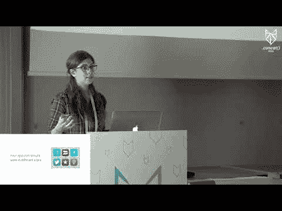
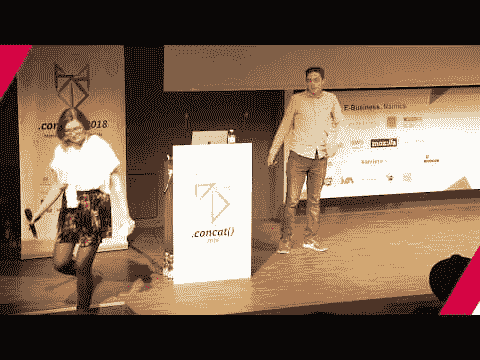
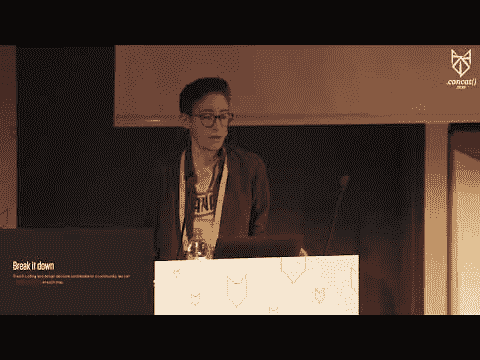
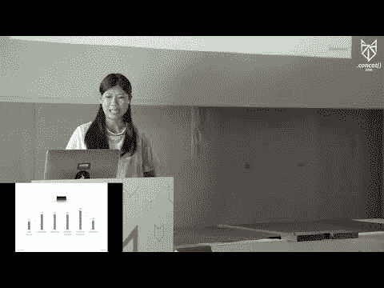
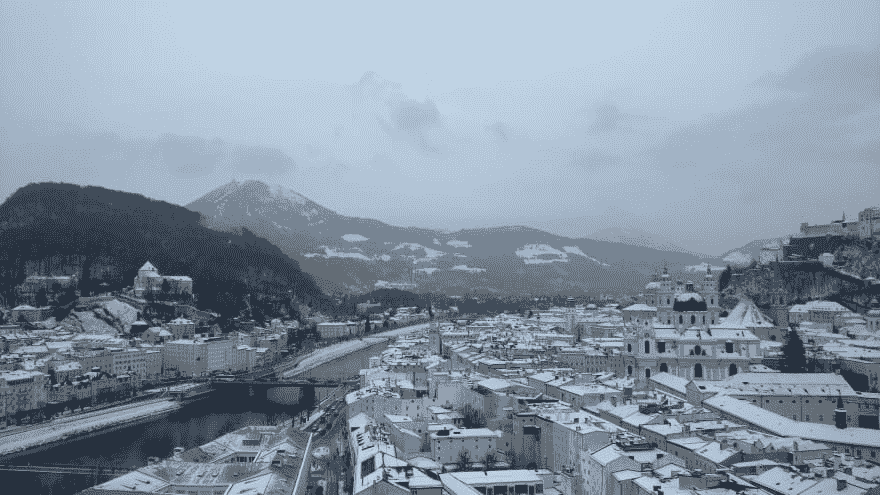

# 我学到的三件事。concat() 2018(以及参观萨尔茨堡的其他原因)

> 原文：<https://dev.to/adammcquiff/three-things-i-learnt-at-concat-2018-and-other-reasons-to-visit-salzburg--3amj>

今年，我有幸参加了[。concat() 2018](https://2018.conc.at/) ，在奥地利萨尔茨堡——莫扎特的故乡和*音乐之声*的背景——FH 萨尔茨堡应用科学大学举办的用户体验和 web 开发大会。桑德兰的[大学](https://www.sunderland.ac.uk/)赞助了我的出席，作为我学习的一部分。

不幸的是，会议有两个轨道，这意味着所有的会谈都发生了冲突，我无法参加一些引起我注意的演讲，包括乌苏拉·萨拉西尼、T2、拉斯马斯·勒德尔夫和 T4 的演讲，以及其他探索诸如可访问性、PHP 和维护遗留代码库等概念的演讲。

这一天以一顿美味的素食早餐开始，随后是没完没了的 30 分钟演讲，一切都以谷歌工程师[丹诺·克利福德](https://twitter.com/expatdanno) : *当快比最快*快时的主题演讲开始，他在演讲中讨论了优化 Chrome V8 JavaScript 引擎。

会谈之间交织着 evermore 食品(这次是正宗的奥地利食品)，无止境的免费赠品、咖啡师咖啡和啤酒。这一天以著名的[萨拉·苏伊丹](https://www.sarasoueidan.com/)的主题演讲圆满结束，她在演讲中讨论了 SVG 的一系列应用。svg 。

我在会议上玩得很开心，也学到了很多东西。在这篇文章中，我想和你分享一些我学到的东西。所以，这里是我在 *concat() 2018* 学到的三件事。

## 第 1 期:设计渐进式网络应用的实用技巧。

在参加会议之前，我对渐进式 Web 应用程序(PWA)开发的技术方面有一些经验。我实现了用于缓存和离线支持、主题化等的服务工作者。但是，我并不精通 PWA 开发的用户体验和界面设计方面。

谢天谢地，妮可填补了我知识上的空白。在她的快节奏演讲:*设计优秀的渐进式网络应用*中，Nicole 讲述了一系列技巧来确保你的渐进式网络应用提供优秀的用户体验。

Nicole 快速地完成了一些基本步骤:通过 [Real Favicon 生成器](https://realfavicongenerator.net/)生成应用图标，通过`manifest.json`和`meta`标签进行主题化。

然后她转向更复杂的方面。

她解释说，公共福利机构的主要吸引力之一是能够离线运营。为了利用这一点，Nicole 提出了一个“离线优先”的策略。这可以通过几个步骤来实现:

*   通知用户互联网连接的变化。
*   当连接恢复时，提供一种检索新内容的方法。
*   如果 PWA 数据量大，则提供“数据节省”模式。
*   如果 PWA 提供内容，请提供下载内容的能力。如果提供下载选项，通知用户文件大小。
*   简单而有效:给应用程序添加一种“离线模式”的颜色。(为了适应有视觉障碍的用户，请确保向用户提供了确定脱机状态的其他方法，例如标签)。

Nicole 提到的另一个有趣的话题是使用[应用程序外壳架构](https://developers.google.com/web/fundamentals/architecture/app-shell)的*渐进式加载*——在整个页面加载之前加载特定元素的概念。

对于一个“传统”网站，当样式表和其他资源被加载后，一切都会立即呈现。然而，当利用应用程序外壳架构时，可以在渲染过程中更早地加载特定元素，以创建一个加载更快的网站的印象，即使该网站实际上并没有*加载得更快。*

在我看来，这种效果最好的部分是其实现的简单性。你所需要做的就是通过页面顶部的一个`<style>`标签提供适用的 CSS。其余的网站样式可以继续通过样式表提供。浏览器会自动区分页面顶部提供的样式的优先级，并在样式表加载时呈现它们。

你可以在多个谷歌产品中看到这种效果，包括 YouTube 和谷歌搜索引擎。

Nicole 在她的演讲中涵盖了更多内容，包括“PWA 审计”、iOS 特有的考虑因素、“微交互”以及您可以使用的详细 PWA 清单。

你可以通过下面的链接在 YouTube 上观看妮可的完整讲话。

[T2】](https://www.youtube.com/watch?v=2NZc4C7uNcU)

## No. 2:今天可以使用 CSS 自定义属性。

虽然我在会议之前听说过 CSS 自定义属性，但是我对它们没有任何经验。随着 HTML、CSS 和 JavaScript 规范的发展速度——更不用说第三方技术了——我发现很难跟上每个特性的发展。

也就是说，CSS 自定义属性规范看起来是对 CSS 语言的一个很有前途的补充。更好的是，它在所有现代浏览器中都得到完全支持——你今天就可以开始使用它了。

如果像我一样，你想知道你到底怎么做到的，那么迈克·里思穆勒已经为你做好了准备。在他的演讲*CSS 自定义属性的策略指南*中，Mike 探索了许多在项目中使用自定义属性来提高 CSS 可维护性的方法。

起初，我担心新功能是试图取代预处理器的可变功能，如 *SASS* 和 *LESS* ，但事实并非如此。事实上，Mike 探索了我们如何以及为什么能够并且应该使用这两者。

简而言之，Mike 认为您应该使用预处理程序变量来进行主题化，并使用 CSS 自定义属性来表示将在媒体查询中更改的值。

要了解迈克策略的本质，请查看他在 YouTube 上的完整发言。

[T2】](https://www.youtube.com/watch?v=Zg8f0fNekp4)

## 第三:解决你的偏见

这是一个事实:我们都有偏见。作为软件开发人员、UX 设计人员等等，这不可避免地会影响我们构建的应用程序。然而，这个事实并不是让我们的应用程序反映我们偏见的充分理由:我们需要解决它们。

似乎没有人比伊万娜·麦康奈尔更了解这一点。在她的充满争议的演讲中，*你的算法不是中立的*，Ivana 探讨了我们应用中的排斥概念。Ivana 指出了许多未能解决其偏见的公司，这些公司反过来将应用程序释放到了野外，对用户的生活产生了负面影响。

从一个假定所有拥有“博士”头衔的用户都是男性的纯粹的健身应用程序[，随后禁止女性进入更衣室](https://www.mirror.co.uk/news/uk-news/doctor-locked-out-womens-changing-5358594)，到像 [AirBnb](https://www.npr.org/2017/03/02/518087610/new-research-looks-at-ways-to-help-stop-airbnb-racial-discrimination) 和 [Nextdoor](https://www.wired.com/2017/02/for-nextdoor-eliminating-racism-is-no-quick-fix/) 这样允许种族歧视的应用程序，以及为用户提供种族主义过滤器的[Snapchat](http://www.bbc.co.uk/news/world-asia-37042475):用户被排除在外，并受到严重歧视。

产品应该赋予用户权利，而不是排斥他们。那么，我们如何实现包容性的 UX 呢？

你可以在 Ivana 在 YouTube 上的强大演讲中找到这样做的一系列步骤。

[T2】](https://www.youtube.com/watch?v=As5fhzBY5xk)

同样， [Jenny Shen](https://twitter.com/jennyshen) 在她的幽默但无疑发人深省的演讲中探讨了我们如何进行跨文化设计，*建造桥梁，而不是墙壁。为跨文化用户设计*。

在探索什么是文化，以及为什么我们应该关注文化的时候，Jenny 提供了一系列不直观的例子来说明在困难文化中的用户是如何对不熟悉他们文化的人做出的设计决策做出反应的。

虽然我可以试着引用她的例子，但我不会公正地对待它们，我恳求你们在方便的时候尽早观看珍妮的演讲。你可以在下面这样做。

[T2】](https://www.youtube.com/watch?v=ER3534JJucc)

两次谈话都贯穿着一个一致的主题:**你有偏见，你需要有意识地采取行动，确保你的用户确实体验到你无意的、自然的偏见的影响，这种偏见会影响种族、文化、性别和社会条件。**

## 结论

*Concat() 2018* 大会是一个值得纪念的日子:来自众多伟大演讲者的发人深省的演讲；高质量的当地美食，以及一些我喝过的由现场咖啡师提供的最好的咖啡；可爱的与会者，当然，还有一个了不起的团队。

从我观看的所有演讲中，我有许多要思考的要点，以及我错过的积压的演讲。我在这篇文章中讨论的观点仅仅触及了一天中流传的观点的表面，我建议你亲自观看这些演讲，当然，还要注册明年的门票...(手指交叉)。

在这种情况下…

## 奖励:这里有一些*和其他*游览萨尔斯堡的理由

这次会议对我来说是一次探索奥地利的绝佳机会，因为我以前从未访问过这个国家。尽管萨尔斯堡在历史上以盐开采而闻名，直接翻译过来就是“盐堡”，最近又以世界著名作曲家沃尔夫冈·阿马德乌斯·莫扎特的出生地和《音乐之声》的背景而闻名，但萨尔斯堡还有更多值得一提的地方。

### 风景

与 19 世纪的许多城市不同，萨尔茨堡的建筑没有被推倒，这要归功于 1816 年该市加入奥地利后，执政的哈布斯堡王朝长达一百年的经济忽视，确保了该市能够保留其独特的外观。

[T2】](https://res.cloudinary.com/practicaldev/image/fetch/s--IqWn-phg--/c_limit%2Cf_auto%2Cfl_progressive%2Cq_auto%2Cw_880/https://thepracticaldev.s3.amazonaws.com/i/4xtgawmtisynyw40ngu4.jpg)

因此，现代游客能够体验到在欧洲许多其他地方很难找到的如画的建筑。此外，萨尔茨堡被群山和其他各种有利位置所包围，有足够的机会让人敬畏。

[T2】](https://res.cloudinary.com/practicaldev/image/fetch/s---1ME2lf---/c_limit%2Cf_auto%2Cfl_progressive%2Cq_auto%2Cw_880/https://i.imgur.com/YGJ2tOr.jpg)

### 菜肴和饮料

萨尔茨堡提供美味佳肴，也是许多美食的故乡，包括 Paul Furst 的[原味萨尔茨堡 Mozartkugel](http://www.original-mozartkugel.com/index_e.php) 和*原味 Sacher Torte* ，后者可在 [Café Confiserie Sacher](https://www.sacher.com/hotel-wien-2/kulinarik/cafe-sacher-wien/) 买到(他们从不放过任何机会提醒你他们不仅提供任何一种 Sacher Torte，还提供*原味 Sacher Torte* )。

[T2】](https://res.cloudinary.com/practicaldev/image/fetch/s--ZWLu8YbP--/c_limit%2Cf_auto%2Cfl_progressive%2Cq_auto%2Cw_880/https://i.imgur.com/izTRdHR.jpg)

除了美食，这里也不缺少正宗的食物，包括牛肉炖牛肉、菠菜饺子和法兰克福香肠。甚至咖啡也很突出。在萨尔茨堡，一个常见的选择是混合咖啡:一种过滤咖啡，配有牛奶、鲜奶油，在大多数情况下，还有巧克力。我在萨尔茨堡尝过的所有咖啡甚至都配有一小杯冷水。

[T2】](https://res.cloudinary.com/practicaldev/image/fetch/s--2uyJNy5---/c_limit%2Cf_auto%2Cfl_progressive%2Cq_auto%2Cw_880/https://i.imgur.com/bHDqHql.jpg)

### 安特斯伯格山

在格尔迪格，离市中心不远的地方，有一辆缆车，你可以乘坐它去白雪皑皑的 Untersberg 山。尽管缆车通常上下要花费 25 欧元，但你可以持[萨尔斯堡卡](https://www.salzburg.info/en/hotels-offers/salzburg-card)免费乘坐。

在下了一整天的雪后，我们能够在一个特别晴朗的日子爬山，并且能够享受烈日、无尽的雪，以及萨尔斯堡、*瓦茨曼*山和德国巴伐利亚*联邦区*的难忘景色。

[T2】](https://res.cloudinary.com/practicaldev/image/fetch/s--Jx7Sw-k_--/c_limit%2Cf_auto%2Cfl_progressive%2Cq_auto%2Cw_880/https://thepracticaldev.s3.amazonaws.com/i/hmf24mf3qafse6k9w3ho.jpg)

描述:无意中“深入”的我欣赏风景的照片。

没有任何描述或照片能公正地描述这一经历。如果您发现自己在萨尔茨堡、格尔迪格或附近的任何地方，这是一次不可错过的经历。