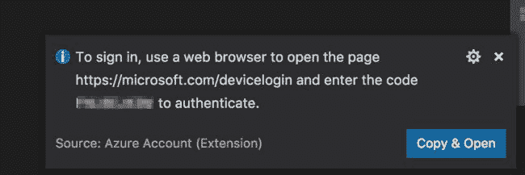
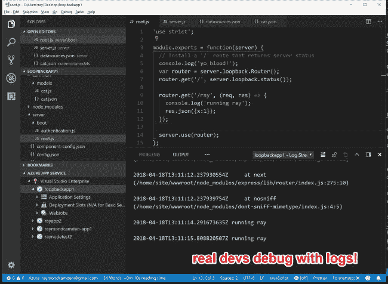
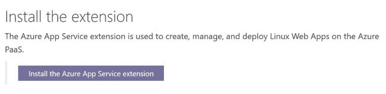

# TIL -使用 Visual Studio 代码将节点应用程序推送到 Azure

> 原文：<https://dev.to/raymondcamden/til---pushing-node-apps-to-azure-with-visual-studio-code-4b6c>

我玩微软 Azure 已经有一段时间了。我主要关注的是服务领域(参见我的[帖子](https://www.raymondcamden.com/2017/06/15/testing-multiple-image-recognition-services-at-once/)比较不同的视觉识别服务)，但我也很好奇它作为节点应用的 PaaS 工作得如何。大约两三个月前，我试图推出一个简单的[回环](https://loopback.io/)应用程序，但没有成功。我责怪自己没有好好阅读文件，但这不是一次好的经历。大约一周前，我与一名微软员工谈论部署的总体情况，当我提到我的上一次经历时，他向我推荐了这个很棒的教程:

### [使用应用服务部署到 Azure】](https://code.visualstudio.com/tutorials/app-service-extension/getting-started)

本教程将带您完成将 [Azure App Service](https://marketplace.visualstudio.com/items?itemName=ms-azuretools.vscode-azureappservice) 扩展安装到 Visual Studio 代码中，然后使用它将节点应用部署到 Azure 的过程。

我不打算重复教程中的内容，因为它通常就像现在这样很好。我将警告您在测试时可能会遇到的一些事情。

首先，当您开始身份验证过程时，它会要求您打开一个 URL 并输入一个代码:

[T2】](https://res.cloudinary.com/practicaldev/image/fetch/s--UODolRgo--/c_limit%2Cf_auto%2Cfl_progressive%2Cq_auto%2Cw_880/https://static.raymondcamden.cimg/2018/04/azurepin2.jpg)

不要点击！如果你这样做了，那里的小面板就会消失，如果你的记忆和我一样，你就不会记得密码了。我不得不退出 VSC，并重新启动它再次得到提示。你可以在对话框中选择文本，并把它放在你的剪贴板上，或者只是草草记下。

糟糕！所以请注意上面的截图是如何显示“复制”的。就像，嗯，复制，就像雷，你怎么能错过呢？是的，都是我的错。我想也许我期望它用代码预先填充表单域。无论哪种方式-粘贴即可。咄。

其次，对我来说，第一次部署慢得令人难以置信。我想大约十分钟。也许 LoopBack 很大(老实说我从来没有真正想过)。也许是供应东西。但不管是什么原因，第一次推动肯定是缓慢的。然而，在那之后，它移动得非常快。我会说大概 30 秒，或者更快，来更新应用程序。

最后，该扩展支持从应用程序查看日志。这很酷，但它并不总是对我有效。也就是说，昨晚当我测试的时候，我遇到了一点麻烦，今天早上它似乎工作得非常好。

[T2】](https://res.cloudinary.com/practicaldev/image/fetch/s--ylm2ajg6--/c_limit%2Cf_auto%2Cfl_progressive%2Cq_auto%2Cw_880/https://static.raymondcamden.cimg/2018/04/azure2.jpg)

最后，有点跑题，但是如果您开发 Visual Studio 代码扩展，请查看指南中的这个按钮:

[T2】](https://res.cloudinary.com/practicaldev/image/fetch/s--ATFKgNlI--/c_limit%2Cf_auto%2Cfl_progressive%2Cq_auto%2Cw_880/https://static.raymondcamden.cimg/2018/04/azure3.jpg)

点击这个将打开 Visual Studio 代码到市场和扩展。这只是一个格式正确的网址，但我很惊讶地看到它工作得如此之好。(显然你需要安装 VSC 才能正常工作。)像任何优秀的 webdev 一样，我做了一个快速检查元素来查看 URL:vs code:extension/ms-azure tools . vs code-azureappservice。我很惊讶我没看到这个用得更多。