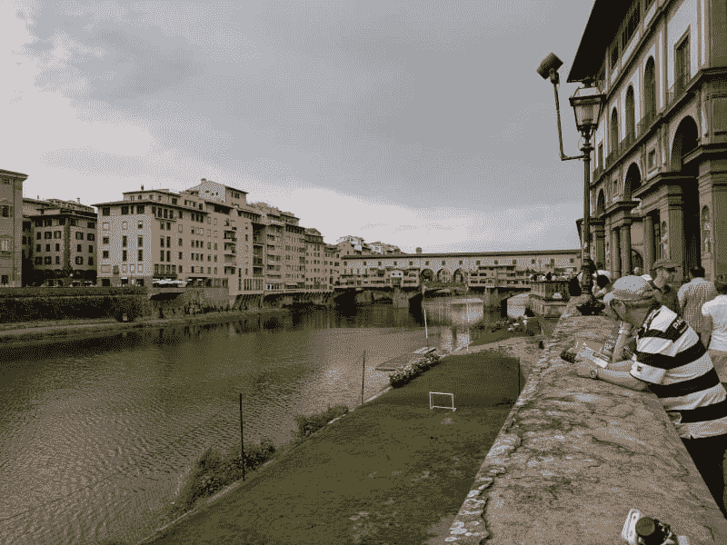

# 休假和环游欧洲

> 原文：<https://dev.to/risdenk/time-off-and-traveling-around-europe-4gld>

## 过去两个半月我都在哪里

休假是我喜欢做的事情，有助于充电和评估我想从生活中得到什么。每年我都会尝试花至少 2-3 周的时间进行一次长途旅行。我感谢我的父母激励我去做我喜欢的事情，并抽出时间去探索。当我还是个孩子的时候，我们家进行了两次穿越美国的长途公路旅行(分别是 7 周和 9 周)。在我 25 岁之前，我以个人旅行的方式去过了所有的 50 个州(由于工作旅行，没有新的州)。这是我的一个目标，在出国旅行之前去遍所有的 50 个州。2016 年秋天，我去了第 50 个州(佛蒙特州),这为出国旅行敞开了大门。

在过去的两个半月里，我远离了电脑和互联网。我最近在欧洲呆了大约 40 天，走访了 12 个国家。旅行使人耳目一新，我正在重新适应事物的变化。我想写一些我去过的地方，这个博客会详细介绍我去了哪里。

## 欧洲旅行概述

*   12 个国家
    *   英国、法国、比利时、荷兰、德国、波兰、捷克共和国、奥地利、匈牙利、克罗地亚、斯洛文尼亚、意大利

*   大约 40 天

*   大部分城市间的交通都是坐火车

*   一天走了大约 10 英里

*   欧洲大部分地区创纪录的高温
    *   整个旅程中只有大约两天的雨

## 欧洲旅行详情

### 英国伦敦

伦敦是这次旅行的良好开端。从纽瓦克到希思罗机场只有短短的 5-6 个小时的飞行。我们住在城市东边的一家酒店，乘火车/地铁大约 20 分钟。我们参观了许多有趣的地方，包括宫殿、大本钟等等。我们进行了一次哈利波特徒步旅行(这是我女朋友非常想做的)，从电影中看到现实生活中的地方很酷。我们发现英国(和欧洲其他国家)的柠檬水实际上只是雪碧加几个柠檬。旅行的第一个晚上包括一个没有空调的旅馆，温度接近历史最高水平，所以按照美国的标准来看是不舒服的。我们六个人和一个领队一起开始了这次旅行。三个来自澳大利亚，一个来自英国，我们来自美国。领导者来自西班牙。

[T2】](https://res.cloudinary.com/practicaldev/image/fetch/s--nY-tP1DK--/c_limit%2Cf_auto%2Cfl_progressive%2Cq_auto%2Cw_880/https://risdenk.github.img/posts/2018-09-11/london_uk_2018.jpg)

### 法国巴黎

第二天我们乘坐欧洲之星列车从伦敦到巴黎。300 公里/小时很有趣，但太快了，以至于不能真正看窗外。海底隧道像隧道一样黑，所以没什么可看的。巴黎看起来非常统一，所有建筑的颜色和设计都差不多。建筑内的庭院一定是所有草的地方，因为真的没有公园或任何东西。到处走很热，我们在那里的第一天走了很多路(差不多 14 英里)。我们参观了艾菲尔铁塔、卢浮宫和巴黎的其他著名景点。最疯狂的是凯旋门和环形广场周围的交通。到处都没有车道和汽车。

[T2】](https://res.cloudinary.com/practicaldev/image/fetch/s--eskqPez6--/c_limit%2Cf_auto%2Cfl_progressive%2Cq_auto%2Cw_880/https://risdenk.github.img/posts/2018-09-11/paris_france_2018.jpg)

### 比利时布鲁日

布鲁日是比利时的一个小城市/小镇，保存得非常好(除了曾经保护城市的城墙已经不在了)。去布鲁日的火车很顺利，我们一直待在布鲁日市中心附近。布鲁日的食物确实很贵，但其他一切似乎都很合理。第二天晚上，我们进行了一次免费的徒步旅行，非常棒，有很多关于这个城镇的细节。这里有很酷的老式风车和城门，这些都是城市被城墙包围时留下的。这里的冰淇淋和华夫饼棒极了，我吃了几次。

[T2】](https://res.cloudinary.com/practicaldev/image/fetch/s--DyvSfnlB--/c_limit%2Cf_auto%2Cfl_progressive%2Cq_auto%2Cw_880/https://risdenk.github.img/posts/2018-09-11/brugge_belgium_2018.jpg)

### 荷兰阿姆斯特丹

我们从布鲁日乘火车穿过布鲁塞尔北上阿姆斯特丹。火车旅行又顺利了，我们不得不乘渡船过河去旅馆。旅馆有“空调”,它实际上只是吹通风，但他们能给我们一个风扇。酷热伴随着我们，让我们有些晚上难以入睡。来回过河的免费客轮很好玩。我们去参观了安妮·弗兰克的房子、植物园、科学博物馆和动物园。动物园不像我们动物园那样有巨大的围栏，所以我们可以拍出非常清晰的照片。

[T2】](https://res.cloudinary.com/practicaldev/image/fetch/s--MVHWJjrH--/c_limit%2Cf_auto%2Cfl_progressive%2Cq_auto%2Cw_880/https://risdenk.github.img/posts/2018-09-11/amsterdam_netherlands_2018.jpg)

### 德国柏林

去柏林的火车真的很长，把我们带到了旅途中最糟糕的旅社。我们四处走走，看了电视塔、查理检查站和市中心的其他地方。第二天晚上我们在电视塔吃了晚饭。我们吃晚饭时，它旋转了大约 1.5 圈，给了我们一些令人惊叹的景色。这也是我们发现芝士蛋糕在欧洲没那么好的地方。在柏林的购物中心，我们发现了玩具反斗城(玩具反斗城现在在美国已经关闭)和空调，它们真的帮助我们冷静下来。

提到的那家招待所很糟糕。第一天晚上浴帘发霉了，所以我们需要换房间，然后第二天晚上 11:30 有人来到我们的房间“找裤子”。这让我们感到不安全，最后我们搬到了街尾的万豪酒店住了第三个晚上。

在柏林，我们的团队增加了 4 个人(一个来自新西兰，一个来自加利福尼亚，两个来自澳大利亚)，总共有 10 个人，外加一个新的领导。领队来自捷克共和国，对我们去的地方了解很多。

[T2】](https://res.cloudinary.com/practicaldev/image/fetch/s--2ZAK6pDD--/c_limit%2Cf_auto%2Cfl_progressive%2Cq_auto%2Cw_880/https://risdenk.github.img/posts/2018-09-11/berlin_germany_2018.jpg)

### 波兰克拉科夫

我们先在什切青停留了一会儿，吃了晚饭，然后乘夜车去了克拉科夫。夜车是我们一周以来睡得最好的一次。虽然没有空调，但是随着火车的移动，窗户开着，带来了舒适的微风。克拉科夫是一个美丽的小镇。有一个很酷的彩色玻璃博物馆/旅游，我们真的很喜欢。旅馆很温暖，没有微风，所以这又是一个温暖的几个晚上。

[T2】](https://res.cloudinary.com/practicaldev/image/fetch/s--EwTHUevt--/c_limit%2Cf_auto%2Cfl_progressive%2Cq_auto%2Cw_880/https://risdenk.github.img/posts/2018-09-11/krakow_poland_2018.jpg)

### 捷克共和国布拉格

去布拉格的火车还行。我们进行了一次迎新步行，并在老城区的一些地方走了走。第二天，我们去了布拉格城堡，登上了山顶。这是下雨的第一天，我们在挑选晚餐地点时被雨淋了。我们不小心去了一家非常高档的海鲜餐厅。我们在大盘子里吃了章鱼、扇贝、蛤蜊、贻贝等等。第二天，我们不得不在公共汽车站呆了大约 45 分钟，以避免一场突如其来的倾盆大雨。我们住的地方就在一家夜总会的正上方，这家夜总会凌晨 4 点就关门了，所以我们在这里的两个晚上都睡不着。

[T2】](https://res.cloudinary.com/practicaldev/image/fetch/s--N6eUNy13--/c_limit%2Cf_auto%2Cfl_progressive%2Cq_auto%2Cw_880/https://risdenk.github.img/posts/2018-09-11/prague_czech_republic_2018.jpg)

### 捷克共和国切斯基·克鲁姆洛夫

我们乘火车去了捷克克鲁姆洛夫，这是一个小城镇，山顶上有一座城堡。这里的食物很糟糕，先是素食，然后晚餐吃了鲤鱼(这是捷克共和国的圣诞菜)。声明一下，不要吃鲤鱼，除非你想挑出小骨头，尽量不要被它们噎住。第二天我们和团队中的其他几个人去漂流，这至少可以说是一次冒险。这家旅馆很古怪(在接待处进入时必须脱鞋)，但幸运的是，夜晚的温度最终降低了一点。

[T2】](https://res.cloudinary.com/practicaldev/image/fetch/s--d_2CtBQQ--/c_limit%2Cf_auto%2Cfl_progressive%2Cq_auto%2Cw_880/https://risdenk.github.img/posts/2018-09-11/cesky_krumlov_czech_republic_2018.jpg)

### 奥地利维也纳

然后我们坐火车去了维也纳。在维也纳，我们去了音乐之家博物馆(互动音乐展品，如可播放的楼梯键盘)，探索了这座城市。我们在河边散步，去了一些宫殿花园，当时外面太热了。我们讨论过去看古典音乐会，但是票价太贵了。这里的旅馆有一个风扇，但窗户只开了几英寸，所以它再次变得非常温暖。

[T2】](https://res.cloudinary.com/practicaldev/image/fetch/s--m7s-JubB--/c_limit%2Cf_auto%2Cfl_progressive%2Cq_auto%2Cw_880/https://risdenk.github.img/posts/2018-09-11/vienna_austria_2018.jpg)

### 匈牙利布达佩斯

第二天，我们乘火车去了布达佩斯，然后我们去了另一个山顶。我的女朋友曾在布达佩斯留学，所以我们参观了她以前的学校，并探索了周围的地区。我们去了英雄广场和浴场周围，看看排队是否合理。天气又热了，所以去洗热水澡的人排起了长队。动物园里也挤满了人，但我们沿着玛格丽特岛散步，欣赏了与音乐同步的喷泉。布达佩斯的旅馆有一些空调帮助我们放松。由于布达佩斯是另一个过渡城市，我们再次更换了领导人，失去了三个人，增加了两个人(一个来自英国，一个来自澳大利亚)。我们只剩下 9 个人(两个英国人，三个澳大利亚人，一个新西兰人，三个美国人)和一个领队。这位领队来自斯洛文尼亚，她喜欢谈论很多我们要去的地方。

[T2】](https://res.cloudinary.com/practicaldev/image/fetch/s--5irH5CJP--/c_limit%2Cf_auto%2Cfl_progressive%2Cq_auto%2Cw_880/https://risdenk.github.img/posts/2018-09-11/budapest_hungary_2018.jpg)

### 匈牙利巴拉顿湖

我们乘火车去了巴拉顿湖，这是离布达佩斯不远的一个大湖。我们所在的一侧显然是派对一侧，有很多酒吧。我们去游了一会儿泳，但因为是星期天，那里有很多人。我们进行了一次日落巡游，感觉很不错。我们只在那里呆了半天就去了克罗地亚的萨格勒布。

[T2】](https://res.cloudinary.com/practicaldev/image/fetch/s--tEs4Ap8b--/c_limit%2Cf_auto%2Cfl_progressive%2Cq_auto%2Cw_880/https://risdenk.github.img/posts/2018-09-11/lake_balaton_hungary_2018.jpg)

### 克罗地亚萨格勒布

去萨格勒布的火车很漂亮，因为它经过了巴拉顿湖的其余部分。在萨格勒布，我们很晚才到达，所以我们没有进行迎新步行，而是自己探索。我们终于找到了食物，然后绕着城市走了一圈。我们去了一个旧碉堡，第二天去了一个幻觉博物馆，里面有很多有趣的脑力游戏。我们还冒险去了附近的一个湖，并沿着它散步。

[T2】](https://res.cloudinary.com/practicaldev/image/fetch/s--uq-zxYQO--/c_limit%2Cf_auto%2Cfl_progressive%2Cq_auto%2Cw_880/https://risdenk.github.img/posts/2018-09-11/zagreb_croatia_2018.jpg)

### 斯洛文尼亚布莱德湖

从萨格勒布出发，我们乘公共汽车去了布莱德湖，以避免艰难的火车换乘。有交通进入布莱德湖与备份数英里。从旅馆到湖边走了一段不错的路，我们走了很多次。其中一项活动是骑自行车，这是一种体验。有些人显然以前没怎么骑过车。把不骑马和爬山以及汽车结合在一起，使得第一次骑马去吃午饭变得很有趣。午饭后，我们决定独自去探索湖的其余部分。第二天，我们在湖里游泳，然后徒步走到山顶的城堡。从城堡顶部看去，景色非常壮观。

[T2】](https://res.cloudinary.com/practicaldev/image/fetch/s--cZiFsbTC--/c_limit%2Cf_auto%2Cfl_progressive%2Cq_auto%2Cw_880/https://risdenk.github.img/posts/2018-09-11/lake_bled_slovenia_2018.jpg)

### 意大利威尼斯

从布莱德湖出发，我们乘火车翻山越岭来到威尼斯，在意大利边缘的一个小镇换车。入住威尼斯的旅馆后，我们乘坐短途火车去威尼斯岛进行徒步旅行，然后吃晚餐。这是这次旅行的第三次也是最后一次改变，所以我们换了领队，最后总共只有 4 人(一个英国，一个澳大利亚，两个美国)。这位领队来自英国，但已经在意大利生活了很多年。与大团队相比，这个小团队非常好。在威尼斯的日子里，我们乘坐水上出租车环岛游览不同的公园，避开拥挤的旅游区。我们还去了丽都岛探索沙滩。

[T2】](https://res.cloudinary.com/practicaldev/image/fetch/s--aQXlSKo3--/c_limit%2Cf_auto%2Cfl_progressive%2Cq_auto%2Cw_880/https://risdenk.github.img/posts/2018-09-11/venice_italy_2018.jpg)

### 意大利拉斯佩齐亚(和五渔村)

我们乘火车(穿过佛罗伦萨)去了拉斯佩齐亚和五渔村。到达的那天，我们乘公共汽车去了 Portovenere，那是一条有趣的蜿蜒道路。我们在拉斯佩齐亚吃过晚饭。第二天，我们乘火车穿过五渔村的五个城市，五渔村就在海岸边，俯瞰着水面。火车在上升的途中被挤满了，我们在乘火车回来之前在蒙特罗索吃了午餐。我们试着在水边吃晚餐，但是大多数餐馆因为假期在这一周都关门了，或者只是在周一/周二关门。拉斯佩齐亚的住宿就在火车站旁边，但是很安静，而且有空调。

[T2】](https://res.cloudinary.com/practicaldev/image/fetch/s--b5uM61o---/c_limit%2Cf_auto%2Cfl_progressive%2Cq_auto%2Cw_880/https://risdenk.github.img/posts/2018-09-11/la_spezia_italy_2018.jpg)

### 意大利佛罗伦萨

我们乘火车经过比萨去佛罗伦萨。我们作为一个团体讨论了我们是否应该在比萨停留。我们决定不停车，因为这会使我们的行李和上下火车变得很复杂。我们到达佛罗伦萨，进行了一次迎新步行，在那里我们不得不避开几场阵雨。之后，我们走到米开朗基罗广场的顶端，在那里可以看到令人惊叹的城市景观(还有阵雨)。

[T2】](https://res.cloudinary.com/practicaldev/image/fetch/s--TEwPeVJF--/c_limit%2Cf_auto%2Cfl_progressive%2Cq_auto%2Cw_880/https://risdenk.github.img/posts/2018-09-11/florence_italy_2018.jpg)

### 意大利罗马

我们乘了一趟短途(最后一趟)火车去罗马，并进行了一次迎新步行。我们参观了许愿池、罗马圆形大剧场、罗马广场、万神殿等等。在和大家告别之前，我们做了最后一次集体聚餐。第二天，我们乘火车/地铁到公共汽车到达城外的酒店。我们得到了一个非常好的升级房间，想试着回去看看梵蒂冈和其他一些东西。在离酒店大约一英里的地方发生故障之前，我们试图乘公共汽车回去。我们认为这是一个信号，于是下午去游泳了。第二天我们放松了一下，享受了酒店餐厅和行政酒廊。然后我们乘班车去机场飞回美国。

[T2】](https://res.cloudinary.com/practicaldev/image/fetch/s--BM4rEiMj--/c_limit%2Cf_auto%2Cfl_progressive%2Cq_auto%2Cw_880/https://risdenk.github.img/posts/2018-09-11/rome_italy_2018.jpg)