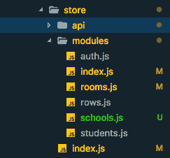

# 提示-一次导入 Vuejs 模块。

> 原文：<https://dev.to/simo_benhida/tip---import-vuejs-modules-at-once-58dl>

嘿，在这篇文章中，我们将看到如何一次添加多个模块。

每次在我们的模块文件夹中创建一个模块时，我们都需要导入模块，就像这样(来自一个真实的项目)。

*store/index . js*

```
 import Vue from "vue";
    import Vuex from "vuex";

    import auth from "./modules/auth";
    import rows from "./modules/rows";
    import rooms from "./modules/rooms";
    import students from "./modules/students";

    Vue.use(Vuex);

    export default new Vuex.Store({
      modules: {
        auth,
        rows,
        rooms,
        students
      }
    }); 
```

Enter fullscreen mode Exit fullscreen mode

[T2】](https://res.cloudinary.com/practicaldev/image/fetch/s--CJ_8KgZO--/c_limit%2Cf_auto%2Cfl_progressive%2Cq_auto%2Cw_880/https://image.ibb.co/bAWG4c/Screen_Shot_2018_03_16_at_8_54_22_PM.png)

就像你在上面的例子中看到的，我们的代码中多了 10 行。5 行代码用于导入模块，另外 5 行代码用于在模块对象上声明它们。

现在让我们看看如何将这 10 行减少到 1 行，为此我们需要在 modules 文件夹中创建一个`index.js`文件，它可以监听 modules 文件夹中的所有`.js`文件，并逐个导入它们。

*模块/index.js*

```
 import camelCase from "lodash/camelCase";
    const requireModule = require.context(".", false, /\.js$/); //extract js files inside modules folder
    const modules = {};

    requireModule.keys().forEach(fileName => {
      if (fileName === "./index.js") return; //reject the index.js file

      const moduleName = camelCase(fileName.replace(/(\.\/|\.js)/g, "")); //

      modules[moduleName] = requireModule(fileName).default;
    });
    export default modules; 
```

Enter fullscreen mode Exit fullscreen mode

*模块/auth.js*

```
 import auth from "../api/auth";

    const state = {
      isLoggedIn: !!localStorage.getItem("token"),
    };

    const getters = {
      isLoggedIn: state => {
        return state.isLoggedIn;
      }
    };

    const actions = {
      async loginUser({ commit }, data) {
        return await auth.login(data, data => {
          localStorage.setItem("token", data.access_token);
          commit("loginUser");
        });
      },
      async registerUser({ commit }, data) {
        await auth.register(data, data => {
          localStorage.setItem("token", data.access_token);
          commit("loginUser");
          return data;
        });
      },
      async logoutUser({ commit }) {
        return await auth.logout(data => {
          localStorage.removeItem("token");
          commit("logoutUser");
        });
      }
    };

    const mutations = {
      loginUser: state => {
        state.isLoggedIn = true;
      },
      logoutUser: state => {
        state.isLoggedIn = false;
      }
    };
    export default {
      state,
      actions,
      mutations,
      getters
    }; 
```

Enter fullscreen mode Exit fullscreen mode

现在我们回到我们的`store/index.js`，只导入等价于`"./modules/index.js"`的`"./modules"`

*store/index . js*

```
 import Vue from "vue";
    import Vuex from "vuex";

    import modules from "./modules";

    Vue.use(Vuex);

    export default new Vuex.Store({
      modules // Equivalent to => modules : modules(imported)
    }); 
```

Enter fullscreen mode Exit fullscreen mode

你现在可以看到我们的 store/index.js 是多么的干净。

欲了解更多信息，请查看 [chris vfritz repo](https://github.com/chrisvfritz/vue-enterprise-boilerplate/tree/master/src/state) 。