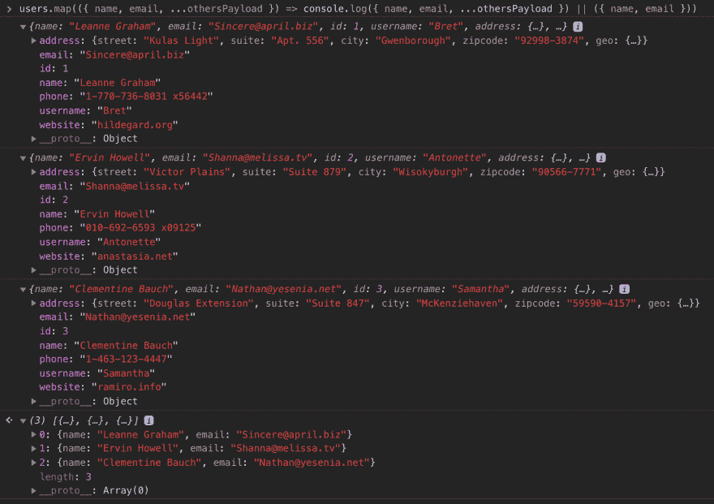

# Javascript 中的提示

> 原文：<https://dev.to/azrizhaziq/tip-when-in-javascript-497f>

嗨，你好。所以今天我想分享一些不同的写作方法。您可以自由地复制代码并将其粘贴到浏览器的 devtool 上。

在我写作的时候，我用的是 Chrome 70。我们将使用来自这个令人敬畏的服务 [JSONPlaceholder](https://jsonplaceholder.typicode.com/) 的 JSON 响应。还要注意，我将使用 [Javascript ESNext](https://developer.mozilla.org/en-US/docs/Web/JavaScript/New_in_JavaScript/ECMAScript_Next_support_in_Mozilla) 语法。

```
 // this will be our dummy data list of users
  const users = [
  {
    "id": 1,
    "name": "Leanne Graham",
    "username": "Bret",
    "email": "Sincere@april.biz",
    "address": {
      "street": "Kulas Light",
      "suite": "Apt. 556",
      "city": "Gwenborough",
      "zipcode": "92998-3874",
      "geo": {
        "lat": "-37.3159",
        "lng": "81.1496"
      }
    },
    "phone": "1-770-736-8031 x56442",
    "website": "hildegard.org"
  },
  {
    "id": 2,
    "name": "Ervin Howell",
    "username": "Antonette",
    "email": "Shanna@melissa.tv",
    "address": {
      "street": "Victor Plains",
      "suite": "Suite 879",
      "city": "Wisokyburgh",
      "zipcode": "90566-7771",
      "geo": {
        "lat": "-43.9509",
        "lng": "-34.4618"
      }
    },
    "phone": "010-692-6593 x09125",
    "website": "anastasia.net"
  },
  {
    "id": 3,
    "name": "Clementine Bauch",
    "username": "Samantha",
    "email": "Nathan@yesenia.net",
    "address": {
      "street": "Douglas Extension",
      "suite": "Suite 847",
      "city": "McKenziehaven",
      "zipcode": "59590-4157",
      "geo": {
        "lat": "-68.6102",
        "lng": "-47.0653"
      }
    },
    "phone": "1-463-123-4447",
    "website": "ramiro.info"
  }
] 
```

我们有一个名为`users`的虚拟数据，我们只对用户的`name`和`email`感兴趣。 [Array.prototype.map](https://developer.mozilla.org/en-US/docs/Web/JavaScript/Reference/Global_Objects/Array/map) 前来救援。

```
 const nameAndEmails = users.map(user => {
        return {
            name: user.name,
            email: user.email,
        };
    })

/*
  [
    {
      "name": "Leanne Graham",
      "email": "Sincere@april.biz"
    },
    {
      "name": "Ervin Howell",
      "email": "Shanna@melissa.tv"
    },
    {
      "name": "Clementine Bauch",
      "email": "Nathan@yesenia.net"
    }
  ]

*/ 
```

是的，我们得到的结果包含了`name`和`email`。但是我们可以用[对象文字表达式](https://developer.mozilla.org/en-US/docs/Web/JavaScript/Reference/Functions/Arrow_functions#Advanced_Syntax)和[析构](https://developer.mozilla.org/en-US/docs/Web/JavaScript/Reference/Operators/Destructuring_assignment)来编写这个更好更短的语法

```
 // 👍 implicitly return object literal expression
    const nameAndEmails = users.map(user => ({
      name: user.name,
      email: user.email,
    }))

    // 👍👍destructuring function parameter and return object literal expression
    const nameAndEmails = users.map(({ name, email }) => ({ name, email })) 
```

好吧，让我们假设在编写这段代码 1 个月后，你很有可能已经忘记了`User Shape`，你可能还需要返回用户的电话号码。所以我们需要`console.log`，这样我们就可以再看一眼我们的`User Shape`。

```
 // 1) Write console.log(users) before running the function.
   console.log(users);
   const nameAndEmails = users.map(({ name, email }) => ({ name, email }))

   // 2) Open devtool and reload the browser
   // 3) Lastly, look at the logged `users` 
```

对我来说，这种方法有点无聊，下面是我在网上找到的方法。

```
 const nameAndEmails = users.map((user) => console.log(user) || ({ 
        name: user.name, 
        email: user.email
   }))

   or 

   const nameAndEmails = users.map(({ name, email, ...otherPayload }) => console.log({ name, email, ...otherPayload }) || ({ name, email })) 
```

[T2】](https://res.cloudinary.com/practicaldev/image/fetch/s--Cwqudhyh--/c_limit%2Cf_auto%2Cfl_progressive%2Cq_auto%2Cw_880/https://thepracticaldev.s3.amazonaws.com/i/a31o4cr8f3eobl2rknhd.png)

**为什么？**，是因为`console.log`返回`undefined`，浏览器还会运行`||`后的代码。

您可以在 devtool 中使用这些示例:

*   `undefined || 'return me'`。
*   `console.log('log me') || 'return me'`
*   `true && console.log('log me')`
*   `false && console.log('do not log me')`

我希望你学到了一些东西😁😁；