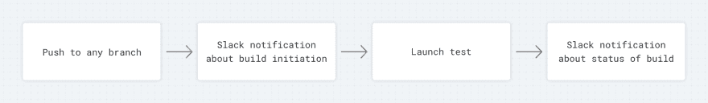
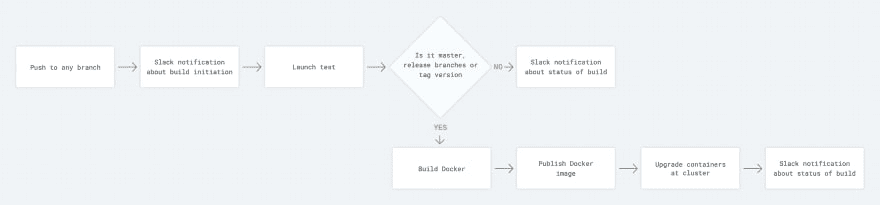

# 可扩展 CI/CD 流的提示和技巧

> 原文：<https://dev.to/alex_barashkov/tips-and-tricks-for-scalable-cicd-flow--49b7>

当你计划一个项目时，你并不总是知道它最终会有多大。因此，遵循使开发过程尽可能顺利的指导方针是至关重要的。一个特别有用的工具是持续集成/交付流程，或 CI/CD 流程。

在典型开发过程的开始，在项目准备发布之前，您的 CI 流程看起来像这样:

[T2】](https://res.cloudinary.com/practicaldev/image/fetch/s--eypmNFFv--/c_limit%2Cf_auto%2Cfl_progressive%2Cq_auto%2Cw_880/https://thepracticaldev.s3.amazonaws.com/i/3xo43j329k54d8ee9ph9.jpg)

在开发阶段，更多的步骤被添加到流程中，直到它看起来像下面的图片。然而，在某些项目中，您可能会看到比这更多的步骤。[原图](https://user-images.githubusercontent.com/2697570/48337431-33340c80-e663-11e8-87b0-cdc4e24aa776.jpg)。

[T2】](https://res.cloudinary.com/practicaldev/image/fetch/s--xfeMCA0L--/c_limit%2Cf_auto%2Cfl_progressive%2Cq_auto%2Cw_880/https://user-images.githubusercontent.com/2697570/48337431-33340c80-e663-11e8-87b0-cdc4e24aa776.jpg)

在本文中，我将演示一个典型的 CI/CD 流程，并提供一些技巧来帮助您将它扩展到更大的项目中。请注意，这些建议是在假设您已经使用 Docker 和编排工具(如 Kubernetes)开发了基础设施设置的基础上提出的。

### 定义你的 VCS 流

所有的现代 CI 工具都依赖于版本控制系统，所以为了在高水平上维护你的 CI 流程，你应该有一个适当的版本控制流程。如果你在寻找想法，我推荐 [Git Flow](https://danielkummer.github.io/git-flow-cheatsheet/) 或 [Github Flow](https://guides.github.com/introduction/flow/) 。选择一个并根据您的需求调整您的管道。

*推荐:*

*   对任何分支中的每个推送运行测试。这有助于您的开发人员更快地发现 bug，并加快代码审查过程。
*   定义将用于触发 Docker 映像构建过程的分支，并如上图所示部署它们。
*   如果您的发布有一个复杂的手动批准过程，请使用标签来触发生产发布。

### 指定您的环境

一旦有了 git 流，就将它与您的构建逻辑集成，并根据您的环境数量进行调整。最初，您可能会在本地环境测试之后将一切部署到生产环境中。后来，你可能会决定做开发，UAT 和生产。

*举例:*

我们经常使用主分支来启动开发环境的部署。然后我们将主分支合并到发布分支中。这触发了在 UAT 的部署，我们允许少量用户测试新版本。如果一切工作正常，QA 团队确认了发布，我们从发布分支创建一个标签，启动生产部署。

### 设置通知

您应该通过您喜欢的通知渠道跟踪所有 CI 流程。我们在项目中使用 Slack。

*   创建系统通知通道，并使其能够发送关于所有配置项和基础架构流程的通知。
*   设置关于成功或失败状态的通知，并在构建开始时提醒您。

### 保持 Docker 形象简单

最好不要传递给 Docker image env 变量。所有的 env 变量都应该通过 Docker run 命令或者在您的编排工具级别上传递(例如 Kubernetes)。这也有助于保持配置项配置文件的简单性。

### 统一你的管道

如今的公司越来越多地使用微服务架构；统一管道可帮助您更快地扩展部署并在新的微服务中配置 CI，从而从中受益。在 Drone CI 或 Travis CI 中，您可以在管道步骤中使用大量 CI 环境变量(在 [Travis CI 环境变量](https://docs.travis-ci.com/user/environment-variables/#default-environment-variables)和 [Drone CI 环境变量](https://docs.drone.io/reference/environ/)中找到它们)。以下是 CI 环境变量的几个实例:

*   要标记 Docker 映像，可以使用构建分支和构建号的连接。因此，您将拥有类似于“master-6”的内容或者，您可以使用您的 git 标记版本。`tags: "${DRONE_COMMIT_BRANCH}-${DRONE_BUILD_NUMBER}"`

*   在您的编排工具中为部署使用存储库名称。使用 env 变量将无人机 CI 部署到 Kubernetes 集群的示例。

```
deploy:
   image: peloton/drone-k8s-deployment
   deployment_names: "${DRONE_REPO_NAME}"
   container_names: "${DRONE_REPO_NAME}"
   namespaces: microservices
   docker_image: "62673275295.dkr.ecr.eu-west-1.amazonaws.com/${DRONE_REPO_NAME}:${DRONE_COMMIT_BRANCH}-${DRONE_BUILD_NUMBER}"
   date_label: deployment.drone.io/date-deployed
   secrets: [kubernetes_url, kubernetes_token] 
```

Enter fullscreen mode Exit fullscreen mode

### 定义 Docker 图像命名约定

您应该根据环境的具体情况和重要性来定义 Docker 映像的命名策略。例如，在开发和 UAT 环境中，您不需要回滚功能，您可以使用分支名称作为标记，以便所有新的构建都覆盖以前的映像。对于生产来说，最好用发布的版本号(v1.0.0)来标记图像，这样可以减少注册表的大小，从而使注册表更具结构性和可读性。

### 使用构建器模式

如果您可以在 CI 级别上编译和构建一些东西，那么在将它放入最终映像之前，作为一个额外的步骤来做这件事会很有帮助。看一下[这个视频](https://www.youtube.com/watch?v=wGz_cbtCiEA&feature=youtu.be&t=141)可以更好的理解。

### 数据库迁移作为一个单独的步骤

不要将迁移作为 docker 文件的一部分；相反，请在单独的步骤中完成。额外的命令，如资产编译或迁移，应该作为单独的步骤运行，而不是在 Docker 启动时执行。您还应该尝试在尽可能短的时间内启动并运行您的 Docker 映像。

### 避免私有库和子模块

任何额外的依赖项，如私有 npm 模块或子模块，都可能在 CI 配置的设置过程中给您带来问题。例如，如果您有一个子模块，并且默认情况下您的 CI 只能通过 http 和授权令牌访问您的存储库，那么您通过 git 对本地机器的配置将不起作用。您需要覆盖您的子模块，并非所有 CI 工具都提供该功能。

[无人机 CI 子模块覆盖示例](https://docs.drone.io/cloning/)

如果您使用私有 npm 模块，您将面临类似的问题，因为您将需要密钥或 Docker 映像中已经下载的模块。

### 总结

当您为一个新项目配置一个配置项时，花一些时间考虑和定义命名约定、潜在的增长方法和构建步骤的统一。这有助于您更快地部署新服务，将这些实践作为新项目的基础，并更快地让员工参与到管道流程中。