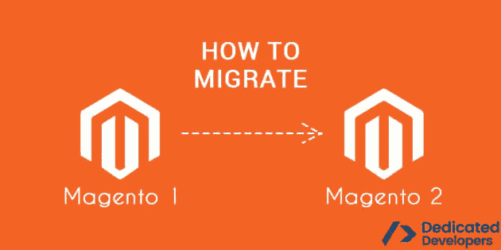

# Magento 2 的提示。十.移徙

> 原文：<https://dev.to/dedicateddevs/tips-for-magento-2x-migration--n76>

作为一家零售店，确保你的网上空间至关重要。赢得你的目标市场，确保你的商业形象在他们心中根深蒂固。就目前的情况来看，这种策略的效果不容小觑；它在过去被证明是有效的，并将继续发挥作用。

[T2】](https://res.cloudinary.com/practicaldev/image/fetch/s--WgHlsK4d--/c_limit%2Cf_auto%2Cfl_progressive%2Cq_auto%2Cw_880/https://thepracticaldev.s3.amazonaws.com/i/6eamkgrz8z6eplw6nrbs.jpg)

对于希望构建功能平台的公司来说，最好的选择是 [**雇佣 Magento 认证的开发者**](https://dedicateddevelopers.com/developers/hire-magento-developers/) 。当你想雇佣 Magento 程序员时，你应该坚持使用 Magento 的第一版还是第二版？让我们找出答案。

### Magento 2.0

Magento 2.0 于 2015 年 11 月发布，其目标是增加用户参与度，提高转化率，提供流畅的导航，当然，还包括为店主创造最佳收入。Magento 提供了两种特殊平台:

**Magento 开源**
这是以前的 Magento 社区版。这是一个开源的电子商务平台。当你雇佣有专业知识的 Magento 程序员时，他们会通过添加新的插件模块来包含重要的文件及其功能。自 2007 年发布以来，Magento 开源经过多年的发展，现在更加定制化，简化了电子商务平台的开发。

> 阅读博客- [开发一个 Magento 网站需要多少成本](https://dedicateddevelopers.com/blog/how-much-does-it-cost-to-develop-a-magento-website/)

Magento Commerce
当你雇佣 Magento 认证的开发人员时，你会发现从 Magento 1 迁移到 Magento 2 并不容易，但这确实是值得推荐的，因为 Magento 2 提供了更多的功能。

要安装 Magento，请确保您使用的系统满足以下要求:

1.  操作系统应该是 Linux 发行版，比如 Debian、Ubuntu、Redhat Enterprise Linux (RHEL)等等。

2.  它有 Apache 2.2 或更高版本。

3.  它需要 PHP 5.4.11 或 PHP 5.5.x 或更高版本。

4.  最新版本的作曲家。

5.  所需的 PHP 扩展将是 mbstring、mcrypt、mhash、simplexml、curl、gd2、imagemagick 6.3.7、soap 和 PDO/MySQL。

6.  邮件传输代理(MTA)或 SMTP 服务器。

7.  MYSQL 5.6.x。

安装 Magento 的建议要求；

1.  PHP 单元(作为命令行工具)4.1。或者以后。

2.  PHP xdebug 2.2.0 或更高版本。

一旦你确定所有需要的东西都已经准备好了，你就可以继续下一步了，那就是:

**1。安装 Composer**
Composer 可以用来安装 Magento 2。众所周知，它是 PHP 中的依赖管理工具，允许您声明项目需要的库，它会为您安装这些库。Composer 帮助您管理 Magento 2 依赖项及其扩展。
使用 Composer 有其自身的优势，即:

o 它为用户提供了另一种配对包装系统的选择。

o 版本依赖。

o 它减少了兼容性问题和扩展冲突。

o 它支持 PHP 框架互操作性标准。

现在我们已经了解了 Composer 的重要性，让我们回到设置。运行 Composer 的最新版本并安装。

**2。克隆 Magento 2 Git hub 库**
这看起来很容易，但事实并非如此，下面是如何完成的:

o 切换到您的 web 服务器反启动目录。

o 输入命令以写入 web 服务器 decroot，执行此操作时，请确保您拥有正确的访问权限，并且存储库存在。

o 完成上述操作后，等待存储库进行克隆。

**3。安装并重新安装 Magento 2.0**
按照上面的说明，接下来的事情是安装 Magento 2:0，如下所示:

安装前更改文件系统、许可和所有权:一些公司雇佣 Magento 程序员来确保安装成功。这样的程序员可能会更改以下系统权限和所有权:

(a)某些目录必须是可写的。

(b)网络用户拥有的所有文件和目录。

您必须更新 Composer 并运行安装程序:在您雇佣 Magento 开发人员后，开发人员完成了文件系统权限和所有权的更改，他们必须更新 Magento 2.0 根文件夹上的 Composer。

完成后，他们现在打开 PHP 管理，然后为 Magento 2.0 创建一个数据库。

然后程序员从它的 setup 子目录安装 Magento，就完成了。

### 设置 Magento2 时可能遇到的问题

当专家帮助您设置时，他们可能会遇到以下问题:

1.  在 Magento 2 安装后安装数据示例可能会出现问题。

2.  清除 CSS 缓存和主题时可能会出现问题。

3.  重建索引的问题。

4.  从布局中删除块时也可能出现问题。

5.  设置开发者模式时。

当您雇佣一个经过认证的 Magento 开发人员来帮助您从 Magento 1 迁移到 Magento 2 时，您将享受到许多好处，例如:

壮观的 Magento 2 网页设计
开发人员将创建一个美丽的网站设计，将脱颖而出，看起来真棒。除此之外，您的电子商务平台将易于客户使用，为他们提供世界级的用户体验。

> 阅读博客- [为什么 Magento 最适合您的电子商务需求？](https://dedicateddevelopers.com/blog/why-is-magento-best-for-your-ecommerce-needs/)

**快速获取更新**
要知道通过使用 Magento 2。x，软件的更新设计得更快，让用户在发布时就能获得新功能。

**它也是移动友好的**
因为人们在智能手机和平板电脑上购物，Magento 2.x 对于任何电子商务平台都是完美的，因为你的客户可以在任何地方轻松使用它。

**性能提升**
Magento 2 比 Magento 1 跑得快。当你的网站速度更快时，它会鼓励更多的人访问网站，给你带来更多的客户，并自动增加销售额。

**您的顾客可以即时购物**
Magento 2 帮助顾客快速购物。他们可以在你的网站上冲浪，订购他们想要的所有产品，他们点击产品页面上的即时购买按钮，然后继续付款，这将使他们回到你的网站上继续购物。

### 结论

阅读完所有关于 Magento 2.x 的内容后，你会明白为什么你应该使用这个软件。如果你不是一个技术人员，建议你雇佣一个 Magento 认证的开发者，同时享受其中的好处。要 [**雇佣 Magento 开发人员**](https://dedicateddevelopers.com/developers/hire-magento-developers/ %0A) ，您可以联系我们了解您项目的详细信息，我们将与您一起无缝过渡您的网站。

## 标签:

雇佣 magento 认证开发者，雇佣 magento 开发者，magento 开发服务，电子商务开发