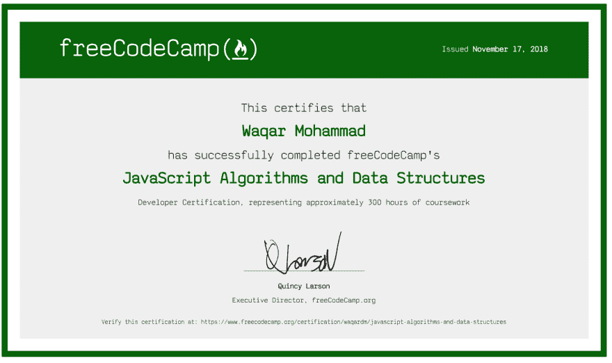
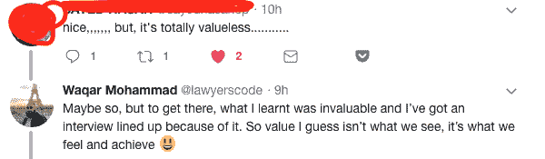
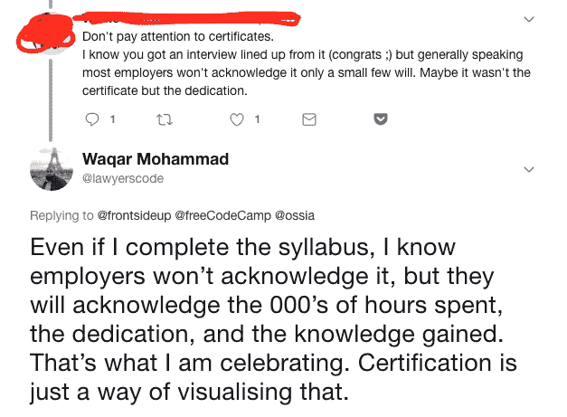

# 对所有与你们唱反调的人——无妨，我知道我的价值😃

> 原文：<https://dev.to/waqardm/to-all-ye-naysayers---its-ok-i-know-my-value--3fom>

[T2】](https://res.cloudinary.com/practicaldev/image/fetch/s--5NUSo7_E--/c_limit%2Cf_auto%2Cfl_progressive%2Cq_auto%2Cw_880/https://thepracticaldev.s3.amazonaws.com/i/ltpkk3ht3ridfnpj98fs.png)

我设法获得了我的第二个 Javascript 算法和数据结构的 FreeCodeCamp(FCC)认证，并在 twitter 上分享给了我的一小群粉丝。在我知道之前，由于昆西(FCC 创始人)对推特的回应，很少有人看到过它。

我对收到的大量好评和祝贺信息并不感到惊讶，因为这个社区太棒了。我确实吸引了几条不那么祝贺的推特。他们关注的是证书没有任何真正的价值——哼😒。虽然他们的推文并没有真正困扰我，但我认为分享我的回应很重要，这样其他遇到相同态度的人可以从更好的角度看待事情。

##### 推文 1

[T2】](https://res.cloudinary.com/practicaldev/image/fetch/s--i1FAolo4--/c_limit%2Cf_auto%2Cfl_progressive%2Cq_auto%2Cw_880/https://thepracticaldev.s3.amazonaws.com/i/yz2s99pdig4k4hx335yg.png)

##### 推文 2

[T2】](https://res.cloudinary.com/practicaldev/image/fetch/s--YI0b9B79--/c_limit%2Cf_auto%2Cfl_progressive%2Cq_auto%2Cw_880/https://thepracticaldev.s3.amazonaws.com/i/8fe7shs47y4ulnlzsr7a.png)

是的，从技术上讲，证书没有价值，但是我们的大学学位也没有价值，对吗？这些物品所包含的价值是我们投入的血、汗和泪。数百小时的努力和时间。牺牲。以及获得的知识。

所以如果有人试图贬低你的成就，让他们知道就好。但更重要的是，确保你确切知道你实现的每个里程碑意味着什么。像老板一样庆祝👑。

页（page 的缩写）如果你想成为支持新手社区的一员，就来加入我们的 [Discord](https://discord.gg/n7JNnK2)

编码快乐！

*感谢阅读。如果你想加入我的编码之旅，来打个招呼吧👋在推特上。可以找到我[@ lawyers code](https://twitter.com/lawyerscode)T3】*