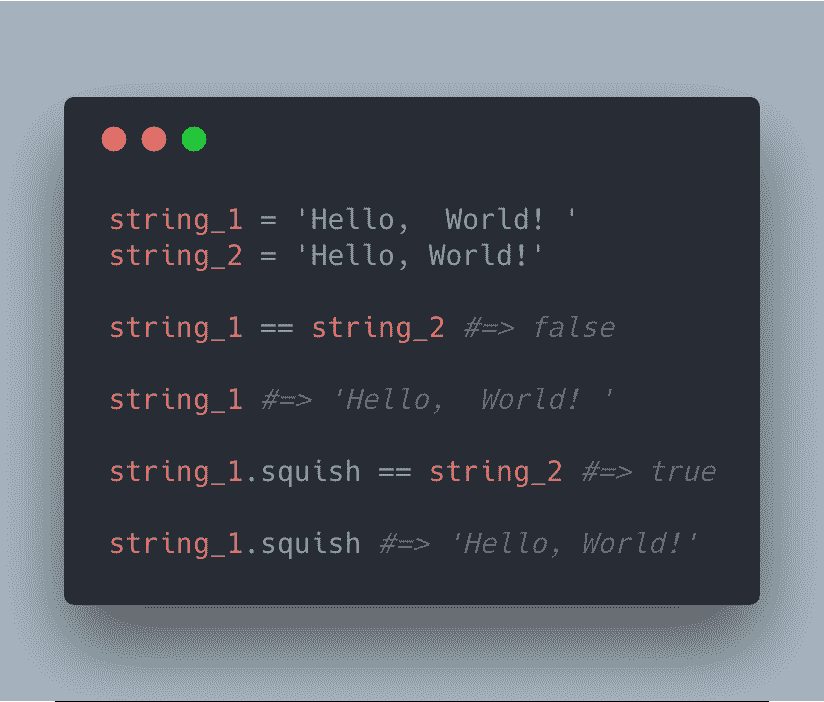

# 今天我用有史以来最好的方法名修复了一个 bug

> 原文：<https://dev.to/drbragg/today-i-fixed-a-bug-using-the-best-method-name-ever-1oco>

[T2】](https://res.cloudinary.com/practicaldev/image/fetch/s---f5Upp5j--/c_limit%2Cf_auto%2Cfl_progressive%2Cq_auto%2Cw_880/https://thepracticaldev.s3.amazonaws.com/i/55daqtvaj4qalihp1xwb.png)

对，没错，Rails 有个方法叫`squish`。我再也不会用`gsub`了

[T2】](https://res.cloudinary.com/practicaldev/image/fetch/s--qOcGTKWp--/c_limit%2Cf_auto%2Cfl_progressive%2Cq_66%2Cw_880/https://thepracticaldev.s3.amazonaws.com/i/m0pj2n9zm400zy8cxjqh.gif)