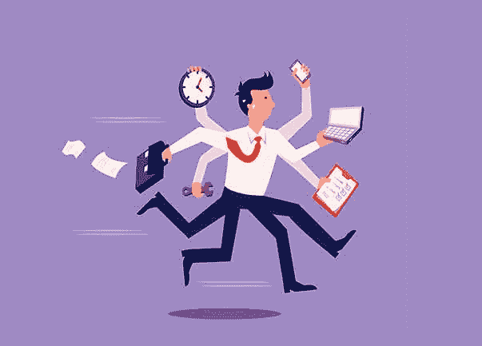

# 忙得没有时间保持健康

> 原文：<https://dev.to/brainfalls/too-busy-to-be-healthy-3cpp>

[T2】](https://res.cloudinary.com/practicaldev/image/fetch/s--YXqH1LtE--/c_limit%2Cf_auto%2Cfl_progressive%2Cq_auto%2Cw_880/https://thepracticaldev.s3.amazonaws.com/i/vakcjfyzy31s9xalwsuo.jpg)

你的日程很忙:工作、家庭、孩子等等。，而你总是感到疲惫和虚弱？你需要的是一个短时间的例行锻炼。毕竟，有锻炼总比没有好。有了 15 个阿敏日，你可能会从短期锻炼中受益。

## 有氧运动

仅仅 15 分钟的有氧运动总比没有强。你可以在家做，这样你就不必花时间开车去健身房或步行去公园。你可以在家训练，在你的后院冲刺，甚至在你的家里模拟 15 分钟的步行。如果你有二楼，试着上下楼梯，你会发现这是多么美妙的 15 分钟锻炼。你也可以在房子周围做一些跑步，结合俯卧撑和一些腹肌。全部在 15 分钟内完成。

如果你决定在附近散步来做有氧运动，选择一个方向，走 8 分钟。一旦你的表显示你已经走了 8 分钟，就马上回家。你还有 8 分钟的有氧运动。

脂肪团是脂肪沉积，需要清除。跑步(或散步)是减少脂肪团的最佳运动。此外，锻炼肌肉有助于消除脂肪团。简单的有氧运动，如弓步、深蹲和俯卧撑就能达到目的。一些轻微的举重也是有帮助的。别忘了多喝水，吃合理的低脂餐。

## 在家进行重量训练

除了跑步，你还需要做一些额外的锻炼来增强肌肉。不，我不是说要成为施瓦辛格，我只是想锻炼并增加那些大肌肉群。最简单的方法是做弓步、深蹲、跳跃深蹲、俯卧撑和一些腹部运动。你可以在网上找到很多关于如何正确操作的具体指导。你也可以举重，但是很简单。

一套便宜的砝码可以放在家里的车库或壁橱里。也许你已经有些体重了。用这些做短期锻炼。即使你没有重量，你也可以在家进行重量训练。试着把一个 5 磅重的面粉袋举过头顶几次，你就会看到你的手臂肌肉是如何锻炼出来的。

用你的身体进行重量训练。为什么不呢？毕竟你的身体有一些重量。如果你做俯卧撑，体重 150 磅，你必须从地板上抬起那个重量。或者如果你做深蹲一样的事情:你将不得不上下举起你 100 磅的重量。

另一个做家务的好运动叫做 dip。拿把椅子，靠墙放。坐下来。从椅子上滑下来，弯曲你的手臂，向地板方向降低你的身体。上下运动，你会通过这些倾斜锻炼出你的二头肌。

## 最终字

你一定会觉得自己更好，更健康。开始坚持节食，增加成功的机会。看看这个[选择健康快餐的 7 条建议](https://brainfalls.com/7-tips-for-making-healthier-fast-food-choices/)。
记住，健康在某些时候是金钱买不到的。