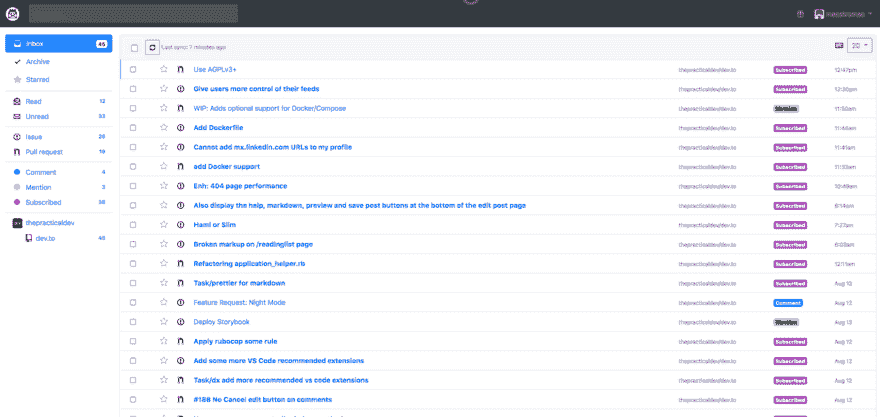
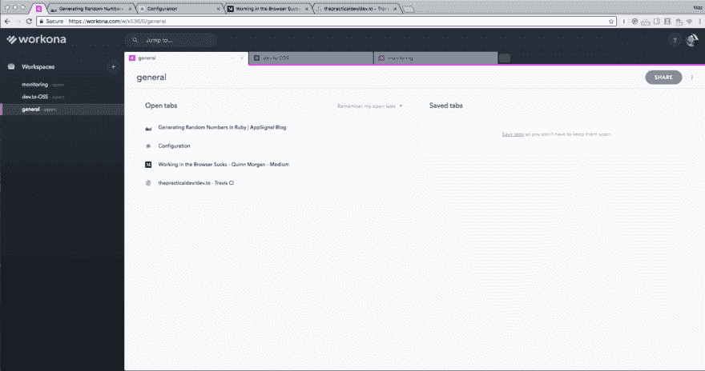

# 我用来掌握 Github 通知的工具

> 原文：<https://dev.to/maestromac/tools-i-use-to-stay-on-top-of-githubs-notifications-56mo>

为了维护一个活跃的开源社区，积极参与所有问题和请求是至关重要的。每样东西都应该看一看，不应该错过任何东西，但这说起来容易做起来难。在努力掌握这一切的过程中，这里有一些我用来保持理智和高效的应用程序。

## [github-通知](https://github.com/bkeepers/github-notifications)

我喜欢把 github-notifications 看作是普通通知页面的改进版。这个应用程序的主要亮点是它还提供了一个评论表格。这为查看所有未读通知提供了一种更好的方式。

## [【10th box】](https://octobox.io/)

 
将 Github 通知精简到类似电子邮件的界面中是管理通知的一种令人惊叹的方式。Octobox 提供了多种过滤选项和一个本地搜索功能。他们还增加了“存档”功能，允许你隐藏任何已完成的通知。

## [沃克纳](https://workona.com/)

 
有没有发现自己一期接一期地打开 GitHub，最终忘记了自己在做什么？这是一个相对较新的工具，刚刚出来解决这个问题。它已经改善了我的工作流程，减少了分心。Workona 提供了一种更简洁的方式来管理标签——现在您可以创建“工作区”,而不是保持多个窗口打开。到目前为止，我有 3 个工作区:一个用于一般浏览，一个专用于处理 Octobox 通知，一个用于生产监控。

这三个工具帮了我很大的忙。如果还有什么我应该尝试的，请在评论中告诉我。