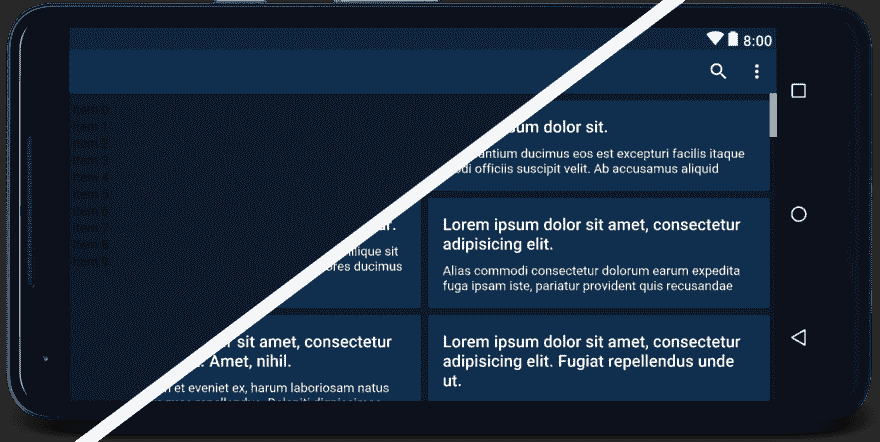

# 工具:title="LayoutPreview "

> 原文：<https://dev.to/vladimirwrites/toolstitlelayoutpreview-5ae9>

[T2】](https://res.cloudinary.com/practicaldev/image/fetch/s--d9qFnLEO--/c_limit%2Cf_auto%2Cfl_progressive%2Cq_auto%2Cw_880/https://cdn-images-1.medium.com/max/2000/1%2AKE1HSefSP2PFKHOcATMyow.png)

作为每一个 Android 开发者，我也开始通过将值硬编码到布局中来构建我的布局。后来，我意识到我应该将它们提取到资源中。下一步是不要在布局中有值，如果它们将从代码中被改变(总是在代码中保持视图的状态)。但是在那个时候，我的布局预览坏了。布局充满了没有文本的文本视图，`ImageViews`没有图像，等等。然后我发现了`tools:`的威力。一晃一年过去了，我的布局中充满了`tools:text="Test text"`、`tools:text="Jake Wharton"`、`tools:src="@drawable/ic_random_res"`……你懂的。你可能会问，有没有更好的方法？

其实是有的。这很简单。您可以使用预定义的示例资源来使您的布局预览美观整洁。通过使用这些，我们可以从这个: