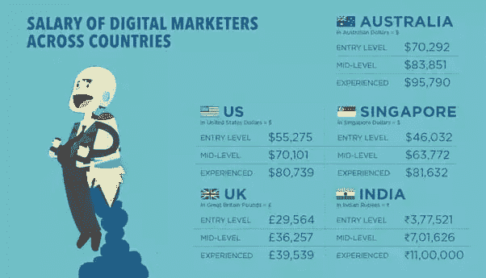

# 数字营销专家收入最高的 10 个国家

> 原文：<https://dev.to/tripathinair/top-10-high-paying-countries-for-digital-marketing-specialists-459g>

[T2】](https://res.cloudinary.com/practicaldev/image/fetch/s--Nd6MeIWh--/c_limit%2Cf_auto%2Cfl_progressive%2Cq_auto%2Cw_880/https://thepracticaldev.s3.amazonaws.com/i/0aruszclog1ormmqudaf.png)

21 世纪初，互联网出现在市场上，并逐渐在普通人中普及。大量使用互联网来简化我们的日常实践，产生了“在线”一词。这也给了商业部门一个新的希望，让他们可以在更大的范围内做一些新奇且有利可图的事情。

当我们着眼于今天的市场时，事情就像 cakewalk 一样顺利，这是互联网发展的一个福音。随着互联网和技术的进步，营销方式也发生了变化。手工营销链现在变成了媒体链。报纸广告以网页的形式出现，参与“绿色环保，少用纸”的革命。严肃地说，所有的在线标记实践都将它们在市场中的位置设定为“数字营销”,即众所周知的互联网营销。为了培养熟练的数字营销专业人员，许多数字营销培训机构变得非常积极地承担起这一责任。

**企业数字营销的优势**

为了使业务流程比以往更加简单，数字营销改变了 ROI(投资回报)和利润的核心基因组。让我们来关注一下相关的优势—
、双向互动(B2C 和 B2B)
、全球影响力
、成本效率
、可定制化
、可追踪和可衡量
、对所有人开放。

**为什么要进行数字营销？**

随着营销策略和实践的发展，顾客的行为也发生了转变。五年前在线下搜索产品和服务的顾客现在开始浏览网络和社交媒体。不是一个论坛，而是大量的社交论坛现在被用作虚拟商店，有数以千计的选项，有描述、定价结构和最好的论点陈述。好消息是，客户发现这个虚拟市场很吸引人，并对其服务感到满意。

年复一年，互联网、智能手机和社交媒体用户的数量在成倍增长，因此将数字营销的紧迫性推到了一定的高度。数字营销不仅仅是互动的，它还为你提供了目标，让你能够满足客户的需求，并在服务高端用户满意度的领域脱颖而出。

**有限的数字资源到处都是**

这些天来，中小型企业不断涌现，创新理念不断成形，因此市场过度拥挤。这不仅是去年企业数量的数倍，也是数字营销需求的倍增。为了满足对数字营销的渴望，整个市场现在都在寻找真正的人才和经验。因此，对熟练的数字营销专家的需求比任何其他职业都要高。
讽刺的是，资源不足以满足市场的花式。报告指出，数字营销职业的潜在求职者的保守心态。但我敢打赌，下面的分析报告将会让他/她大吃一惊，投身于数字营销行业。
我们来看看——

[T2】](https://res.cloudinary.com/practicaldev/image/fetch/s--6p-_AAGo--/c_limit%2Cf_auto%2Cfl_progressive%2Cq_auto%2Cw_880/https://thepracticaldev.s3.amazonaws.com/i/t1y2f0l5wja8cyynbb2n.png)

现在可以肯定的是，你们中的一些人一定已经计划开始你的数字营销生涯。那么，我们来讨论一下数字营销培训机构。每个人都称赞技能、知识和创造力。在数字营销中，由于市场的开放性，这三者甚至具有更高的价值。因此，加入最好的数字营销机构是明智的，它不仅传授营销专业知识，还提供认证。

**成为数字营销专家的称号**

数字营销分析师/执行官
数字营销经理
数字营销主管
数字营销专员
数字营销协调员
Adwords 专员/经理
数字营销 PPC 分析师
总经理-数字营销
品牌广告-数字营销执行官
主管- SEO 分析师
数字内容营销人员
数字营销官员
社交媒体营销主管
社交媒体分析师
数字营销网络专家等等

**数字营销——印度海得拉巴的热门职业**

打开谷歌浏览器，搜索“2018 年海德拉巴数字营销工作报告”。一个令人瞠目结舌的结果！！！是的，大约是海得拉巴特伦甘纳附近的 264，000，000 个结果。

这是你应该选择数字营销职业的原因。报告称，顶级公司中 91%的招聘经理认为证书是关键的招聘标准。因此，来自海德拉巴著名数字营销培训机构的数字营销认证是必须的。

在海得拉巴有数百个[数字营销课程，轮到你为最好的学院进行深度研究了。然而，下面是一些要点，你可以考虑，而得到一个在线培训机构。看一看–](https://www.geekschip.com/training/hyderabad-india/digital-marketing-training-course-in-hyderabad.html)

数字营销认证
培训材料协助
安置协助
面向行业的课程设置
行业专家培训师
综合数字营销课程(SEO、SEM、SMM、SMO、PPC、ORM、ASO、内容营销)

因此，规划你的职业生涯时，请牢记数字营销的未来范围，并祝你拥有美好的未来。