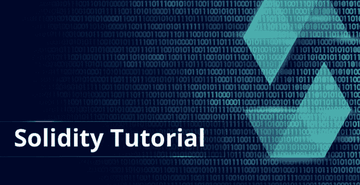

# 十大可靠性教程

> 原文：<https://dev.to/charumalikcs/top-10-solidity-tutorials-1495>

首先，Solidity 是一种面向合同的编程语言，是为在各种区块链平台上编写智能合同而发明的。你已经知道了！对！我的意思是，这就是为什么你在这里知道你可以添加到你的学习清单上的前 10 名坚实度教程。

以太坊是目前领先的区块链平台之一。事实上，Solidity 是专门为开发以太坊专用程序而发明的。Solidity 是一种强大的面向契约的编程语言，每天都在吸引新的学习者。
 
你可能已经意识到加密货币已经流行了好几年了。虽然这场辩论的双方各持己见，有赞成的也有反对的，但与此同时，有几个区块链平台正在崛起。以太坊就是其中之一。事实上，以太坊组织在区块链分散应用市场中占有很大一部分份额。对绘制区块链版图感兴趣的新开发人员需要能够构建分散式应用程序，也称为 Dapps。

要做到这一点，他们需要首先学会稳固。尽管它与 javascript 非常相似，但像任何其他编程语言一样，可靠需要理解和经验。

互联网上有几个教程，但是，显然不是每一个都很好。这就是为什么我们在这里帮助你整理混乱，并通过其中最好的。

因此，这里有 10 个最可靠的教程，你可以用它们来提高你的智能合同写作技巧，还可以做更多的事情:

**Solidity Development:创建我们的第一份智能合同 Nikita Fedosenko**
请访问-[https://medium . com/coin monks/Solidity-Development-Creating-our-First-Smart-Contract-54943 b47d 7 F3](https://medium.com/coinmonks/solidity-development-creating-our-first-smart-contract-54943b47d7f3)

为撰写您的第一份智能合同而激动吗？尼基塔·费多先科的这个教程可以让你以密码游戏的形式写一份智能合同。本教程一步一步地指导你如何编写正确的 Solidity 代码。此外，所有术语在 smallish 教程中都有很好的解释。

**如何学习坚固性:终极以太坊编码教程瑞安·莫莱克**
前往——[https://blockgeeks.com/guides/solidity/](https://blockgeeks.com/guides/solidity/)
除了传授关于坚固性的重要信息，本教程还将讲解关于以太坊的内容。本教程重点介绍如何在以太坊平台上使用 Solidity。本教程将设置环境和编写第一个 Solidity 智能脚本合二为一，增加了关于 Solidity 和以太坊的重要补充信息。

**链表 in Solidity 作者 Austin Thomas Griffith**
前往——[https://medium . com/coin monks/Linked-Lists-in-Solidity-CFD 967 af 389 b](https://medium.com/coinmonks/linked-lists-in-solidity-cfd967af389b)
无论是什么编程语言，链表的概念一直是优先考虑的问题。对于坚固性也是如此。奥斯汀·托马斯·格里菲斯的《可靠度教程》中的链表成功地简化了这个概念，并用恰当的实例进行了说明。教程回答了关于链表的所有问题，从你为什么应该使用它到你应该如何正确地使用它。

**学习 Solidity:教程 8 使用 Remix 调试 Solidity by What ' s Solidity**
前往-[https://www.youtube.com/watch?v=7z52hP26MFs&list = pl 16 wqdaj 66 scodl 6 sifbke-xqg 2 GW _ Avg&index = 8](https://www.youtube.com/watch?v=7z52hP26MFs&list=PL16WqdAj66SCOdL6XIFbke-XQg2GW_Avg&index=8)
Remix 是一款开源工具，有助于从浏览器直接使用 Solidity 编写智能合同。教程告诉你如何使用 Remix 提供的调试功能。这个 10 分半钟长的教程很简单，充满了例子，使它更容易学习。此外，What's Solidity 在 YouTube 上提供了许多其他免费的 Solidity 教程。

**Solidity variables and Types(Smart Contract Tutorial)by design 课程**
前往——[https://www.youtube.com/watch?v=QdG9xsOolJ4](https://www.youtube.com/watch?v=QdG9xsOolJ4)
无论你需要学习和掌握哪种编程语言，对变量及其类型有很好的理解都是必不可少的。为了帮助你理解和欣赏 Solidity 中可用变量和类型，DesignCourse 的这个教程是一个合适的选择。本教程略多于 14 分钟，用几个实例说明了上述内容。

**学习坚固性:教程 27 使用 Metamask 开始浏览器开发由 What's Solidity**
转到-[https://www.youtube.com/watch?v=eog2eYrPEu0](https://www.youtube.com/watch?v=eog2eYrPEu0)
meta mask 是一个基于浏览器的坚固性编辑器，被认为是最好的编辑器之一。许多 Solidity 开发者依赖 Metamask 来开发基于 Solidity 的程序。有了 What's Solidity 的这个教程，你就可以马上开始用 Metamask 开发浏览器了。这个将近 25 分钟的教程阐明了一些与浏览器开发和元掩码相关的重要概念。

**Solidity 简介:创建数据契约(第一部分)作者:科姆哈尔**
前往——[https://blockgeeks.com/introduction-to-solidity-part-1/](https://blockgeeks.com/introduction-to-solidity-part-1/)
这可能是开始使用 Solidity 的最佳教程之一。纯文本教程涵盖了所有的坚实基础，包括环境创建和设置。除了提供对可靠性的启发性见解之外，本教程还提供了创建数据契约的精确而清晰的演示。

**以太坊建造者指南**
前往-[https://ethereumbuilders . git books . io/Guide/content/en/solidity _ tutorials . html](https://ethereumbuilders.gitbooks.io/guide/content/en/solidity_tutorials.html)
互联网上最全面的 Solidity 全文教程之一。本教程不仅帮助你设置 Solidity，而且帮助你在 MacOS，Ubuntu 和 Windows 上安装 Ethereum 客户端。本教程进一步探讨了以太坊 API 和智能合约。

**坚实的基础**
前往——[https://ethereumdev.io/](https://ethereumdev.io/)
【坚实的基础】直接从实验室开始，是一个多方面的教程，它将帮助您了解各种各样的概念，包括以太坊钱包和合同的生命周期。此外，本教程还涵盖了编写分散式应用程序的概念。为了理解本教程，你需要有基本的理解以及使用 Solidity 的经验。

**第一课:通过隐型僵尸制作僵尸工厂**
前往——[https://cryptozombies.io/en/lesson/1](https://cryptozombies.io/en/lesson/1)T5】这是互联网上最令人惊叹的坚固性教程之一。当谈到使用可靠性制作游戏时，隐型僵尸是领先的导师之一。本教程也是更大的 Cryptozombie 游戏制作教程的第一步，通过精确的演示和插图，让你理解各种可靠性概念。

只要浏览一下教程，你就能欣赏到可靠性。这些教程不仅对新手来说很棒，对拥有良好 Solidity 体验的开发者来说也很棒。然而，像任何其他编程语言一样，你投入的时间越多，做的工作越多，你就会变得越好。所以，坚持下去很重要。
如果你对上面这么多建议感到困惑，可以在 Hackr.io 上找到学习者推荐的最好的[坚固度教程](https://hackr.io/tutorials/learn-solidity)

快乐扎实学习！