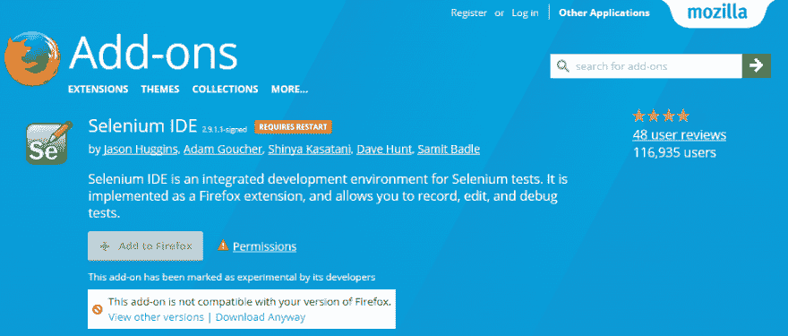
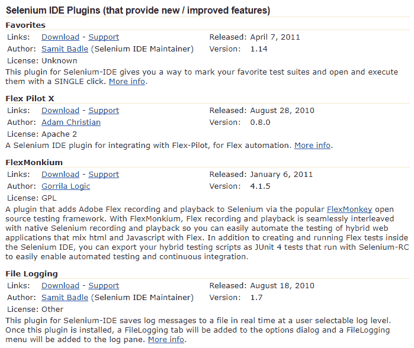
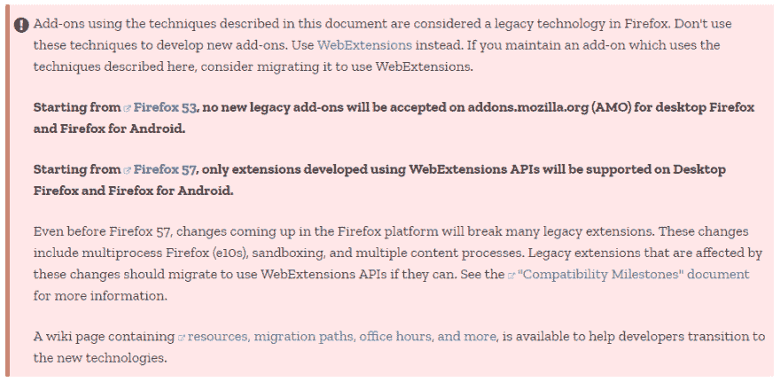

# Firefox 和 Chrome 的三大 Selenium IDE 替代方案。

> 原文：<https://dev.to/executeautotest/top-3-selenium-ide-alternatives-for-firefox--chrome-3hha>

亲爱的 Selenium IDE 用户:

这对测试者社区来说是个坏消息，因为从 Firefox 55 开始， [Selenium IDE 就不再工作了。Selenium IDE 是有史以来使用最广泛的自动化测试工具之一，因此，这一停止提高了寻找其他 Selenium IDE 替代品的需求。](https://seleniumhq.wordpress.com/2017/08/09/firefox-55-and-selenium-ide/?utm_source=feedburner&utm_medium=feed&utm_campaign=Feed%3A+Selenium+%28The+Official+Selenium+Blog%29)

Selenium IDE 替代方案，或 Selenium IDE 替代方案，指的是被认为是可行的替代方案的自动化测试工具，自动化测试工具必须在功能、安装和设置的简易性、学习曲线和成本方面与 Selenium IDE 相当。

[T2】](https://res.cloudinary.com/practicaldev/image/fetch/s--MBYQWM2i--/c_limit%2Cf_auto%2Cfl_progressive%2Cq_auto%2Cw_880/https://d1h3p5fzmizjvp.cloudfront.net/wp-content/uploads/2017/09/28151904/1_JidOCWgcbQtICstuEJ3wAw.png)

下面是 Selenium IDE 的一些潜在继任者。但首先，让我们回到这个优秀解决方案的旧时代。

## **1。硒 IDE 历史**

 
Selenium 最初是 Jason Huggins 在 2004 年作为 ThoughtWorks 的内部工具开发的。后来，Huggins 和 ThoughtWorks 的其他程序员和测试人员一起加入了该团队，之后 Paul Hammant 加入了该团队，并指导了后来成为“Selenium Remote Control”(RC)的第二种操作模式的开发。该工具是当年开源的。

2005 年，Dan Fabulich 和 Nelson Sproul(在 Pat Lightbody 的帮助下)提出接受一系列补丁，将 Selenium-RC 改造成它最著名的产品。在同一次会议上，Selenium 项目的指导将继续作为一个委员会，Huggins 和 Hammant 是 ThoughtWorks 的代表。

2006 年，硒 IDE 由日本 Shinya Kasatani 捐赠给硒项目。他创建了 Selenium 作为 Firefox 的扩展，可以通过录制和回放功能自动化浏览器。他想出这个主意来进一步提高创建测试用例的速度。

2007 年，哈金斯加入谷歌。他和詹妮弗·比万等人一起，继续开发和稳定 Selenium RC。与此同时，ThoughtWorks 的西蒙·斯图尔特(Simon Stewart)开发了一款名为 WebDriver 的高级浏览器自动化工具。2009 年，在谷歌测试自动化大会上，开发人员开会后决定合并这两个项目，并将新项目称为 Selenium WebDriver，或 Selenium 2.0。

[T2】](https://res.cloudinary.com/practicaldev/image/fetch/s--DxOS0Aih--/c_limit%2Cf_auto%2Cfl_progressive%2Cq_auto%2Cw_880/https://d1h3p5fzmizjvp.cloudfront.net/wp-content/uploads/2017/09/28153501/philippe-hanrigou.jpg)

2008 年，Philippe Hanrigou(当时在 ThoughtWorks)开发了“Selenium Grid”，它提供了一个中枢，允许在任意数量的本地或远程系统上同时运行多个 Selenium 测试，从而最大限度地减少测试执行时间。作为开源，Grid 为 Selenium RC 提供了类似于内部/私有 Google cloud 的功能。Pat Lightbody 已经为“HostedQA”开发了一个私有云，并将其出售给了 Gomez，Inc .

## **2。什么是硒 IDE？Selenium IDE 为什么这么成功？**

Selenium IDE 是一个用于 web 应用程序的便携式软件测试工具。它是开源的 Firefox 插件，web 开发人员和测试人员可以免费下载使用。

最初，Selenium IDE 应该是一个快速原型开发工具，它不为测试脚本提供迭代或条件语句。但是它可以通过自己的插件系统为用户提供不同的扩展点。由于随着时间的推移引入了各种插件，Selenium IDE 现在成为了一个功能全面的自动化测试工具。

Selenium IDE 不仅支持记录和回放功能，还提供了其他特性:脚本、调试、报告等。Selenium IDE 拥有最常用的全套功能，是测试人员节省测试项目时间的完整工具。

[T2】](https://res.cloudinary.com/practicaldev/image/fetch/s--OEwQOUeG--/c_limit%2Cf_auto%2Cfl_progressive%2Cq_auto%2Cw_880/https://d1h3p5fzmizjvp.cloudfront.net/wp-content/uploads/2017/09/28155141/Selenium-IDE%25E2%2580%2599s-plugin-page.png)

Selenium 团队表示，Selenium 开发人员鼓励测试自动化中的最佳实践，这需要使用一种受支持的编程语言进行一定量的编程。然而，这也有缺点:大多数构建在 Selenium 之上的测试框架都是以开发人员为中心的。因此，他们需要额外的努力来安装和配置编程语言运行时和组件，然后测试人员才能进行项目。

由于关键的进入壁垒和过度的学习曲线，许多公司更喜欢具有自动化测试综合功能的商业解决方案(如 UFT 或 TestComplete)，即使这些选项是昂贵的，底层引擎可能不如 Selenium WebDriver。

同时，硒 IDE 仍然是那些坚持硒的人的完美选择。此外，对于拥有少量自动化测试用例的测试工程师团队来说，Selenium IDE 也可以作为一个独立的工具，完全支持他们的自动化项目。

虽然稳定，Selenium IDE 建立在 Firefox 的附加平台上，这在当时是好的，但现在已经不是了，因为 Firefox 已经失去了主导地位。Chrome 的附加平台与 Firefox 的完全不兼容，而且没有任何资源，没有一次尝试将 Selenium IDE 移植到其他网络浏览器。

当 Mozilla 在今年年底决定[关闭旧的附加平台](https://developer.mozilla.org/en-US/Add-ons/Overlay_Extensions/Firefox_addons_developer_guide)时，人们普遍认为 Selenium IDE 在不久的将来将不复存在。测试工程师必须寻找其他的东西。

[T2】](https://res.cloudinary.com/practicaldev/image/fetch/s--sybQ0Mqh--/c_limit%2Cf_auto%2Cfl_progressive%2Cq_auto%2Cw_880/https://d1h3p5fzmizjvp.cloudfront.net/wp-content/uploads/2017/09/28155504/Mozilla%25E2%2580%2599s-announcement-of-its-platform-changes.png)

由于 Selenium IDE 的出色体验，Selenium 不再局限于不负责测试的开发人员社区。相反，它成为软件测试人员的神奇解决方案。

## **3。可行的硒 IDE 替代品:**

[**3.1。机器人框架:**](http://robotframework.org/)
**优点:**

–使用以表格格式编写的关键字测试方法生成测试案例。

–它还包含 Robot Integrated Development Environment(RIDE ),通过提供特定于框架的代码完成、语法突出显示等功能，帮助轻松编写测试用例。

**缺点:**

–复杂的安装，缺乏独立的测试记录器工具，以及描述性低的关键字驱动语言。

[**3.2。量角器:**](https://www.protractortest.org/#/)
**优点:**

–简单的安装和更新。在 1-2 条命令内，测试框架和 Selenium WebDriver 都将被很好地安装。

–使用 JavaScript，这是最容易学习的编程语言之一，尤其是对于那些编程背景有限的人来说。

**缺点:**

–量角器过于灵活，但也毫无准备。它需要有经验的开发人员在团队开始之前参与进来:建立项目和适当的报告插件，并编写页面对象框架。

–量角器团队可能会弄乱同步/异步的东西。

[**3.3。卡塔龙工作室**](https://www.katalon.com/)
**优点:**

–安装体验:用户只需解压软件包，即可开始安装。没有编程语言运行时。不需要额外的组件或插件。

–[脚本接口](https://www.katalon.com/resources-center/tutorials/create-test-case-using-script-mode/)允许用户在基于关键字的表格和代码编辑器之间切换。这对于那些想要学习自己编写 Selenium 测试用例的人来说非常有用。

–与 Selenium IDE 不同，Katalon Studio 的[录制功能](https://www.katalon.com/resources-center/tutorials/create-test-case-using-web-recorder-utility/)在主要的网络浏览器上非常强大:Chrome、Firefox 和 IE。

–Katalon Studio 可被视为可行的 Selenium IDE 替代产品，因为它提供了其他方便的功能(报告和集成)，可与付费解决方案(UFT，TestComplete)相媲美。

**缺点:**

–虽然 web 和移动测试非常全面，但一些用户可能希望在 API 测试模块中看到更多内容。

*更新:*

* * *

Katalon 工作室团队已经为 Chrome 和 Firefox 引入了 Katalon 自动化记录器扩展。这个扩展是 Katalon 工作室黑客马拉松比赛的冠军项目。Katalon Automation Recorder 的开发是为了支持那些不再能够使用过时的 Selenium IDE 记录和回放自动化测试的用户，或者那些正在寻找一个方便的记录器的流行开源框架的用户。该扩展与 Chrome 和最新的 Firefox 浏览器兼容，我们将继续开发以支持新版本。

您可以使用该扩展来捕获 web 元素并记录 web 应用程序上的操作，从而轻松地生成测试用例。直观的界面允许用户快速编辑、调试和播放测试用例及测试套件。

Selenium IDE 生成的 Selenese 脚本也可以加载到 Katalon Automation Recorder 中，导出为流行的语言和格式:C# (NUnit)、Java (TestNG 和 JUnit)、Ruby (RSpec)、Python (unittest)、Groovy (Katalon Studio)、Robot Framework。[了解更多](http://forum.katalon.com/discussion/4056/quick-guide#latest)！

* * *

**结论:**

Selenium 和 Selenium IDE 是重大改变了自动化测试历史的伟大技术。虽然 Selenium IDE 不再活跃，但我相信伟大的开发人员会继续致力于开发好的 Selenium IDE 替代品，并使软件测试每天都变得更好。

原文:【Firefox 的三大硒 IDE 替代品& Chrome