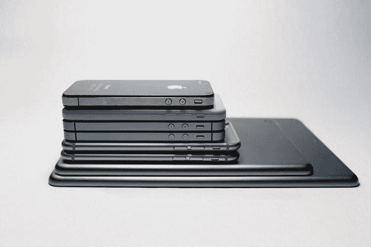

# 2018 年五大移动应用发展趋势

> 原文：<https://dev.to/xongolabtechno/top-5-mobile-app-development-trends-2018-19ce>

[T2】](https://res.cloudinary.com/practicaldev/image/fetch/s--iI0WrI8E--/c_limit%2Cf_auto%2Cfl_progressive%2Cq_auto%2Cw_880/https://www.xongolab.com/blog/wp-content/uploads/2017/08/mobile-application-development.jpeg)

移动应用行业在去年见证了一段不平凡的历程。如果我们看看统计数据，2017 年有超过 2540 亿个免费应用被下载。你知道 25 岁以上的成年人一天使用智能手机 264 次，包括发短信和打电话吗？嗯，这是难以置信的，但今天的残酷现实。

无论是简单地查看电子邮件、听音乐、播放视频、社交媒体还是学习字母，人们都倾向于依赖不同的移动应用程序，并期待日新月异的创新。因此，[移动应用程序开发](https://www.xongolab.com/mobile-apps-development-services/)和移动设备的复杂性不断提高，管理起来更加有用，但也更加繁琐。

事实上，去年我们已经讨论了很多关于移动行业如何影响企业和个人的问题。如今，移动应用开发不再是一种选择，而是企业在市场中生存的必要条件。

如今，随着 2017 年人工智能、增强现实和虚拟现实的出现，移动用户更加注重技术，并期待通过移动应用进行创新，未来一年这些应用会是什么样子？2018 年大家应该警惕的移动应用发展趋势有哪些？嗯，我们有一堆可能的移动应用开发趋势，可以帮助你在 2018 年实现目标。

**1。增强现实是去年的新闻，今年也将继续落地！**
去年，随着谷歌和苹果分别推出 ARCore 和 ARKit，谷歌和苹果正在不分上下地赢得增强现实之战。这是两个坚如磐石的平台，任何专业的移动应用开发公司都可以利用它们来为他们的客户开发增强现实应用。

凭借提供引人注目的用户体验的巨大能力，基于 AR 的移动应用将成为企业和创新者在 2018 年吸引潜在用户注意力的关键。

**2。物联网和可穿戴应用是 2018 年的下一件大事...**
如今，智能城市、智能家居、智能健康和工业物联网的概念正在市场上快速增长。无论是什么，无论是关于健康产业、教育还是智能家居，物联网和可穿戴移动应用都将在 2018 年大放异彩。

当然，物联网还不够成熟，可能需要一些时间来跟上步伐，但它会在这里玩得更久，而且肯定会。另一方面，智能手表和其他联网可穿戴设备等可穿戴应用在过去几年中产生了巨大的影响。随着苹果和谷歌等科技巨头的出现，可穿戴应用在未来几年还有待进一步探索。

**3。更智能，但安全的应用程序将主宰市场！**
当然，移动用户需要借助增强现实[或人工智能](http://designwebkit.com/web-and-trends/5-top-augmented-reality-tools-developers/)的创新应用，但在安全性方面，他们更聪明！我们谈论台式机和笔记本电脑上的恶意软件或病毒的日子已经一去不复返了。因为今天，智能设备是终端用户必须执行所有活动的唯一设备。

如今，黑客可以轻而易举地侵入智能手机和平板电脑，使移动应用程序容易受到攻击并窃取机密信息。因此，移动应用程序开发服务应该关注应用程序的安全性，并设计能够检测移动设备可能面临的威胁的应用程序。对于 Android 用户以及拥有 BYOD 战略以在 2018 年减轻安全风险的组织来说，这种安全性将更加相关和合适。

**4。2018 年，人们想要更多的按需移动应用...**
在 2017 年，按需移动应用已经成功获得了移动用户的关注，并使他们的生活变得更加轻松。嗯，这已经形成了一种新的趋势，今天的人们希望未来有更多的按需移动应用。背后的原因是，我们可以在方便的时候，在任何我们想去的地方使用这样的应用程序。

优步、豆荚和 Airbnb 的成功鼓励了许多个人和小企业主去追求这种按需提供服务的独特理念。无论是订餐、洗车、出租车服务还是洗衣，越来越多的初创企业希望在未来一年利用按需移动应用开发。

**5。借助“加速移动页面”更好地加载网页...**
2018 年最后一个值得关注的趋势是——加速移动页面。这是一种在移动应用设备中提高网页加载时间的新方法。从最终用户体验的角度来看，这真的可以增加跳出率，改善对话，为你的移动网页留住访问者。

如果你是一名开发人员或从事在线业务，加速移动页面是 2018 年最值得关注的趋势之一。因为它来自谷歌本身，它将帮助你获得更高的移动设备和搜索引擎的好处！！！