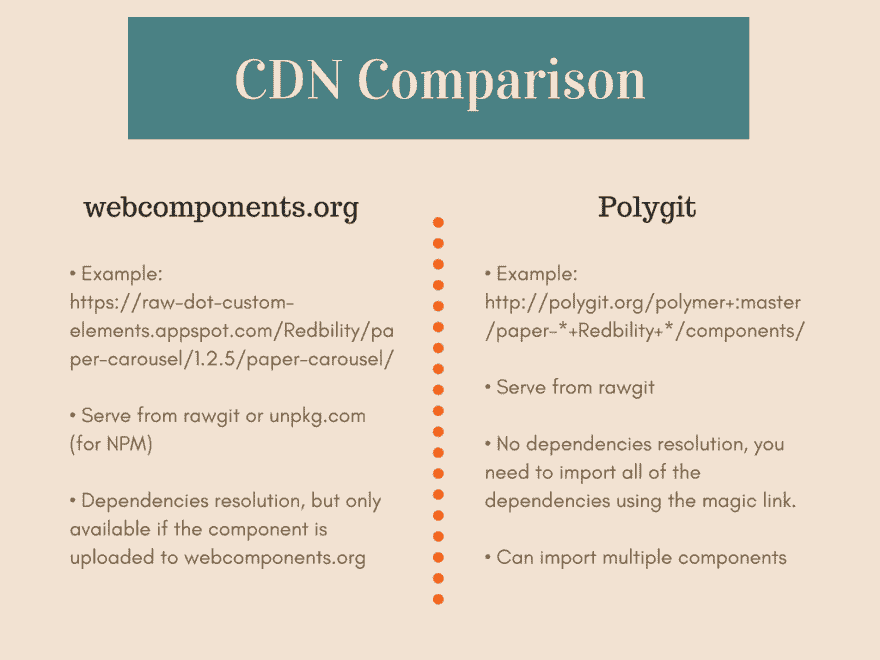

# 我在测试 696 个 web 组件时遇到的 5 大障碍

> 原文：<https://dev.to/thisisbinh/top-5-obstacles-i-faced-in-testing-696-web-components-1e13>

[T2】](https://res.cloudinary.com/practicaldev/image/fetch/s--S03ko__K--/c_limit%2Cf_auto%2Cfl_progressive%2Cq_auto%2Cw_880/https://thepracticaldev.s3.amazonaws.com/i/fu0hobuwz6ahci3vcjo4.jpg)

###### *图片来源:thoughtsofsocent*

继我的上一部[自传](https://dev.to/binhbbbb/the-story-of-a-man-who-has-tested-696-web-components-af8)之后，我答应发布一个关于我在测试 web 组件时遇到的最大障碍的故事。

事实是，当组件的数量达到数百个时，您会遇到成千上万个这样的障碍。在这个故事中，我将指出 10 个最常见的障碍。

### 没有可靠的内容分发网络(CDN)

简而言之，CDN 为网站提供快速、高效和安全的内容交付。要在 CodePen、JSFidde 或 JSBin 等网站上进行远程测试，非常需要一个可靠的 CDN。

否则，您需要在本地测试它，这包括下载源代码、安装依赖项和在网站上提供演示(我说这是三倍的工作量，如果不是更多的话)。

[T2】](https://res.cloudinary.com/practicaldev/image/fetch/s--02CQh1WS--/c_limit%2Cf_auto%2Cfl_progressive%2Cq_auto%2Cw_880/https://thepracticaldev.s3.amazonaws.com/i/zi4sjmtgm8pboxu94gwi.jpg)

### 依赖关系的导入链接不一致

大多数情况下，您会看到 HTML 导入是

`<link rel="import" href="../google-map/google-map.html">`

或者

`<link rel="import href="bower_components/google-map/google-map.html">`

那么，哪一种才是正确的方式呢？

答案是他们都是正确的。在本地开发时，bower_components 是包含所有依赖项的文件夹。因此，从那里导入代码是合乎逻辑的，当你想在 CodePen 上做演示时，问题就来了，没有 bower_components 文件夹，因为它只安装在本地。

# [ 如何通过凉亭 #11](https://github.com/webcomponents/polymer-boilerplate/issues/11) 

 **[zenorocha](https://github.com/zenorocha)** posted on [<time datetime="2014-03-20T23:30:48Z">Mar 20, 2014</time>](https://github.com/webcomponents/polymer-boilerplate/issues/11)

当我们停止使用 CDN 并开始使用 Bower 时，我们提交了这个默认的`bower_components`文件夹(现在称为`lib`)。

我们做出这个决定是因为我们希望人们能够从一开始就展示他们的元素，并轻松地调试它们。

然而，这导致了可重用性问题。它们不能与 Bower 共享，也不能被其他应用程序使用。

[View on GitHub](https://github.com/webcomponents/polymer-boilerplate/issues/11)

Polymer 提出了相对路径服务风格，使在线和本地测试保持一致。webcomponents.org CDN 的表现也非常相似。因此，如果您使用 Polymer 开发 web 组件，总是使用相对路径进行导入，并使用命令 polymer serve 进行服务。

### 人们通常会忘记导入聚合填充

尽管现代浏览器在实现 Web 组件标准方面取得了进展，但并不是所有的技术都得到本地支持。我测试的时候，到目前为止只有 Chrome & Opera 原生支持 Web 组件。其余的提供部分支持，通常需要聚合填充 webcomponentsjs 来使 web 组件正常工作。

## [web components](https://github.com/webcomponents)/[web components js](https://github.com/webcomponents/webcomponentsjs)

### 一套支持 HTML Web 组件规范的 polyfills

<article class="markdown-body entry-content container-lg" itemprop="text">

## <g-emoji class="g-emoji" alias="rotating_light" fallback-src="https://github.githubassets.cimg/icons/emoji/unicode/1f6a8.png">🚨</g-emoji>移至 [`webcomponents/polyfills/packages/webcomponentsjs`](https://github.com/webcomponents/polyfills/tree/master/packages/webcomponentsjs) <g-emoji class="g-emoji" alias="rotating_light" fallback-src="https://github.githubassets.cimg/icons/emoji/unicode/1f6a8.png">🚨</g-emoji>

[`webcomponents/webcomponentsjs`](https://github.com/webcomponents/webcomponentsjs) 回购已经迁移到 [`webcomponents/polyfills`](https://github.com/webcomponents/polyfills) <g-emoji class="g-emoji" alias="monorail" fallback-src="https://github.githubassets.cimg/icons/emoji/unicode/1f69d.png">的 [`packages/webcomponentsjs`](https://github.com/webcomponents/polyfills/tree/master/packages/webcomponentsjs) 文件夹中🚝</g-emoji> *monorepo* 。

我们正在*积极*将未决问题和 PRs 迁移到新的回购协议。新发行和 PRs 应在 [`webcomponents/polyfills`](https://github.com/webcomponents/polyfills) 备案。

</article>

[View on GitHub](https://github.com/webcomponents/webcomponentsjs)

开发人员经常忘记在演示中导入 polyfill。因此，除了 Chrome 或 Opera，这些示例不能在任何浏览器上运行。

### 没有演示或文档

我看到了许多项目，在没有演示和一个如何使用它的单词的情况下发布。考虑到元素是由作者自己的使用方式创建的，这是非常粗心的。很多时候，我必须阅读源代码，并弄清楚如何使用它。

[T2】](https://res.cloudinary.com/practicaldev/image/fetch/s--gQAYHeqz--/c_limit%2Cf_auto%2Cfl_progressive%2Cq_auto%2Cw_880/https://thepracticaldev.s3.amazonaws.com/i/yxv5sy0sfhsz7mzqp52p.jpg)

### 命名约定很重要

即使不是正式的，将你的主要组件命名为与你的项目相同的名字也是一个好的习惯。例如，我遇到过这样的情况，其中主要元素被命名为 skeleton-layout.html，而项目被命名为良好组件。那些项目让我非常困惑。

[T2】](https://res.cloudinary.com/practicaldev/image/fetch/s--4zUjEWEp--/c_limit%2Cf_auto%2Cfl_progressive%2Cq_auto%2Cw_880/https://thepracticaldev.s3.amazonaws.com/i/twy1wckm6qxze276c9aa.jpg)

### 最终字

> “测试产品是一个学习的过程”——布莱恩·马里克

这次旅行最大的好处是，我可以学到人们经常犯的错误，这些错误通常会被正常人忽略。我喜欢这个过程，如果有机会，我还会继续下去。

这是我在开始提到的最后一本自传，它是一篇 4 分钟的阅读。请随意查看。

## 文章不再可用

如果您有任何关于测试 web 组件的问题，请随时 PM 或给我发电子邮件。

*   *更多关于 Web 组件的新闻和文章，请在 Twitter 上关注我 [@binhbbbb](https://twitter.com/binhbbbb)*
*   如果你想尝试 Web 组件，请查看系列 [Web 组件星期三](https://vaadin.com/blog?tag=wcw)，在那里我向初学者介绍并解释了易于使用的 Web 组件。