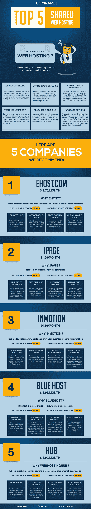
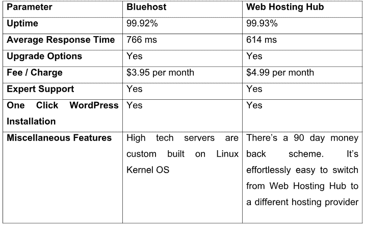

# 前 5 名共享主机比较

> 原文：<https://dev.to/maloneygraham1/top-5-shared-hosting-comparison-4cdl>

[T2】](https://res.cloudinary.com/practicaldev/image/fetch/s--fxWV47E0--/c_limit%2Cf_auto%2Cfl_progressive%2Cq_auto%2Cw_880/https://thepracticaldev.s3.amazonaws.com/i/4tpgyr0j1spmwy1hg7mi.jpg)

选择最好的托管计划和托管服务提供商很重要。更重要的是，选择正确类型的虚拟主机服务将最大限度地提高效益和节省成本。不幸的是，当代的弊病是，绝大多数网站管理员未能寻求足够的信息，主机套装，功能和指标。

这篇文章揭示了[最佳虚拟主机](http://adent.io/top-10-best-adult-web-hosting-2017/)提供商，并深入分析了选择主机提供商时需要考虑的各种因素。

在我们聚在一起行动之前，让我们先了解一下共享托管的含义。

请继续阅读。

[T2】](https://res.cloudinary.com/practicaldev/image/fetch/s--kV3bFlKF--/c_limit%2Cf_auto%2Cfl_progressive%2Cq_auto%2Cw_880/https://cdn-images-1.medium.com/max/800/1%2Akd0m_EGueBqZs_lIJTZUSg.jpeg)

## 共享托管

共享主机是一种网络主机，其中多个网站利用单一服务器的资源。这是最经济的托管方式。要管理您的网站，您可以使用内置的控制面板。

说实话，对于流量大的网站，不推荐共享主机。
在寻找可靠的虚拟主机时，请考虑以下因素:

带宽和存储

评估您的带宽和存储需求。如果你刚刚起步，你可能会有预算限制。这个计划完全在你的预算之内，执行起来很有意义。

正常运行时间

正常运行时间是一个很好的性能指标。它表示共享主机提供商保持服务器运行和操作的时间量。正常运行时间应该至少为 99.9%。

成本

从技术上来说，有两种类型的成本——托管成本和更新成本。许多专门的和共享的主机提供商用打折的价格吸引成人网站管理员。但这里有一个警告——续约价格过高。不要落入这个陷阱。

技术支持

全天候的支持是共享主机提供商的期望。多渠道(电话，实时聊天和电子邮件)支持是可取的。

升级选项

正如上面一段提到的，共享主机并不适合流量巨大的成人网站。如果你的成人网站每天接待的访问者少于 1000 人，那么共享主机是理想的选择。如果你的网站获得了大量宝贵的流量，最好选择专用主机。

现在让我们熟悉一下顶级共享主机提供商的特点:

## 外壳

这个共享主机提供商保证了 99.98%的正常运行时间以及令人印象深刻的 499 毫秒的响应时间。虽然有许多托管计划，我推荐它的 36 个月计划。你每月只需支付 2.75 美元就可以享受它的服务。

众所周知，成人域名每年的费用约为 15 美元。当你选择这个主机提供商，你将免费获得一个成人域名。是的，有一个 45 天的退款计划。

你可以使用免费的网站生成器。它是用户直观的。

## iPage

iPage 是另一个顶级共享主机提供商。iPage 保证 99.97%的正常运行时间，响应时间为 384 毫秒。老实说，这通常是推荐给初学者的。有很多好处。例如，您可以托管多个域和网站。您可以利用可扩展带宽和无限存储等优势。

有一个升级到 VPS 或专用主机的选项。除了一键安装 WordPress，还有一个网站生成器。

这里还有一个值得注意的功能——iPage 提供 200 美元的营销积分。它们可以用于流行的搜索引擎网络。

## InMotion

相比 Ehost 和 iPage，InMotion 的成本有点高。这个顶级共享主机每月花费 4.19 美元，这是理所当然的，因为它保证了 99.99%的正常运行时间。它是开发者友好的。支持不同类型的数据库，如 MySQL、Ruby、PHP、PostgreSQL 等。为了允许 SSH 访问专用和共享帐户，InMotion 提供了许多条款来帮助您发展成人业务。

让我兴奋的是有 90 天退款保证。域名注册免费，数据备份也免费。许多共享主机提供商对自动数据备份收取高额费用。

## 现在让我们看看 Bluehost 和 Web Hosting Hub

[T2】](https://res.cloudinary.com/practicaldev/image/fetch/s--sdNE1Xqn--/c_limit%2Cf_auto%2Cfl_progressive%2Cq_auto%2Cw_880/https://cdn-images-1.medium.com/max/800/1%2AX8-A3XEOSktUZ4Ti60NO0Q.png)

有任何疑问或疑问吗？在评论里枪毙他们。我将在一两天内答复。我最美好的祝愿伴随着你和你的成人事业。干杯！

原文发布于此:[前 5 名共享主机对比](https://medium.com/@adentscript/top-5-shared-hosting-comparison-31b123de129f)