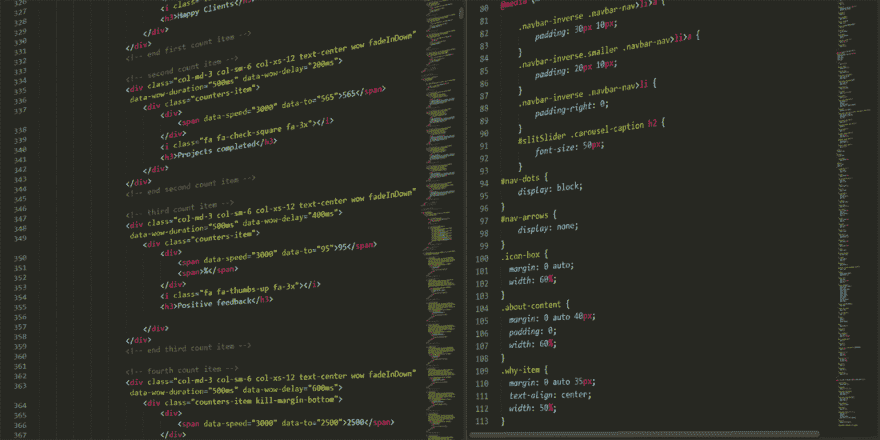

# 每个新时代程序员都需要知道的顶级编程语言

> 原文：<https://dev.to/mikezen9/top-programming-languages-every-new-age-programmer-needs-to-know-235m>

保持领先地位是每个人都在努力的，成为城里最好的程序员之一需要纯粹的耐心和智慧来选择正确的编程语言，人们需要学习这种语言来应对快速发展的 IT 行业。在 600 种独特的编程语言中，哪一种足以适应新时代，这可能会让任何人感到困惑。这里列出了一些最好的编程语言，你需要知道这些语言来震撼舞台。

## Java Script 语言

这是一种高级编程语言，可以认为是任何开发者使用最多的编程语言。这是由堆栈溢出开发者对 173 个国家的 64，000 名开发者进行的调查，他们了解到大约 62.5%的程序员使用这种编程语言来开发他们的项目。JavaScript 使一个程序员能够建立交互式网站，这是继 HTML 和 CSS 之后，程序员用来开发网站的最受欢迎的语言，因为大多数 web 浏览器都以某种方式实现了这种语言。

T3】图片来源:Pexels

## Java 语言(一种计算机语言，尤用于创建网站)

Java 是一种实用的高级编程语言，由詹姆斯·高斯林设计，以避开 C++的复杂性。将近 90%的 IT 公司使用这种语言来开发他们的桌面应用程序和后端系统。Java 拥有跨平台环境 JVM (Java 虚拟机),它帮助程序员在任何地方开发程序，在任何地方运行程序。Java 中的 OOPs(面向对象编程)概念使其成为一种高效的编程语言，因为它有助于在多个领域开发软件和应用程序，如服务器端应用程序、移动应用程序和游戏应用程序。例如，如果一个用户想要开发一个应用程序，允许他[购买 3000 个 Instagram 关注者](https://www.realigfollowers.com/shop/buy-3000-instagram-followers/)或这样的营销应用程序，在这种情况下，他可以很容易地利用 Java 的帮助。Java 在开发者中非常受欢迎，因为它是原生 Android 应用的核心。

## 角度 JS

这是一个基于 JavaScript 的应用程序框架。这是由 Google 和许多其他公司维护的，以应对开发任何单页面应用程序时总是会遇到的挑战。这个跨平台的框架是用 JavaScript 写的，用在 ABC News、NBC、Intel、Wolfram Alpha、Sprint 等网站上。在 2016 年 10 月进行的一项调查中，100 万个网站中约有 12，000 个使用这一框架。在 GitHub 最受瞩目的项目中，AngularJS 位列前 100 名。它可以与 Angular 2 一起使用来创建应用程序。这个结构框架也可以用来创建动态 web 应用程序。设计师可以使用 HTML 和 Angular JS 作为模板语言。这个框架本身就包含了大量的代码，这些代码必须由用户自己编写。使用这个框架也可以创建单页网站。假设一个人想要创建一个允许客户购买 instagram 追随者的单页面网站，Angular JS 将以一种和多种方式帮助开发者开发这样的单页面网站。

## C++

这是 1983 年开发的一种高级编程语言，为 c 语言提供了一种替代方案。如果有人知道微软的 Windows 和谷歌的 Chrome 都是用这种语言开发的，那可能会让他们大吃一惊。事实上，Adobe 和 Amazon 在其网站的许多部分也有 C++。金融、游戏、银行、电子和许多其他领域都热烈欢迎这种语言，因为它迎合了他们中许多人的需要。学习 C++的好处是，它允许一个程序员编写商业网站代码，也可以分别编写游戏和应用程序。它包括各种特性，如平台独立性、封装、数据隐藏、继承和多态。对于开发大型项目来说，这是一种非常方便的语言。

## C#

这是微软设计的一种编程语言，用于在微软平台上开发应用程序。这是一种面向对象的编程语言，用于由。NET 框架。其简单易用的特性使其成为一种可靠的编程语言，人们可以使用 Unity 游戏引擎来开发游戏。它读起来更接近英语，因为它是一种高级语言，它抽象了计算机的复杂细节。作为一名程序员，可以使用这种语言，因为他/她不必担心计算机的小细节。这个平台帮助程序员以更简单的方式创建 Android 及其应用程序，人们可以使用这个平台创建从移动应用程序到 web 服务和服务器应用程序的任何东西。

## 服务器端编程语言（Professional Hypertext Preprocessor 的缩写）

数百万使用脸书和维基百科的网站以某种方式使用 PHP。PHP 没有任何硬性规定，它可以灵活地解决许多问题。它被用在流行的内容管理系统中，因为它是一种服务器端脚本语言，它形成了脸书和 Wordpress 的基础。它帮助人们创建令人惊叹的网络应用程序和网站。人们可以在许多 web 开发项目中使用 PHP，如电子商务、内容管理系统和移动应用程序管理。它简单易学，用途广泛。例如，如果一个开发人员想要开发一个电子商务网站，让买家能够购买 Instagram 追随者，他/她可以使用 PHP 非常容易地做到这一点。

## C

这种语言建立于 1972 年，至今仍被证明是一种非常非常流行的编程语言。这种语言使程序员能够在 UNIX 操作系统中编写程序。它是一种机器级语言，作为一名 c 程序员，需要知道程序如何与硬件交互，因为它是一种稳定的编程语言，许多计算平台都使用它。Linux 操作系统是用 C 语言开发的，Spotify、易贝和 Dropbox 等流行的网络应用程序都使用 C 语言。C 语言的许多特点使它如此受欢迎，例如它的简单和快速。