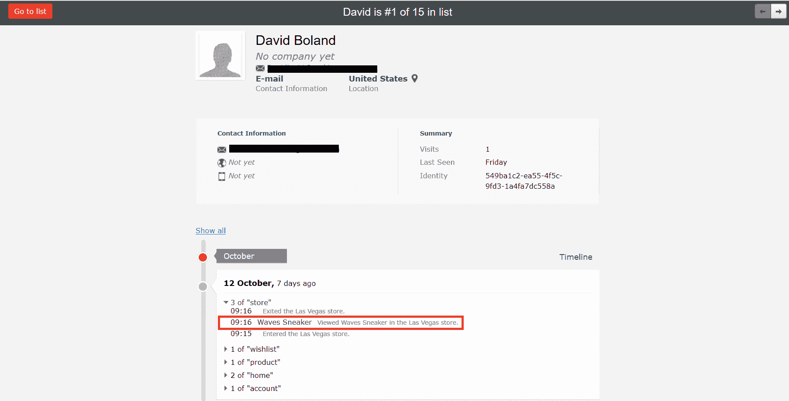

# 使用 Episerver 个人资料商店跟踪用户的店内体验

> 原文：<https://dev.to/debpu06/track-users-in-store-experience-with-episerver-profile-store-p19>

## 快速汇总

2018 年 3 月，Episerver 在拉斯维加斯举办了年度 Ascend 大会。今年，他们举办了合作伙伴创新聚焦活动，要求所有合作伙伴提出一些新的创新方法来使用他们的产品。在[兴风作浪](https://www.makingwaves.com/)时，我们希望在网上和店内体验之间架起一座桥梁。为此，我们模拟了一个鞋店体验，通过混合使用移动应用程序、蓝牙信标和 Episerver Profile Store 来跟踪用户的行为。我们能够通过我们的 Track API 连接这些技术。虽然这篇博客关注的是 Track API 的技术方面，但我鼓励你看看我们的交付总监[阿诺德·麦考利](https://www.linkedin.com/in/arnoldmacauley/)在[发的这篇文章](https://www.linkedin.com/pulse/why-we-created-fictitious-shoe-company-arnold-macauley/)，这篇文章讲述了我们为什么选择这条路线进行演示。

## epi server Profile Store&洞察

这篇文章假设你熟悉 Episerver 的配置文件存储和洞察。如果没有，我建议你通过查看[个人资料商店](https://world.episerver.com/documentation/developer-guides/profile-store/) & [洞察力](https://world.episerver.com/documentation/developer-guides/insight/)的开发者文档来熟悉自己。如果您因为看到“文档”而跳过了这些链接，并对自己说，“不可能”，Episerver 在每个页面的顶部都提供了一个很好的摘要:*每次访问者查看产品、将产品添加到愿望清单或购物车、下订单等，Episerver Profile Store 都会跟踪并保存有关网站访问者行为的数据。您可以使用实际、及时的数据为站点访问者提供自定义体验。**Episerver Insight 是一个用户界面，用于查看和过滤访客资料，并创建细分市场作为全渠道营销活动的输入。*由于这篇文章更侧重于技术方面，我们将更多地关注配置文件存储。但是，为了查看配置文件，我们需要通过 Insight 来创建和跟踪它们。所以熟悉这两者是有好处的。

## 店内体验

我们使用蓝牙信标来跟踪与单个产品的交互。基于哪个产品被处理了多长时间，我们将为用户提供建议产品和购买选项的提示。手势被用来跟踪进出商店的顾客。Android 应用程序然后会将这些交互发送到 Track API，后者将信息存储在配置文件存储中。

## 跟踪 API

正如我前面提到的，Track API 用于跟踪用户在商店中的行为。虽然你可以在 [TrackController](https://gist.github.com/debpu06/09eeb2c64bb7a8a9f678bbe1cdc7399a) 的要点中查看 API 的完整实现，但在这篇文章中，我们将只关注一种方法。需要注意的一点是，我们追踪的用户是通过 Android 应用程序登录网站的。因此，我们能够从对我们的 API 的请求中获取用户。

#### [跟踪产品视图](#trackproductview)

TrackProductView 方法将信标 ID 的字符串作为参数，用于跟踪用户与产品的交互。

```
 [HttpPost] 
    [Route("product/{beaconId}")] 
    public async Task<ihttpactionresult> TrackProductView(string beaconId)
    {
        var user = GetUser();
        string code = GetCode(beaconId);

        if (string.IsNullOrWhiteSpace(code))
        {
            return NotFound();
        }

        var contentLink = _referenceConverter.GetContentLink(code);

        var productName = code;
        if (!ContentReference.IsNullOrEmpty(contentLink))
        {
            var product = _contentLoader.Get<entrycontentbase>(contentLink);
            productName = product.Name;
        }

        var trackingData = new TrackingData<producttrackingdata>
        {
            EventType = CustomTrackingType.Store,
            EventTime = DateTime.UtcNow,
            User = user,
            Value = $"Viewed {productName} in the Las Vegas store.",
            Payload = new ProductTrackingData(code, "en", _httpContextBase, GetCommerceUser()),
            PageTitle = productName,
        };

        await _trackingService.Track(trackingData, _httpContextBase);

        return Ok(trackingData.Value);
    } 
```

Enter fullscreen mode Exit fullscreen mode

在这个方法中，我们做的第一件事是从请求中获取用户。接下来，我们使用信标 id 和产品代码的 JSON 映射来获取用户正在交互的产品的代码。我们在起始页上使用一个可编辑的属性来存储 JSON 映射。这使我们能够在推出新产品或需要更换信标时快速轻松地进行更新。

从那里，使用 **ReferenceConverter** 的实例，我们能够获得产品的**内容链接**。反过来，我们可以使用 **IContentLoader** 的一个实例来获取产品。

最后，该方法最重要的部分是我们调用 Track API 将产品视图保存到配置文件存储中。我们创建了一个新的实例 **TrackingData** ，它的有效负载类型为 **ProductTrackingData** 。我们指定 EventType 为“store ”,让我们知道它是在实体店而不是在网站上被查看的。Payload 是 ProductTrackingData 的一个实例，我们在其中提供产品代码、语言代码、当前 HttpContext 和当前用户。然后，我们从注入控制器的 **ITrackingService** 实例中调用 Track。您可以在下面的 Insight 中看到存储的结果。

[T2】](//images.ctfassets.net/9usgdrjsks5w/xWeWRJDD5QyKqmWoUIEoi/8ff4d27f37da6306c04b4f4661512d78/Insight_View-min.png)

## 结果

你可能会发现，将店内体验与在线资料联系起来的能力非常强大。您可以从 Insight Profile 面板的视图中看到，我们能够看到客户旅程的每一步。从访问我们的网站并创建帐户，到进入商店、查看产品和购买。我们的演示侧重于信标和手势。然而，这个控制器可以扩展到跟踪 NFC 标签、GPS 甚至 QR 码等东西。

我们将发布更多关于我们商店演示的帖子，但我鼓励你阅读我上面提到的[帖子](https://www.linkedin.com/pulse/why-we-created-fictitious-shoe-company-arnold-macauley/)。此外，请查看展示我们商店实际体验的[视频](https://vimeo.com/259898939)。