# 使用 Fn Project 和 Istio 的功能间流量路由

> 原文：<https://dev.to/peterj/traffic-routing-between-functions-using-fn-project-and-istio-2619>

[T2】](https://res.cloudinary.com/practicaldev/image/fetch/s--QuL3_oKL--/c_limit%2Cf_auto%2Cfl_progressive%2Cq_auto%2Cw_880/https://cdn-images-1.medium.com/max/2000/0%2AbjDqgcirv9x1L0nt)

在本文中，我将解释如何使用 [Istio](https://istio.io) 服务网格在 [Fn 功能](https://fnproject.io/)之间实现基于版本的流量路由。

我将首先解释 Istio 路由的基础知识以及 Fn 在 Kubernetes 上部署和运行的方式。最后，我将解释我如何能够利用 Istio 服务网格及其路由规则在两个不同的 Fn 功能之间路由流量。

请注意，下面的解释非常基本和简单——我的意图不是解释 Istio 或 Fn 的深入工作，相反，我想解释足够多，这样您就可以理解如何让路由自己工作。

## Istio 路由 101

让我们花一点时间来解释 Istio 路由的工作原理。Istio 使用一个 sidecar 容器(istio-proxy ),您可以将它注入到部署中。然后，注入的代理劫持进出该 pod 的所有网络流量。您的部署中所有这些代理的集合与 Istio 系统的其他部分进行通信，以确定如何以及在哪里路由流量(以及其他一些很酷的东西，如[流量镜像](https://istio.io/docs/tasks/traffic-management/mirroring/)、[故障注入](https://istio.io/docs/tasks/traffic-management/fault-injection/)和[电路中断](https://istio.io/docs/tasks/traffic-management/circuit-breaking/))。

为了解释这是如何工作的，我们将从一个 Kubernetes 服务(`myapp`)和两个特定于版本的应用部署(v1 和 v2)开始。

[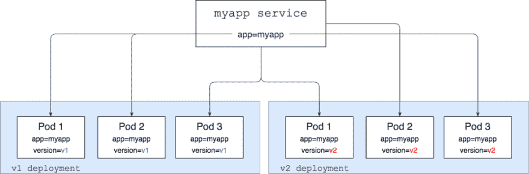T2】](https://res.cloudinary.com/practicaldev/image/fetch/s--aVbNPyVB--/c_limit%2Cf_auto%2Cfl_progressive%2Cq_auto%2Cw_880/https://cdn-images-1.medium.com/max/1000/1%2AL6w-SFpYJl5EBYMZItTQ2g.png)

在上图中，我们有一个选择器设置为`app=myapp`的`myapp` Kubernetes 服务，这意味着它将寻找所有设置了`app=myapp`标签的 pod，并将流量路由给它们。基本上，如果你做了一个`curl myapp-service`，你将从运行`v1`版本的应用程序或者从运行`v2`版本的应用程序得到一个响应。

我们在那里还有两个 Kubernetes 部署——这些部署运行着`myapp` v1 和 v2 代码。除了`app=myapp`标签，每个 pod 还具有设置为`v1`或`v2`的版本标签。

上图中的一切都是 Kubernetes 开箱即用的结果。

输入 Istio。为了能够进行更加智能和基于权重的路由，我们需要安装 Istio，然后将代理注入到我们的每个 pod 中，如下图所示。下图中的每个窗格都有一个包含 Istio 代理(由蓝色图标表示)的容器和运行应用程序的容器。在上图中，我们在每个 pod 中只运行了一个容器 app 容器。

[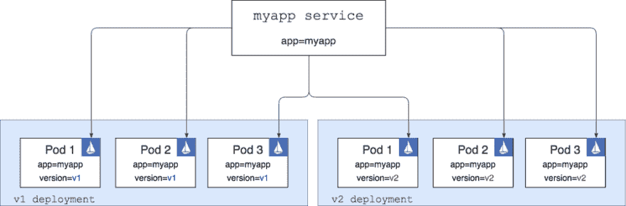T2】](https://res.cloudinary.com/practicaldev/image/fetch/s--B5jG-AT9--/c_limit%2Cf_auto%2Cfl_progressive%2Cq_auto%2Cw_880/https://cdn-images-1.medium.com/max/1000/1%2AGJZqOqNAryl34XxdlW2vTw.png)

> 请注意，还有比图中所示更多的东西。我没有展示同样部署在 Kubernetes 集群上的其他 Istio pods 和服务——注入的 Istio 代理与这些 pods 和服务通信，以便知道如何正确地路由流量。有关 Istio 不同部分的深入解释，请参见此处的文档[。](https://istio.io/docs/concepts/traffic-management/overview/)

如果我们可以在这一点上卷曲`myapp`服务，我们仍然会得到与第一张图中的设置完全相同的结果——来自`v1`和`v2`pod 的随机响应。唯一的区别是网络流量从服务流向 pod 的方式。在第二种情况下，对服务的任何调用都在 Istio 代理中结束，然后代理决定(基于任何定义的路由规则)将流量路由到哪里。

就像当今几乎所有的东西一样，Istio 路由规则是使用 YAML 定义的，它们看起来像这样:

[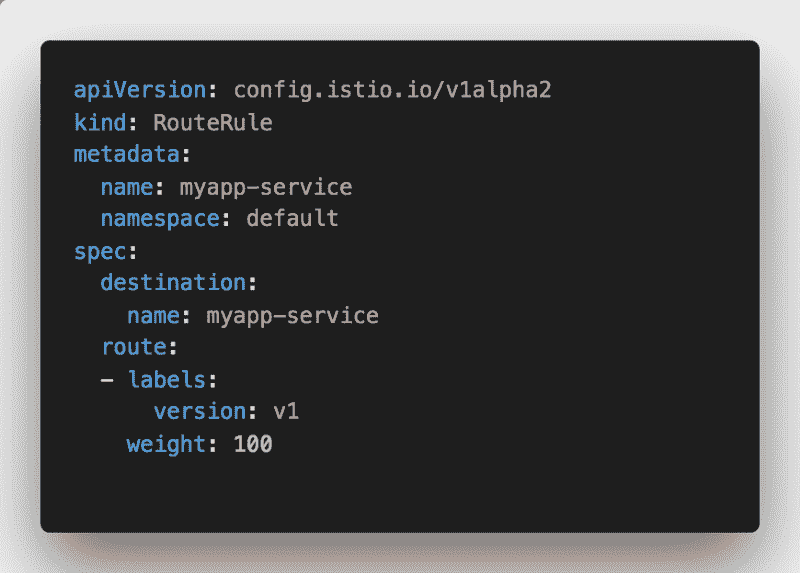T2】](https://res.cloudinary.com/practicaldev/image/fetch/s--rYVzVx7M--/c_limit%2Cf_auto%2Cfl_progressive%2Cq_auto%2Cw_880/https://cdn-images-1.medium.com/max/800/1%2ADGqVjIDow2pEldMfxmki8Q.png)

上面的路由规则接收到达`myapp-service`的请求，并将它们重新路由到标记为`version=v1`的 pod。以下是具有上述路由规则的图表的外观:

[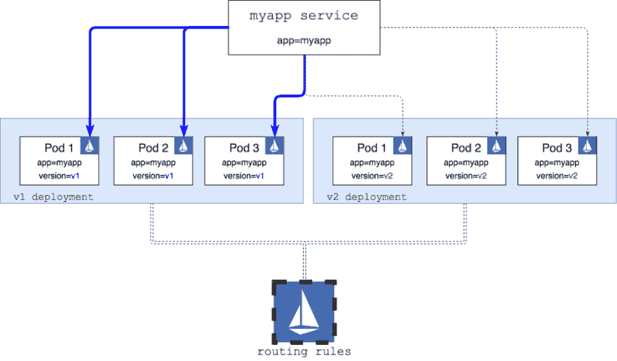T2】](https://res.cloudinary.com/practicaldev/image/fetch/s--9Dtb0WsF--/c_limit%2Cf_auto%2Cfl_progressive%2Cq_auto%2Cw_880/https://cdn-images-1.medium.com/max/1000/1%2AA4DSAqKQ3_VChe0RJVmWPw.png)

底部的大 Istio 图标代表 Istio 部署/服务，除了其他事情之外，路由规则是从这里读取的。然后，这些规则用于重新配置在每个 pod 内运行的 Istio 代理边车。

有了这个规则，如果我们卷曲服务，我们只能从标有`version=v1`的容器中得到响应(在图中用蓝色连接器表示)。

既然我们已经知道了路由是如何工作的，我们可以研究一下 Fn，部署它，看看它是如何工作的，以及我们是否可以使用 Istio 来建立路由。

# Kubernetes 上的 Fn 函数

我们将从 Kubernetes 上的一些 [Fn](http://fnproject.io/) 片段的基本图开始。您可以使用[掌舵图](http://github.com/fnproject/fn-helm)在您的 Kubernetes 集群上部署 Fn。

[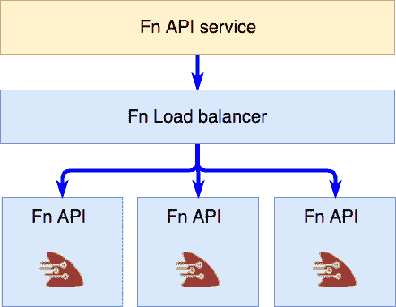T2】](https://res.cloudinary.com/practicaldev/image/fetch/s--b2p6LQLA--/c_limit%2Cf_auto%2Cfl_progressive%2Cq_auto%2Cw_880/https://cdn-images-1.medium.com/max/800/1%2AeXGvk4PNnd8Pj0lM6z_j-Q.png)

图表顶部的 Fn API 服务是 Fn 的入口点，用于管理您的功能(创建、部署、运行等)。)—这是在 Fn 项目中被称为`FN_API_URL`的 URL。

该服务进而将调用路由到 Fn 负载平衡器(即任何标有`role=fn-lb`的 pod)。然后负载均衡器施展魔法，将调用路由到 fn-service pod 的一个实例。这些是作为 Kubernetes 守护进程集的一部分部署的，通常每个 Kubernetes 节点都有一个 pod 实例。

有了这些简单的基础知识，让我们创建和部署一些功能，并考虑如何进行流量路由。

## 创建和部署功能

如果你想跟进，确保你已经将 [Fn 部署到你的 Kubernetes 集群](https://hackernoon.com/part-ii-fn-load-balancer-585babd90456)(我使用的是 Mac 版 Docker)并且安装了 Fn CLI，然后运行以下命令来创建应用程序和一些函数:

```
# Create the app folder
mkdir hello-app && cd hello-app
echo "name: hello-app" > app.yaml
# Create a V1 function
mkdir v1
cd v1
fn init --name v1 --runtime go
cd ..
# Create a V2 function
mkdir v2
cd v2
fn init --name v2 --runtime go
cd .. 
```

Enter fullscreen mode Exit fullscreen mode

使用上面的命令，您已经为应用程序创建了一个名为`hello-app`的根文件夹。在这个文件夹中，我们创建了两个各有一个功能的文件夹— v1 和 v2。样板文件 Go 函数是使用将 Go 指定为运行时的`fn init`创建的——这就是文件夹结构的样子:

```
.
├── app.yaml
├── v1
│   ├── Gopkg.toml
│   ├── func.go
│   ├── func.yaml
│   └── test.json
└── v2
    ├── Gopkg.toml
    ├── func.go
    ├── func.yaml
    └── test.json 
```

Enter fullscreen mode Exit fullscreen mode

打开两个文件夹中的`func.go`,更新返回的消息，使其包含版本号——我们这样做的唯一原因是为了快速区分哪个函数被调用。v1 `func.go`应该是这样的(`Hello V1`):

[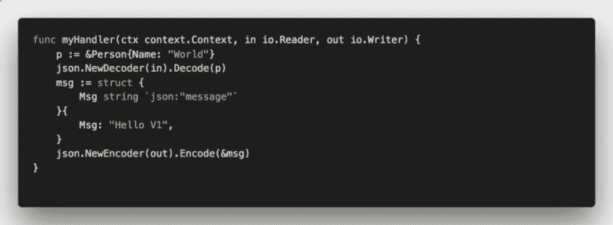T2】](https://res.cloudinary.com/practicaldev/image/fetch/s--JlQkpUbU--/c_limit%2Cf_auto%2Cfl_progressive%2Cq_auto%2Cw_880/https://cdn-images-1.medium.com/max/1000/1%2ATz7dz7HPsQabsOZSjnn1tw.png)

完成这些更改后，您可以将这些功能部署到 Kubernetes 上运行的 Fn 服务中。为此，您必须设置`FN_REGISTRY`环境变量来指向您的 Docker 注册用户名。

> 因为我们在 Kubernetes 集群上运行 Fn，所以我们不能使用本地构建的映像——它们需要被推送到可由 Kubernetes 集群访问的 Docker 注册表。

现在我们可以使用 [Fn CLI](https://github.com/fnproject/cli) 来部署功能:

```
FN_API_URL=http://localhost:80 fn deploy --all 
```

Enter fullscreen mode Exit fullscreen mode

> 上述命令假设 Fn API 服务在 localhost:80 上公开(如果您在 Docker for Mac 中使用 Kubernetes 支持，这是默认的)。如果使用不同的群集，可以用 fn-api 服务的外部 IP 地址替换 FN_API_URL。

Docker 构建和推送完成后，我们的功能被部署到 Fn 服务中，我们可以尝试调用它们。

部署到 Fn 服务的任何功能都有一个唯一的 URL，其中包含应用程序名称和路由名称。通过我们的应用名称和路线，我们可以在`http://$(FN_API_URL)/r/hello-app/v1`访问部署的功能。所以，如果我们想调用 v1 路由，我们可以做:

```
$ curl http://localhost/r/hello-app/v1
{"message":"Hello V1"} 
```

Enter fullscreen mode Exit fullscreen mode

类似地，调用`v2`路由返回 Hello V2 消息。

### 但是函数在哪里运行呢？

如果您在调用函数时查看正在创建/删除的窗格，您会注意到实际上没有什么变化，即没有创建或删除窗格。原因是 Fn 不能创建像 Kubernetes pods 那样的功能，因为那样太慢了。相反，所有 Fn 功能部署和调用都发生在 fn-service pods 内部。然后，Fn 负载平衡器负责放置和路由到这些 pod，以最佳方式部署/执行功能。

因此，我们没有得到 Kubernetes pods/services for functions，但是 Istio 要求我们有可以路由到的服务和 pods…在这种情况下，我们该做什么以及如何使用 Istio？

## 想法

让我们暂时抛开这些功能，思考一下 Istio 路由工作需要什么:

*   Kubernetes 服务——我们 hello-app 的入口
*   针对 v1 hello-app 的 Kubernetes 部署
*   针对 v2 hello-app 的 Kubernetes 部署

正如在 Istio Routing 101 的文章开头所解释的那样，我们还必须为我们的两个部署添加一个代表版本的标签和`app=hello-app`标签。服务上的选择器将只有`app=hello-app`标签——特定于版本的标签将由 Istio 路由规则添加。

为此，每个版本特定的部署都需要在正确的路径(例如`/r/hello-app/v1`)上调用 Fn 负载均衡器。由于一切都在 Kubernetes 中运行，并且我们知道 Fn 负载平衡器服务的名称，我们可以实现这一点。

因此，我们的部署中需要一个容器，当被调用时，它会将调用转发到特定路径上的 Fn 负载平衡器。

下面是用图表表示的上述想法:

[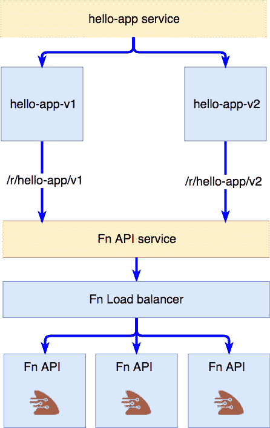T2】](https://res.cloudinary.com/practicaldev/image/fetch/s--R4BpqVX_--/c_limit%2Cf_auto%2Cfl_progressive%2Cq_auto%2Cw_880/https://cdn-images-1.medium.com/max/800/1%2AnrP0L_uSR7aCXBGByeZtcg.png)

我们有一个代表我们的应用程序的服务和两个特定于版本的部署，并直接路由到 Fn 服务中运行的功能。

### 简单代理

为了实现这一点，我们需要某种代理来接收任何传入的呼叫，并将它们转发给 Fn 服务。这里有一个简单的 Nginx 配置可以做到这一点:

```
events {
    worker_connections  4096;
}
http {
    upstream fn-server {
        server my-fn-api.default;
    }
server {
        listen 80;
location / {
            proxy_pass http://fn-server/r/hello-app/v1;
            proxy_set_header X-Real-IP  $remote_addr;
            proxy_set_header X-Forwarded-For $remote_addr;
            proxy_set_header Host $host;
        }
    }
} 
```

Enter fullscreen mode Exit fullscreen mode

为了解释这个配置:我们说每当有东西进入/时，将这个调用传递给`http://fn-server/r/hello-app/v1`，其中`fn-server`(定义为上游)被解析为`my-fn-api.default`——这是运行在默认名称空间中的`fn-api`的 Kubernetes 服务名。

为了对 v2 做同样的事情，实际的路由和上游服务器名称是我们唯一需要改变的。

我已经用一个脚本创建了一个 [Docker 映像](https://hub.docker.com/r/pj3677/simple-proxy/)，该脚本根据您传入的上游和路由值生成 Nginx 配置。图片可以在 [Docker hub](https://hub.docker.com/r/pj3677/simple-proxy/) 上获得，你可以在这里查看来源[。](https://github.com/peterj/fn-simple-proxy)

### 部署到 Kubernetes

现在，我们可以为服务、部署和用于访问功能的入口创建 Kubernetes YAML 文件。

下面是部署文件的摘录，展示了我们如何为`UPSTREAM`和`ROUTE`以及标签设置环境变量。

[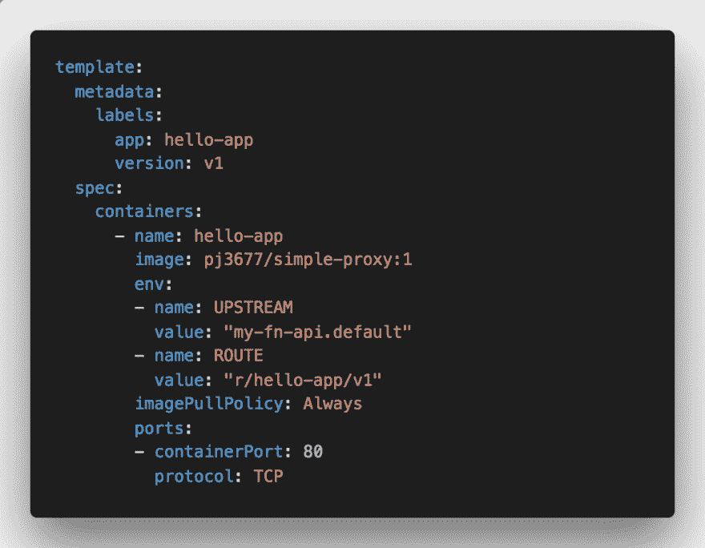T2】](https://res.cloudinary.com/practicaldev/image/fetch/s--joqR4mLL--/c_limit%2Cf_auto%2Cfl_progressive%2Cq_auto%2Cw_880/https://cdn-images-1.medium.com/max/1000/1%2A41VRsFr66EWiPEnMsvPOaw.png)

简单代理容器读取`UPSTREAM`和`ROUTE`环境变量，并根据这些值生成 Nginx 配置。

服务 YAML 文件也没什么特别的——我们只是将选择器设置为`app: hello-app`:

[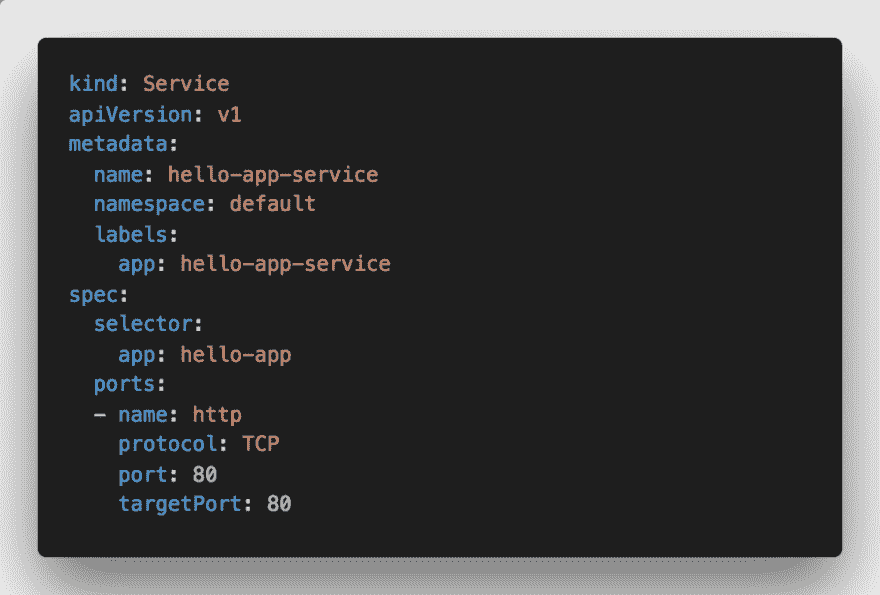T2】](https://res.cloudinary.com/practicaldev/image/fetch/s--cRcGjQ8e--/c_limit%2Cf_auto%2Cfl_progressive%2Cq_auto%2Cw_880/https://cdn-images-1.medium.com/max/1000/1%2AbLsp-8E4A7LUCvKgZRweBg.png)

最后一部分是 Istio 入口，我们在这里设置规则，将所有传入流量路由到后端服务:

[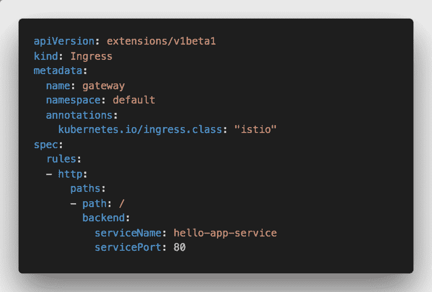T2】](https://res.cloudinary.com/practicaldev/image/fetch/s--JQDohyXT--/c_limit%2Cf_auto%2Cfl_progressive%2Cq_auto%2Cw_880/https://cdn-images-1.medium.com/max/1000/1%2AZS3wp0Q8GUWjmEuLcEz-vQ.png)

要部署这些，您可以使用`kubectl`来部署入口和服务，使用`istioctl kube-inject`来部署以注入 Istio 代理。

部署好所有东西后，您最终应该会得到以下 Kubernetes 资源:

*   hello-app-deployment-v1(使用指向 v1 路由的简单代理映像进行部署)
*   hello-app-deployment-v2(使用指向 v2 路由的简单代理映像进行部署)
*   hello-app-service(针对 hello-app 部署中的 v1 和 v2 pods 的服务)
*   指向 hello-app-service 的入口，使用“istio”入口类注释进行注释

现在，如果我们调用`hello-app-service`或者调用入口，我们应该从 v1 和 v2 函数得到随机响应。下面是对入口进行调用的示例输出:

```
$ while true; do sleep 1; curl http://localhost:8082;done
{“message”:”Hello V1"}
{“message”:”Hello V1"}
{“message”:”Hello V1"}
{“message”:”Hello V1"}
{“message”:”Hello V2"}
{“message”:”Hello V1"}
{“message”:”Hello V2"}
{“message”:”Hello V1"}
{“message”:”Hello V2"}
{“message”:”Hello V1"}
{“message”:”Hello V1"}
{“message”:”Hello V1"}
{“message”:”Hello V2"} 
```

Enter fullscreen mode Exit fullscreen mode

## Istio rules!

随着我们的服务和部署的启动和运行(以及工作)，我们可以为 Fn 功能创建 Istio 路由规则。让我们从一个简单的 v1 规则开始，它将把所有(`weight: 100`)到`hello-app-service`的呼叫路由到标记为`v1`的 pod:

[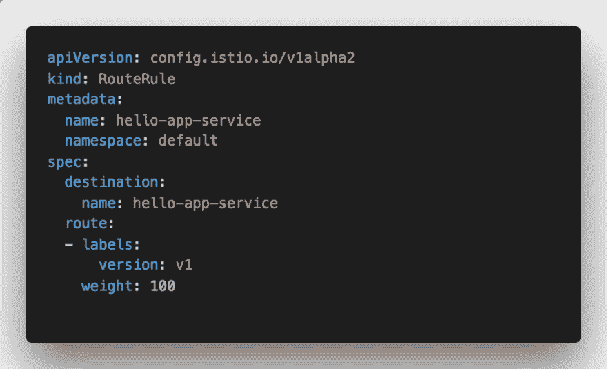T2】](https://res.cloudinary.com/practicaldev/image/fetch/s--iipNNxRN--/c_limit%2Cf_auto%2Cfl_progressive%2Cq_auto%2Cw_880/https://cdn-images-1.medium.com/max/1000/1%2A8QTpQ3mt0_msCoF8AkJQig.png)

您可以通过运行`kubectl apply -f v1-rule.yaml`来应用此规则。查看路由运行情况的最佳方式是运行一个不断调用端点的循环，这样您可以看到响应从混合(v1/v2)到全 v1。

正如我们对权重为 100 的`v1`规则所做的那样，我们可以类似地定义一个将所有内容路由到`v2`的规则，或者一个将 50%的流量路由到`v1`和 50%的流量路由到`v2`的规则，如下面的演示所示。

[https://www.youtube.com/embed/pErZvbqYhMY](https://www.youtube.com/embed/pErZvbqYhMY)

一旦我证明这可以用简单的 curl 命令工作，我就停止了:)

幸运的是， [Chad Arimura](https://medium.com/@carimura/the-importance-of-devops-to-serverless-f671070efb9) 在他关于 DevOps 对无服务器的重要性的文章中更进一步(剧透:DevOps 不会消失)。他使用 Spinnaker 对运行在实际 Kubernetes 集群上的 Fn 函数进行了加权蓝绿色部署。请看下面他的演示视频:

[https://www.youtube.com/embed/nRnatpJZwN0](https://www.youtube.com/embed/nRnatpJZwN0)

# 结论

每个人都会同意，服务网格在函数世界中是重要的，并且将会是重要的。如果使用服务网格，可以获得很多好处——比如路由、流量镜像、故障注入和一堆其他东西。

我认为最大的挑战是缺乏以开发人员为中心的工具，这些工具可以让开发人员利用所有这些又好又酷的功能。设置这个项目并演示运行几次并不太复杂。

但是这两个函数几乎只返回一个字符串，不做任何其他事情。这是一个简单的演示。只要想想运行数百或数千个函数，并在它们之间设置不同的路由规则。然后考虑管理所有这些。或者推出新版本并监控故障。

我认为，在使功能管理、服务网格管理、路由、[插入其他很酷的功能]以一种对所有相关人员都很直观的方式工作方面，存在巨大的机遇(和挑战)。

## 感谢阅读！

欢迎对本文的任何反馈！你也可以在 [Twitter](http://twitter.com/pjausovec) 和 [GitHub](http://github.com/peterj) 上关注我。如果你喜欢这个并且想在我写更多东西的时候得到通知，你应该订阅我的[时事通讯](https://tinyletter.com/pjausovec)！