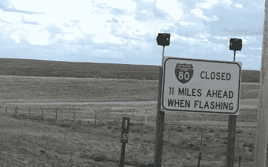

# 除非谨慎使用，否则被认为是有害的尾随条件句

> 原文：<https://dev.to/jerodsanto/trailing-conditionals-considered-harmful-unless-used-sparingly-3i19>

> 注意:我不久前为我的博客写了这篇文章，但是我已经不怎么写了，因为我大部分时间都花在了[变更日志](https://changelog.com)上。

我很早就爱上的一个 Ruby 特性是在一行的末尾附加条件的能力。比如这段代码:

```
if some_condition?
  object.perform_some_action
end 
```

Enter fullscreen mode Exit fullscreen mode

可以用一行程序来表达，就像这样:

```
object.perform_some_action if some_condition? 
```

Enter fullscreen mode Exit fullscreen mode

这是一个很小的区别，但后一种形式通常更直接地反映了作者对问题的看法。和`unless`关键词:
搭配起来感觉更好

```
object.perform_some_action unless some_condition? 
```

Enter fullscreen mode Exit fullscreen mode

经过多年这样写代码和阅读代码，我已经慢慢对这种风格感到厌倦了。

# 为什么

我不看好尾随条件句的原因可能最好用我最近在 80 号州际公路上看到的路标来表达:

[T2】](https://res.cloudinary.com/practicaldev/image/fetch/s--8iO0rGcA--/c_limit%2Cf_auto%2Cfl_progressive%2Cq_auto%2Cw_880/https://thepracticaldev.s3.amazonaws.com/i/u4f20fyiebwd14vyuxq5.jpg)

注意到后面的条件句了吗？如果司机没有看到文字的最后一行，像这样的标志会出很多问题。为什么会这样？

*   这个标志可能会被一些障碍物挡住，直到最后一秒钟
*   司机可能会被孩子、收音机、手机等分散注意力。直到为时已晚
*   当司机在错误的车道上 <sup id="fnref1">[1](#fn1)</sup> 时，与标志相关的出口可能即将到来

在这种情况下，闪烁时的**是标志上的关键指示器。为什么是最后提到的？在新闻界，他们称之为[埋没主角](http://en.wiktionary.org/wiki/bury_the_lead)。**

如果标志设计者在第一次闪烁时将**放置在第一位，驾驶员通常可以跳过其余的文字 <sup id="fnref2">[2](#fn2)</sup> 。这节省了驾驶员可以在其他地方使用的认知开销，并避免了如果条件没有被及时理解可能发生的潜在灾难。**

以一种稍微有点离题的方式，结尾条件句违反了最小惊奇原则。这条原则——生活中最重要的事情——变成了米奇·赫德伯格的一个笑话，[在这个笑话中，他用“请勿打扰”这句话挑起了一场争斗](https://soundcloud.com/jerodsanto/mitch-hedberg-do-not-disturb-joke)。

当在州际公路上以 80 英里/小时的速度行驶时，这个问题变得更加严重，但它也存在于我们的法规中。当你在*写*代码的时候，尾随条件感觉很好，但是它经常让*读*变得更困难。当条件之前的操作很冗长时，这一点最为明显。以这段伪代码为例:

```
call_this_really_long_method_that_is_probably_too_long_but_that_will_not_stop_us unless some_condition? 
```

Enter fullscreen mode Exit fullscreen mode

如果你没有滚动到最后看`unless`会怎么样？你根本不知道发生了什么。诚然，这种长度的方法名很少见，但是*在其他具有相同效果的控制结构中嵌套尾随条件 <sup id="fnref3">[3](#fn3)</sup> 是*常见的。

[代码被读取的次数比它被写入的次数多得多](http://blogs.msdn.com/b/oldnewthing/archive/2007/04/06/2036150.aspx)，所以我们需要优化可读性而不是可写性 <sup id="fnref4">[4](#fn4)</sup> 。尾随条件句倾向于做相反的事情。

## 但是

正如软件(和写作)中的大多数事情一样，也有例外。尾随条件句的一些用法提高了可读性。以我的经验来看，对他们来说最好的情况是使用[保护条款](http://en.wikipedia.org/wiki/Guard_(computer_science))。保护子句有几个特点，使它们在尾随条件句中可读性很强:

*   它们出现在方法的顶部，所以它们本身很少嵌套
*   它们经常返回或引发一个错误，这些都是简短的语句
*   通常有几个保护子句在一起，所以纵向简洁有助于阅读

看看这个方法，它返回一个给定对象的`price_range`字符串，该字符串响应`price_minimum`和`price_maximum` :

```
def price_range
  return @price_range if defined? @price_range
  return "" unless price_minimum
  return "" unless price_maximum

  # ... code to determine `minimum` and `maximum` ...

  @price_range = "#{minimum}-#{maximum}"
end 
```

Enter fullscreen mode Exit fullscreen mode

第一行[记忆](http://en.wikipedia.org/wiki/Memoization)的`price_range`，因为这显然是一个昂贵的计算。第 2 行和第 3 行是保护子句。传统条件句会是什么样子？

```
def price_range
  if defined? @price_range
    return @price_range
  end

  unless price_minimum
    return ""
  end

  unless price_maximum
    return ""
  end

  # ... code to determine `minimum` and `maximum` ...

  @price_range = "#{minimum}-#{maximum}"
end 
```

Enter fullscreen mode Exit fullscreen mode

这段代码需要更多的垂直工作来解析。还有第三种形式，就是把条件句放在第一位，同时保持每个条件句都是一行:

```
def price_range
  if defined? @price_range return @price_range
  if !price_minimum return ""
  if !price_maximum return ""

  # ... code to determine `minimum` and `maximum` ...

  @price_range = "#{minimum}-#{maximum}"
end 
```

Enter fullscreen mode Exit fullscreen mode

这对我有用，但是我更喜欢返回优先的形式，因为任何时候一个方法提前返回，我们都想尽快了解这个方法。

## 如此

在抛出拖尾条件句之前要三思。他们本末倒置，在极端情况下，他们导致读者完全错过了马。这使得它们通常比传统形式可读性差。

或许米奇是对的，我们都需要读得更快！

* * *

1.  这其实就是发生在我身上的事。我勉强及时破译了正确的意思。 [↩](#fnref1)

2.  这条路被封闭是例外，而不是常见的情况。这意味着灯很少闪烁，标志通常是不相关的。 [↩](#fnref2)

3.  这是我提倡每行不超过 80 个字符的另一个原因。 [↩](#fnref3)

4.  这两者通常是结合在一起的，但有时也会发生冲突。 [↩](#fnref4)