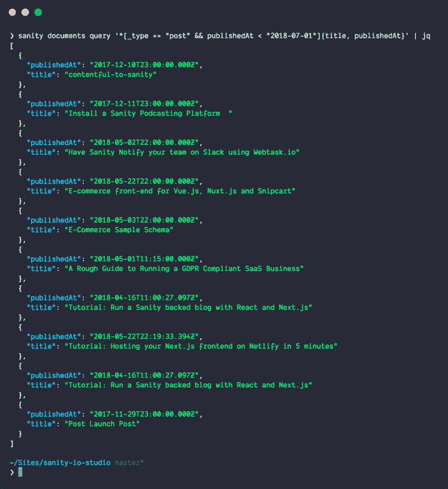
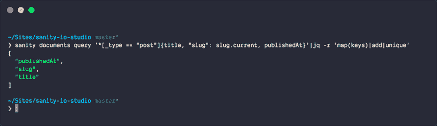
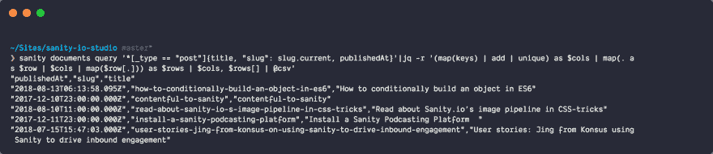

# 在命令行中使用 jq 将 JSON 转换为 CSV

> 原文：<https://dev.to/sanity-io/transform-json-to-csv-using-jq-in-the-commandline-53gb>

是一个优秀的小工具，它存在于你的终端中，用 JSON-data 做有用的事情。这是一个强大的工具，但对于小事情也很方便。例如，如果您将 JSON 数据通过管道传递给它，它会用语法高亮显示打印出来🔦默认情况下:

`$ cat some-data.json|jq`

你可以[在大多数系统上安装 jq](https://stedolan.github.io/jq/download/) (在装有[家酿](https://brew.sh/) / `chocolatey install jq`的 mac 上安装`brew install jq`，在装有[巧克力](https://chocolatey.org/)的 windows 上安装`chocolatey install jq`)。这篇文章介绍了一种更先进的`jq`技术，但是如果你想获得基础知识，你应该查看教程。

`jq`适用于任何 JSON 源代码，但是由于我大部分时间都在使用基于 [Sanity.io](https://sanity.io/) 的后端，我将用它作为例子。还因为我认为我们可以用这种组合做的事情非常酷。

[Sanity 是结构化内容](https://www.sanity.io/docs/introduction/getting-started)的后端，带有一个实时 API 和一个名为 [GROQ](https://www.sanity.io/docs/data-store/how-queries-work) 的查询语言。CLI 工具，让您查询您的后端，并在终端中用`$ sanity documents query 'GROQ-expression'`输出结果。

因此，如果您想要类型为`post`的文档，您可以输入`$ sanity documents query '*[_type == "post"]'`。或者，如果你只是想要那些出版日期在 2018 年的，那就应该是`$ sanity documents query '*[_type == "post" && publishedAt > "2018-01-01"]'`。这个查询给出了完整的文档，但是如果您只是想要标题和出版日期，您可以写:`*[_type == "post"]{title, publishedAt}`。

[T2】](https://res.cloudinary.com/practicaldev/image/fetch/s--UPGiuOhs--/c_limit%2Cf_auto%2Cfl_progressive%2Cq_auto%2Cw_880/https://cdn.sanity.img/3do82whm/production/12b7f7872916dda7170928afaf279d18424e4177-1386x1512.png)

您也可以在`jq`中从 JSON 数据中挑选出键和值，但是今天我们将使用它将 JSON 数组中的结构化内容转换成 CSV 文件。因为你的老板想要 Excel 表格里的东西，对吗？坐好，我们开始吧！🏊‍♀️

假设你想在一个电子表格中列出你的博客条目的标题、段落和发布日期。整个表达式将如下所示:

```
sanity documents query '*[_type == "post"]{title, "slug": slug.current, publishedAt}'|jq -r '(map(keys) | add | unique) as $cols | map(. as $row | $cols | map($row[.])) as $rows | $cols, $rows[] | @csv' 
```

Enter fullscreen mode Exit fullscreen mode

你可以复制这个然后用它运行或者在 jqplay.com 上[用它玩，但是让我们看看`jq`里发生了什么-表情:](https://jqplay.org/s/QOs3d_fMLU)

*   `-r`代表`--raw-ouput`,确保输出是没有颜色或特殊格式的普通的旧文本。
*   `(map(keys) | add | unique) as $cols`遍历对象中的键(`map`)和`add` `unique`到一个名为`$cols`的变量。换句话说，这最终成为您的列标题。

[T2】](https://res.cloudinary.com/practicaldev/image/fetch/s--ZZ4tCn1d--/c_limit%2Cf_auto%2Cfl_progressive%2Cq_auto%2Cw_880/https://cdn.sanity.img/3do82whm/production/da54941c127a979d03d7bf057cd5a5154a0a8608-1640x476.png)

*   `map(. as $row | $cols | map($row[.])) as $rows`获取外部数组中的所有对象，遍历所有对象键(title、slug、publishedAt)并将值附加到一个数组中，这样就得到一个包含值的数组，这就是将 JSON 转换为 CSV 时所需要的。
*   `$cols, $rows[] | @csv`首先将列标题放入数组，然后将每个数组通过管道传输到`@csv`转换为行，这将输出格式化为… csv。

[T2】](https://res.cloudinary.com/practicaldev/image/fetch/s--NdprNK3w--/c_limit%2Cf_auto%2Cfl_progressive%2Cq_auto%2Cw_880/https://cdn.sanity.img/3do82whm/production/92c28578b1eadd30205b92842b2a4fbcbc12e31c-2080x452.png)

这个命令在 shell 中打印出结果，但是如果您想直接将结果写到文件中，您可以将`> filename.csv`附加到文件中，或者附加到剪贴板中(如果您在 mac 上，则通过管道将结果传送到`| pbcopy`)。或者也许你会在[熊猫](https://pandas.pydata.org/)中用 csv 做一些退出的事情🐼🐼用 Python？

如果你觉得这有用，我很乐意听听！