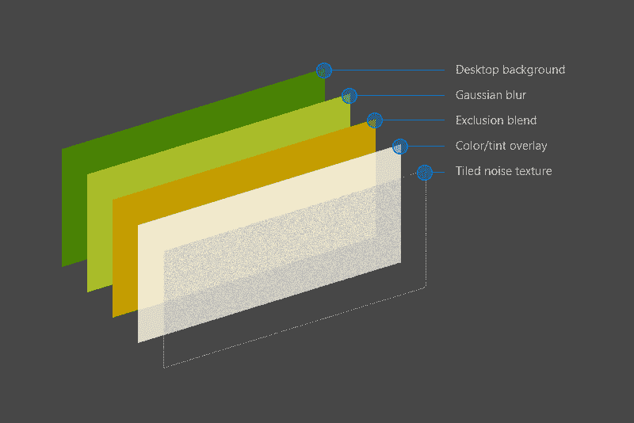
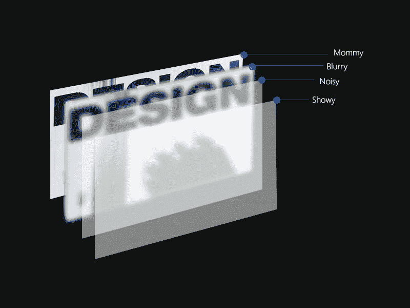

# 半透明和透明

> 原文：<https://dev.to/svijaykoushik/translucency-with-transparency--2gh6>

你好世界！因此，Windows 10 凭借其吸引人的(确实如此)彩色用户界面、花哨的开始菜单和动态磁贴已经问世两年了。然而，最吸引人的功能是商店应用程序中使用的“模糊玻璃效果”，尤其是邮件、Groove Music 和商店本身。

我在几个网站中看到了透明元素的美丽运用，但造成这种“模糊玻璃效果”的是你知道背景中有什么，但你看不清楚！这种效果隐藏了背后的细节，让你好奇想看看背后是什么。

我描述的“模糊玻璃效果”被称为丙烯酸材料，是“流畅设计系统”的一部分。这是微软给其为所有 windows 10 设备构建软件的“设计指南”起的名字。

既然你知道什么是丙烯酸材料，我就告诉你我做的实验。正如我之前说过的，丙烯酸材料是如此迷人，以至于我对自己说“为什么我不能在 HTML 中应用它呢？”带着这个问题，我开始在互联网上研究现有的实现，并将这个问题分解成更简单的问题，以便更好地理解。我发现了两个很好的现有实现(我真幸运！)的效果–CodemyUi.com 上的一支笔和堆栈溢出上的一个线程。

这些实现包括一个父容器元素和 3 个子容器元素，父容器元素有一张图片作为背景元素，我们称之为“妈咪”层。

1.  一个容器元素“模糊”的模糊版本的妈咪层的背景使用 CSS 滤镜属性-模糊。
2.  另一个以噪波纹理为背景的容器元素“噪波”。
3.  最后，第三个容器元素“显示”要显示的内容文本或图像以及颜色覆盖。

在最后一步，第二个关键属性，第一个是“模糊过滤器”，在这个效果中是“透明度”，在 CSS 中是“不透明度”。这是这个效果的点睛之笔。我通过颜色透明度和 CSS 的不透明属性实现了半透明，在颜色透明度中，可以使用颜色的 alpha 值和 rgba()函数来增加颜色的透明度。我发现 0.3 或者 30%的不透明度对于这个效果已经足够了。这些步骤非常接近微软自己创造丙烯酸材料的配方。

 微软的亚克力配方

除了排斥混合物。可以用 CSS 属性“background-blend-mode”添加到模糊容器中。这是 HTML 实现的秘诀

 Html 亚克力配方

这样做出来的效果非常接近原作，非常棒！在这里看一看[丙烯酸效果和背景图片](https://jsfiddle.net/svijaykoushik/ybLuvzh3/)

还没完呢。我知道 CSS 背景属性不仅支持图片，还支持渐变和纯色。这种效果可以应用于渐变和颜色吗？我突然想到一个问题。所以，我开始用不同的背景，不同的颜色和不同的渐变来做实验。这个实验的结果是...(鼓声)是的！这种效果适用于图像、渐变和作为背景的颜色。将背景从图像更改为渐变。或者只用一种纯色，省略前者。

这里有一个例子，用印度国旗的三色渐变作为背景，带有丙烯酸效果[带有渐变背景的丙烯酸效果](https://jsfiddle.net/svijaykoushik/qoyj058m/)

我从学习这种效应中获得了很多乐趣。我学习了 CSS 过滤器，伪元素和 z 索引的有效使用来堆叠多个层，以创建一个单一的酷效果。观察这把小提琴的[动作](https://jsfiddle.net/svijaykoushik/8cdbe21b/)的效果。单击/点击菜单图标以切换导航窗格。
真是牛逼呐？你喜欢吃吗?别忘了在评论中分享你对这篇文章的看法。