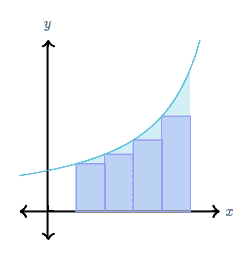
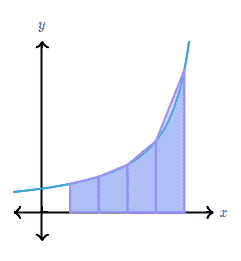
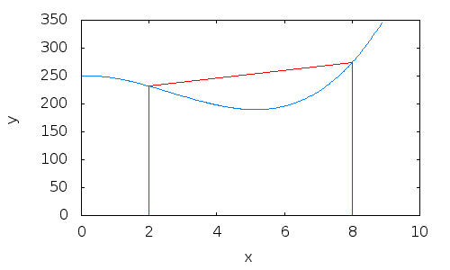

# F#中的梯形法则

> 原文：<https://dev.to/marinesm/trapezoidal-rule-in-f-253l>

数值是近似值；分析是精确的。

数值方法是一种工具，用于找到难以解析解决的问题的数值解。

这种方法主要由计算机来完成，是为了找到解决方案而执行的一整套指令。话虽如此，
梯形法则是一种用于求定积分的数值方法。这种方法最常见的应用是在一组给定的区间内找到函数下的
面积。找到这个区域通常是使用黎曼和，但这种方法被证明是更准确的，因为它使用梯形而不是矩形。

[T2】](https://res.cloudinary.com/practicaldev/image/fetch/s--EqGAOOL_--/c_limit%2Cf_auto%2Cfl_progressive%2Cq_auto%2Cw_880/https://raw.githubusercontent.com/MarinesM/Trapezoidal-Rule/master/Left.PNG)

*   莱曼总和
*   梯形法则

在这种情况下，我使用函数式编程语言 F#实现了这种数值方法。第一，我选择了要积分的函数；在这种情况下，sin(x):

```
let f x = System.Math.Sin(x) 
```

Enter fullscreen mode Exit fullscreen mode

该算法必须接收区间(a，b ),通过该区间它将找到要形成的梯形的面积和数量(N)。有了这些参数，现在可以计算每个梯形的长度:

```
let h = (b - a)/N 
```

Enter fullscreen mode Exit fullscreen mode

[T2】](https://res.cloudinary.com/practicaldev/image/fetch/s--EE_HbMeI--/c_limit%2Cf_auto%2Cfl_progressive%2Cq_66%2Cw_880/https://upload.wikimedia.org/wikipedia/commons/7/7e/Trapezium2.gif)

*   By [Mkwadee](https://en.wikipedia.org/wiki/User:Mkwadee "wikipedia:User:Mkwadee") at [英文维基百科](https://en.wikipedia.org/wiki/ "wikipedia:")， [CC BY-SA 3.0](https://creativecommons.org/licenses/by-sa/3.0 "Creative Commons Attribution-Share Alike 3.0") ，[链接](https://commons.wikimedia.org/w/index.php?curid=54729903)

此方法的公式如下:
[](https://res.cloudinary.com/practicaldev/image/fetch/s--1UR-MjEU--/c_limit%2Cf_auto%2Cfl_progressive%2Cq_auto%2Cw_880/https://raw.githubusercontent.com/MarinesM/Trapezoidal-Rule/master/formula.PNG)

为了计算上面的公式，我创建了两个函数:

```
let rec sum_recursive (xi:float) (h:float) f (N:float) (iter:float) =
    if iter = N then
      xi
    else
      let xi_1 = xi + h*f(h*iter)
      sum_recursive xi_1 h f N (iter+1.0)

let trapezoidal (a:float) (b:float) f (N:float) =
      let h = (b - a)/N
      let left_side = h/2.0*(f(a)+f(b))
      left_side + sum_recursive 0.0 h f N 0.0 
```

Enter fullscreen mode Exit fullscreen mode

这种方法可以用于:找出有多少流体流过特定区域，计算以一定速度移动物体所需的功，甚至找到物体的质心。

总的来说，学习编程一个数值方法使我能够联系数学概念，这通常只是在课堂上看到的；编程，这是我在日常生活中实际使用的东西。此外，这也是我第一次使用函数式编程语言，比如 F #；我最后很享受。

[这里](https://github.com/MarinesM/Trapezoidal-Rule)是我的完整代码
希望你觉得有用！

### 参考文献

[理解梯形法则](https://www.khanacademy.org/math/ap-calculus-ab/ab-accumulation-riemann-sums/ab-midpoint-trapezoid/a/understanding-the-trapezoid-rule)
[梯形法则](https://en.wikipedia.org/wiki/Trapezoidal_rule)
[如何用梯形法则求近似面积](http://www.dummies.com/education/math/calculus/how-to-approximate-area-with-the-trapezoid-rule/)