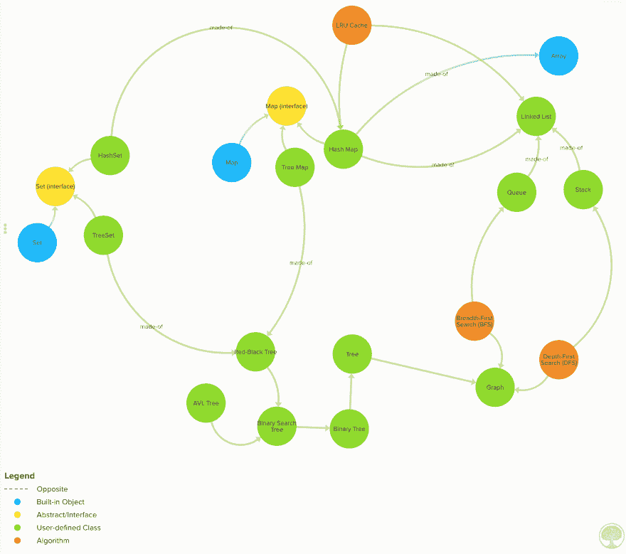
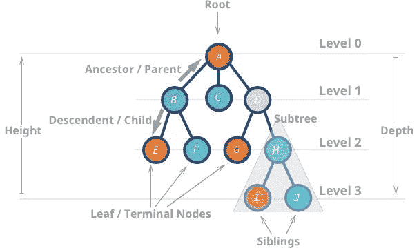
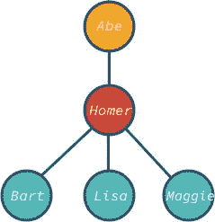
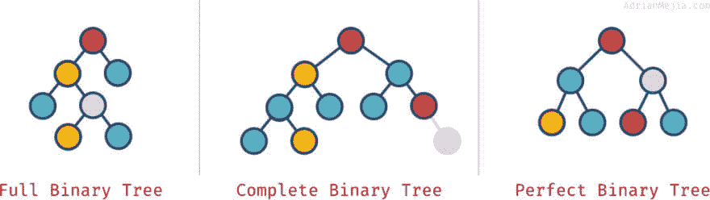
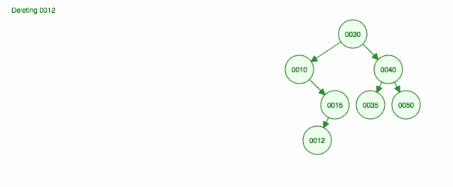
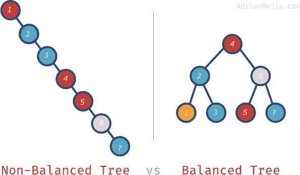

# 用 JavaScript 解释树形数据结构

> 原文：<https://dev.to/amejiarosario/tree-data-structures-explained-with-javascript-1d7d>

树形数据结构有许多用途，最好对它们的工作原理有一个基本的了解。树是地图和集合等其他常用数据结构的基础。此外，它们在数据库中用于执行快速搜索。HTML DOM 使用树形数据结构来表示元素的层次结构。在这篇文章中，我们将探索不同类型的树，如二叉树，二分搜索法树，以及如何实现它们。

在[之前的文章](https://dev.to/amejiarosario/graph-data-structures-for-beginners-5edn)中，我们探索了图形数据结构，它是树的一种广义情况。让我们开始学习什么是树数据结构吧！

您可以在 Github repo:
中找到所有这些实现以及更多内容

##  [阿梅加罗萨里奥](https://github.com/amejiarosario)/[DSA . js-数据-结构-算法-javascript](https://github.com/amejiarosario/dsa.js-data-structures-algorithms-javascript)

### 🥞JavaScript + eBook 中解释和实现的数据结构和算法

<article class="markdown-body entry-content container-lg" itemprop="text">

[T2】](https://user-images.githubusercontent.com/418605/59557258-10742880-8fa3-11e9-84fb-4d66a9d89faa.png)

# JavaScript 中的数据结构和算法

[](https://app.circleci.com/pipelines/github/amejiarosario/dsa.js-data-structures-algorithms-javascript)[](https://badge.fury.io/js/dsa.js)[](https://dsajs-slackin.herokuapp.com)

> 这是 DSA.js book 的编码实现和 NPM 包的回购。

> 在这个库中，您可以找到 JavaScript 中算法和数据结构的实现。这些材料可以作为开发人员的参考手册，或者您可以在面试前刷新特定主题。还有，你可以找到更高效解决问题的思路。

[T2】](https://user-images.githubusercontent.com/418605/46118890-ba721180-c1d6-11e8-82bc-6a671428b422.png)

## 目录

*   [安装](https://raw.githubusercontent.com/amejiarosario/dsa.js-data-structures-algorithms-javascript/master/#installation)
*   [特性](https://raw.githubusercontent.com/amejiarosario/dsa.js-data-structures-algorithms-javascript/master/#features)
*   [里面有什么](https://raw.githubusercontent.com/amejiarosario/dsa.js-data-structures-algorithms-javascript/master/#whats-inside)
    *   [<g-emoji class="g-emoji" alias="chart_with_upwards_trend" fallback-src="https://github.githubassets.cimg/icons/emoji/unicode/1f4c8.png">📈</g-emoji>算法分析](https://raw.githubusercontent.com/amejiarosario/dsa.js-data-structures-algorithms-javascript/master/#-algorithms-analysis)
    *   [<g-emoji class="g-emoji" alias="pancakes" fallback-src="https://github.githubassets.cimg/icons/emoji/unicode/1f95e.png">🥞</g-emoji>线性数据结构](https://raw.githubusercontent.com/amejiarosario/dsa.js-data-structures-algorithms-javascript/master/#-linear-data-structures)
    *   [<g-emoji class="g-emoji" alias="evergreen_tree" fallback-src="https://github.githubassets.cimg/icons/emoji/unicode/1f332.png">🌲</g-emoji>非线性数据结构](https://raw.githubusercontent.com/amejiarosario/dsa.js-data-structures-algorithms-javascript/master/#-non-linear-data-structures)
    *   [<g-emoji class="g-emoji" alias="hammer_and_pick" fallback-src="https://github.githubassets.cimg/icons/emoji/unicode/2692.png">⚒</g-emoji> 算法技巧](https://raw.githubusercontent.com/amejiarosario/dsa.js-data-structures-algorithms-javascript/master/#%E2%9A%92-algorithms-techniques)
*   [预定](https://raw.githubusercontent.com/amejiarosario/dsa.js-data-structures-algorithms-javascript/master/#book)
*   [常见问题解答](https://raw.githubusercontent.com/amejiarosario/dsa.js-data-structures-algorithms-javascript/master/#faq)
*   [支持](https://raw.githubusercontent.com/amejiarosario/dsa.js-data-structures-algorithms-javascript/master/#support)
*   [执照](https://raw.githubusercontent.com/amejiarosario/dsa.js-data-structures-algorithms-javascript/master/#license)

## 装置

您可以克隆回购协议或安装来自 NPM 的代码:

```
npm install dsa.js
```

Enter fullscreen mode Exit fullscreen mode

然后您可以将它导入到您的程序或 CLI 中

```
const { LinkedList, Queue, Stack } = require('dsa.js');
```

Enter fullscreen mode Exit fullscreen mode

所有公开的数据结构和算法的完整列表[见](https://raw.githubusercontent.com/amejiarosario/dsa.js-data-structures-algorithms-javascript/master/src/index.js)。

## 特征

算法是一种…

</article>

[View on GitHub](https://github.com/amejiarosario/dsa.js-data-structures-algorithms-javascript)

## 树木:基本概念

树是一种数据结构，其中一个节点可以有零个或多个孩子。每个节点包含一个**值**。像图一样，节点之间的连接叫做**边**。树是图的一种类型，但并不都是树(后面会详细介绍)。

这些数据结构被称为“树”，因为数据结构类似于树🌳。它以一个**根**节点和**分支**及其后代开始，最后是**叶**。

[T2】](https://res.cloudinary.com/practicaldev/image/fetch/s--HhqAH6wD--/c_limit%2Cf_auto%2Cfl_progressive%2Cq_auto%2Cw_880/https://adrianmejia.cimg/tree-parts.jpg)

以下是树的一些属性:

*   最顶层的节点称为**根**。
*   没有子节点的节点称为**叶节点**或**终端**节点。
*   **树的高度** ( *h* )是最远的叶子到根的距离(边数)。
    *   `A`高度为 3
    *   `I`高度为 0
*   节点的**深度**或**级别**是指根与所述节点之间的距离。
    *   `H`深度为 2
    *   `B`深度为 1

### 实现简单的树形数据结构

正如我们前面看到的，树节点只是一个数据结构，它有一个值，并且有到它们的后代的链接。

下面是一个树节点的例子:

```
class TreeNode {
  constructor(value) {
    this.value = value;
    this.descendents = [];
  }
} 
```

Enter fullscreen mode Exit fullscreen mode

我们可以创建一个有 3 个后代的树，如下:

```
// create nodes with values
const abe = new TreeNode('Abe');
const homer = new TreeNode('Homer');
const bart = new TreeNode('Bart');
const lisa = new TreeNode('Lisa');
const maggie = new TreeNode('Maggie');

// associate root with is descendents
abe.descendents.push(homer);
homer.descendents.push(bart, lisa, maggie); 
```

Enter fullscreen mode Exit fullscreen mode

仅此而已；我们有一个树形数据结构！

[T2】](https://res.cloudinary.com/practicaldev/image/fetch/s--laKfQbVG--/c_limit%2Cf_auto%2Cfl_progressive%2Cq_auto%2Cw_880/https://adrianmejia.cimg/simpson2-tree.jpg)

节点`abe`是树的**根**和`bart`，`lisa`和`maggie`是树的**叶**节点。请注意，树的节点可以有不同数量的后代:0、1、3 或任何其他值。

树形数据结构有许多应用，例如:

*   [地图](https://adrianmejia.com/blog/2018/04/28/data-structures-time-complexity-for-beginners-arrays-hashmaps-linked-lists-stacks-queues-tutorial/#HashMaps)
*   [设置](https://adrianmejia.com/blog/2018/04/28/data-structures-time-complexity-for-beginners-arrays-hashmaps-linked-lists-stacks-queues-tutorial/#Sets)
*   数据库
*   优先队列
*   查询 LDAP(轻量级目录访问协议)
*   表示网站上 HTML 的文档对象模型(DOM)。

## 二叉树

树节点可以有零个或多个子节点。然而，当一棵树最多有两个子树时，它被称为**二叉树**。

### 完全、完整、完美的二叉树

根据节点在二叉树中的排列方式，可以是**完整**、**完整**和**完美**:

*   **全二叉树**:每个节点正好有 0 或 2 个子节点(但从来没有 1 个子节点)。
*   **完全二叉树**:当除最后一层外的所有层都**满**且有节点时。
*   **完美二叉树**:当所有层(包括最后一层)都充满节点时。

看看这些例子:

[T2】](https://res.cloudinary.com/practicaldev/image/fetch/s--1C4dgmyL--/c_limit%2Cf_auto%2Cfl_progressive%2Cq_auto%2Cw_880/https://adrianmejia.cimg/full-complete-perfect-binary-tree.jpg)

这些属性并不总是相互排斥的。您可以有多个:

*   一棵完美的树总是完整的。
    *   完美的二叉树有精确的`2^k - 1\`节点，其中 *`k`* 是树的最后一级(从 1 开始)。
*   一棵完整的树总是**而不是**`full`。
    *   就像我们的“完整”示例一样，因为它的父节点只有一个子节点。如果我们移除最右边的灰色节点，那么我们将得到一个**完整的**和**完整的**树，但不是完美的。
*   一棵完整的树并不总是完整和完美的。

## 二叉查找树(英国夏令时)

二分搜索法树或简称 BST 是二叉树的一个特殊应用。BST 最多有两个节点(像所有二叉树一样)。但是，这些值是这样的，左边的子值必须小于父值，而右边的子值必须大于父值。

**Duplicates:** 一些 BST 不允许重复，而另一些 BST 添加与右子代相同的值。其他实现可能会对表里不一的情况进行计数(我们将在后面做这件事)。

让我们实现一个二叉查找树吧！

### BST 实现

BST 与我们之前的树的[实现非常相似。但是，也有一些不同之处:](#Implementing-a-simple-tree-data-structure)

*   节点最多只能有两个子节点:左和右。
*   节点值必须按`left < parent < right`排序。

这是树节点。非常类似于我们之前所做的，但是我们为左右儿童添加了一些方便的 getters 和 setters。请注意，它还保留了对父节点的引用，每次添加子节点时我们都会更新它。

[树节点. js](https://github.com/amejiarosario/dsa.js/blob/master/src/data-structures/trees/tree-node.js)

```
const LEFT = 0;
const RIGHT = 1;

class TreeNode {
  constructor(value) {
    this.value = value;
    this.descendents = [];
    this.parent = null;
  }

  get left() {
    return this.descendents[LEFT];
  }

  set left(node) {
    this.descendents[LEFT] = node;
    if (node) {
      node.parent = this;
    }
  }

  get right() {
    return this.descendents[RIGHT];
  }

  set right(node) {
    this.descendents[RIGHT] = node;
    if (node) {
      node.parent = this;
    }
  }
} 
```

Enter fullscreen mode Exit fullscreen mode

好了，目前为止我们可以添加一个左右子。现在，让我们来实现实施`left < parent < right`规则的 BST 类。

```
class BinarySearchTree {
  constructor() {
    this.root = null;
    this.size = 0;
  }

  add(value) { /* ... */ }
  find(value) { /* ... */ }
  remove(value) { /* ... */ }
  getMax() { /* ... */ }
  getMin() { /* ... */ }
} 
```

Enter fullscreen mode Exit fullscreen mode

让我们实现插入。

### BST 节点插入

要在二叉树中插入一个节点，我们执行以下操作:

1.  如果一棵树是空的，第一个节点成为根节点，你就大功告成了。
2.  比较根/父的值，如果它是*高*向右**走**，如果它是*低*向左**走**。如果相同，则该值已经存在，因此您可以增加重复计数(多重性)。
3.  重复#2，直到我们找到一个空插槽来插入新节点。

让我们来举例说明如何插入 30、40、10、15、12、50:

[")T2】](https://res.cloudinary.com/practicaldev/image/fetch/s--MyNrfBEk--/c_limit%2Cf_auto%2Cfl_progressive%2Cq_66%2Cw_880/https://adrianmejia.cimg/bst2.gif)

我们可以[实现插入](https://github.com/amejiarosario/dsa.js/blob/master/src/data-structures/trees/binary-search-tree.js#L11)如下:

```
 add(value) {
    const newNode = new TreeNode(value);

    if (this.root) {
      const { found, parent } = this.findNodeAndParent(value);
      if (found) { // duplicated: value already exist on the tree
        found.meta.multiplicity = (found.meta.multiplicity || 1) + 1;
      } else if (value < parent.value) {
        parent.left = newNode;
      } else {
        parent.right = newNode;
      }
    } else {
      this.root = newNode;
    }

    this.size += 1;
    return newNode;
  } 
```

Enter fullscreen mode Exit fullscreen mode

我们正在使用一个叫做`findNodeAndParent`的助手函数。如果我们发现节点已经存在于树中，那么我们增加`multiplicity`计数器。我们来看看这个功能[是如何实现的](https://github.com/amejiarosario/dsa.js/blob/master/src/data-structures/trees/binary-search-tree.js#L44) :

```
 findNodeAndParent(value) {
    let node = this.root;
    let parent;

    while (node) {
      if (node.value === value) {
        break;
      }
      parent = node;
      node = ( value >= node.value) ? node.right : node.left;
    }

    return { found: node, parent };
  } 
```

Enter fullscreen mode Exit fullscreen mode

`findNodeAndParent`遍历树搜索值。它从根开始(第 2 行)，然后根据值向左或向右移动(第 10 行)。如果该值已经存在，它将返回节点`found`和父节点。如果节点不存在，我们仍然返回`parent`。

### BST 节点删除

我们知道如何插入和寻找价值。现在，我们将实现删除操作。比加法稍微棘手一点，下面用以下案例来解释一下:

**删除一个叶节点(0 个子节点)**

```
 30                             30
 /     \         remove(12)     /     \
10      40       --------->    10      40
  \    /  \                      \    /  \
  15  35   50                    15  35   50
  /
12* 
```

Enter fullscreen mode Exit fullscreen mode

我们只是从节点的父节点(15)中移除引用，使其为空。

**删除只有一个子节点的节点。**

```
 30                              30
 /     \         remove(10)      /     \
10*     40       --------->     15      40
  \    /  \                            /  \
  15  35   50                         35   50 
```

Enter fullscreen mode Exit fullscreen mode

在这种情况下，我们转到父节点(30)并用子节点的子节点(15)替换子节点(10)。

**删除有两个子节点的节点**

```
 30                              30
 /     \         remove(40)      /     \
15      40*      --------->     15      50
       /  \                            /
      35   50                         35 
```

Enter fullscreen mode Exit fullscreen mode

我们正在删除节点 40，它有两个子节点(35 和 50)。我们用孩子的右孩子(50)替换父(30)的孩子(40)。然后我们把左边的孩子(35)放在原来的位置，所以我们必须让它成为 50 的左边的孩子。

移除节点 40 的另一种方法是向上移动左边的子节点(35 ),然后将右边的子节点(50)保持在原来的位置。

```
 30
  /     \
 15      35
           \
            50 
```

Enter fullscreen mode Exit fullscreen mode

只要保住二叉查找树房产，哪种方式都可以:`left < parent < right`。

**删除根。**

```
 30*                            50
  /     \       remove(30)      /     \
 15      50     --------->     15      35
        /
       35 
```

Enter fullscreen mode Exit fullscreen mode

删除根非常类似于我们前面讨论的删除具有 0、1 或 2 个子节点的节点。唯一的区别是，之后，我们需要更新树的根的引用。

这是我们讨论的动画。

[T2】](https://res.cloudinary.com/practicaldev/image/fetch/s--zLaciLZT--/c_limit%2Cf_auto%2Cfl_progressive%2Cq_66%2Cw_880/https://adrianmejia.cimg/bst-remove.gif)

在动画中，它向上移动左边的子/子树，并保持右边的子/子树不动。

现在我们有了一个好主意，让我们[实现](https://github.com/amejiarosario/dsa.js/blob/master/src/data-structures/trees/binary-search-tree.js#L89)它:

```
 remove(value) {
    const nodeToRemove = this.find(value);
    if (!nodeToRemove) return false;

    // Combine left and right children into one subtree without nodeToRemove
    const nodeToRemoveChildren = this.combineLeftIntoRightSubtree(nodeToRemove);

    if (nodeToRemove.meta.multiplicity && nodeToRemove.meta.multiplicity > 1) {
      nodeToRemove.meta.multiplicity -= 1; // handle duplicated
    } else if (nodeToRemove === this.root) {
      // Replace (root) node to delete with the combined subtree.
      this.root = nodeToRemoveChildren;
      this.root.parent = null; // clearing up old parent
    } else {
      const side = nodeToRemove.isParentLeftChild ? 'left' : 'right';
      const { parent } = nodeToRemove; // get parent
      // Replace node to delete with the combined subtree.
      parent[side] = nodeToRemoveChildren;
    }

    this.size -= 1;
    return true;
  } 
```

Enter fullscreen mode Exit fullscreen mode

以下是实施的一些亮点:

*   首先，我们搜索节点是否存在。如果没有，我们返回 false，我们就完成了！
*   如果要删除的节点存在，则将左右子节点合并成一个子树。
*   用合并的子树替换要删除的节点。

将左子树合并为右子树的函数如下:

[binarysearchtree . prototype . combineleftintorightsubtree](https://github.com/amejiarosario/dsa.js/blob/master/src/data-structures/trees/binary-search-tree.js#L89)

```
 combineLeftIntoRightSubtree(node) {
    if (node.right) {
      const leftmost = this.getLeftmost(node.right);
      leftmost.left = node.left;
      return node.right;
    }
    return node.left;
  } 
```

Enter fullscreen mode Exit fullscreen mode

例如，假设我们想要合并下面的树，并且我们将要删除节点`30`。我们想把 30 左边的子树混合到右边的子树中。结果是这样的:

```
 30*                             40
    /     \                          /  \
   10      40    combine(30)       35   50
     \    /  \   ----------->      /
     15  35   50                  10
                                   \
                                    15 
```

Enter fullscreen mode Exit fullscreen mode

现在，如果我们把新的子树作为根，那么节点`30`就不存在了！

## 二叉树横向

根据访问节点的顺序，遍历二叉树有不同的方式:按序、前序和后序。同样，我们可以使用从[图帖中了解到的](https://dev.to/blog/2018/05/14/Data-Structures-for-Beginners-Graphs-Time-Complexity-tutorial/) [DFS](https://dev.to/blog/2018/05/14/Data-Structures-for-Beginners-Graphs-Time-Complexity-tutorial/#Depth-first-search-DFS-Graph-search) 和 [BFS](https://dev.to/blog/2018/05/14/Data-Structures-for-Beginners-Graphs-Time-Complexity-tutorial/#Breadth-frirst-search-BFS-Graph-search) 。让我们逐一讲解。

**有序遍历**

按序遍历按以下顺序访问节点:左、父、右。

[binarysearchtree . prototype . in order traversal](https://github.com/amejiarosario/dsa.js/blob/master/src/data-structures/trees/binary-search-tree.js)T2】

```
 * inOrderTraversal(node = this.root) {
    if (node.left) { yield* this.inOrderTraversal(node.left); }
    yield node;
    if (node.right) { yield* this.inOrderTraversal(node.right); }
  } 
```

Enter fullscreen mode Exit fullscreen mode

让我们用这棵树来举例:

```
 10
         /    \
        5      30
      /       /  \
     4       15   40
   /
  3 
```

Enter fullscreen mode Exit fullscreen mode

有序遍历将打印出以下值:`3, 4, 5, 10, 15, 30, 40`。如果树是 BST，那么节点将按照升序排序，如我们的例子所示。

**后序遍历**

后序遍历按这个顺序访问节点:左，右，父。

[binarysearchtree . prototype . postordertraversal](https://github.com/amejiarosario/dsa.js/blob/master/src/data-structures/trees/binary-search-tree.js)

```
 * postOrderTraversal(node = this.root) {
    if (node.left) { yield* this.postOrderTraversal(node.left); }
    if (node.right) { yield* this.postOrderTraversal(node.right); }
    yield node;
  } 
```

Enter fullscreen mode Exit fullscreen mode

后序遍历将打印出以下值:`3, 4, 5, 15, 40, 30, 10`。

**前序遍历和 DFS**

按顺序遍历按以下顺序访问节点:父节点，左节点，右节点。
[binarysearchtree . prototype . preorderstraversal](https://github.com/amejiarosario/dsa.js/blob/master/src/data-structures/trees/binary-search-tree.js)T3】

```
 * preOrderTraversal(node = this.root) {
    yield node;
    if (node.left) { yield* this.preOrderTraversal(node.left); }
    if (node.right) { yield* this.preOrderTraversal(node.right); }
  } 
```

Enter fullscreen mode Exit fullscreen mode

前序遍历将打印出以下值:`10, 5, 4, 3, 30, 15, 40`。这个数字顺序与我们运行深度优先搜索(DFS)得到的结果相同。

[binarysearchtree . prototype . DFS](https://github.com/amejiarosario/dsa.js/blob/master/src/data-structures/trees/binary-search-tree.js)T2】

```
 * dfs() {
    const stack = new Stack();

    stack.add(this.root);

    while (!stack.isEmpty()) {
      const node = stack.remove();
      yield node;
      // reverse array, so left gets removed before right
      node.descendents.reverse().forEach(child => stack.add(child));
    }
  } 
```

Enter fullscreen mode Exit fullscreen mode

如果你需要复习 DFS，我们在[图帖](https://dev.to/blog/2018/05/14/Data-Structures-for-Beginners-Graphs-Time-Complexity-tutorial/#Depth-first-search-DFS-Graph-search)中有详细介绍。

**广度优先搜索(BFS)**

类似于 DFS，我们可以通过用`Queue`切换`Stack`来实现 BFS:

[binarysearchtree . prototype . bfs](https://github.com/amejiarosario/dsa.js/blob/master/src/data-structures/trees/binary-search-tree.js)T2】

```
 * bfs() {
    const queue = new Queue();

    queue.add(this.root);

    while (!queue.isEmpty()) {
      const node = queue.remove();
      yield node;
      node.descendents.forEach(child => queue.add(child));
    }
  } 
```

Enter fullscreen mode Exit fullscreen mode

BFS 的顺序是:`10, 5, 30, 4, 15, 40, 3`

## 平衡与非平衡树

到目前为止，我们已经讨论了如何对`add`、`remove`和`find`元素进行处理。然而，我们还没有谈到运行时。让我们想想最坏的情况。

假设我们要按升序对数字进行加法运算。

[T2】](https://res.cloudinary.com/practicaldev/image/fetch/s--bzdkmIdK--/c_limit%2Cf_auto%2Cfl_progressive%2Cq_66%2Cw_880/https://adrianmejia.cimg/bst-asc.gif)

我们将结束左侧的所有节点！这个不平衡的树并不比 LinkedList 好多少，所以寻找一个元素需要花费 *O(n)* 。😱

在一棵不平衡的树上找东西，就像在字典里一页一页地找一个词。当树被平衡时，你可以在中间打开字典，从那里你知道你是否必须根据字母表和你正在寻找的单词向左或向右。

我们需要找到一种方法来平衡这棵树！

如果树是平衡的，那么我们可以在 T2 中找到元素，而不是遍历每个节点。先说平衡树是什么意思。

[T2】](https://res.cloudinary.com/practicaldev/image/fetch/s--alv7RLsf--/c_limit%2Cf_auto%2Cfl_progressive%2Cq_auto%2Cw_880/https://adrianmejia.cimg/balanced-vs-non-balanced-tree.jpg)

如果我们在非平衡树中搜索`7`，我们必须从 1 到 7。但是，在平衡树中，我们访问:`4`、`6`和`7`。大树的情况更糟。如果有一百万个节点，搜索一个不存在的元素可能需要访问全部一百万个节点，而在平衡树上只需要访问 20 次！这是一个巨大的差异！

我们将在下一篇文章中使用自平衡树(AVL 树)来解决这个问题。

## 总结

我们已经覆盖了很多树木。让我们用子弹来总结一下:

*   树是一种数据结构，其中节点具有 0 个或多个后代/孩子。
*   树节点没有循环(非循环)。如果它有循环，则它是一个[图形数据结构](https://dev.to/amejiarosario/graph-data-structures-for-beginners-5edn)。
*   有两个或更少孩子的树叫做:二叉树
*   当一棵二叉树以左边的值小于父值，右边的值大于父值的方式排序时，那么并且只有这样我们才有一个**二叉查找树**。
*   你可以以前/后/按顺序的方式访问一棵树。
*   一个不平衡的时间复杂度为 *O(n)* 。🤦🏻‍
*   a 均衡的时间复杂度为 *O(log n)* 。🎉