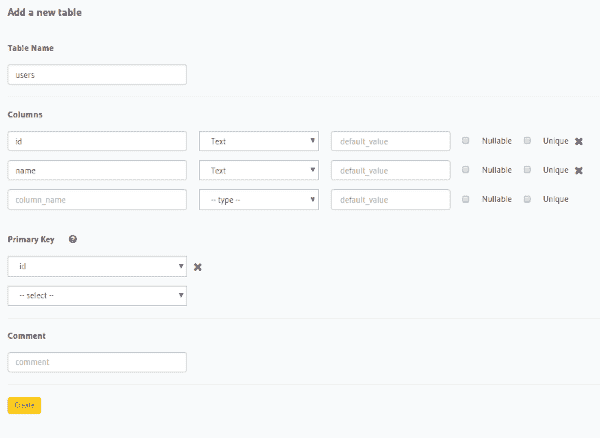
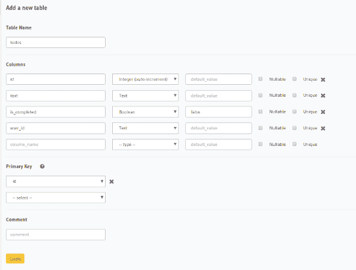
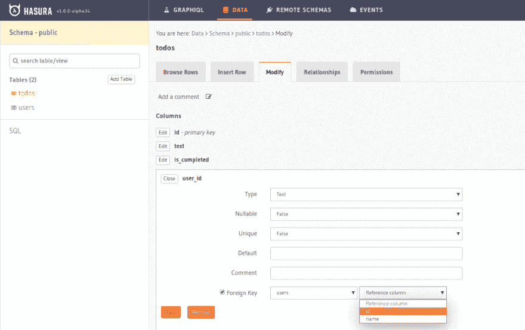
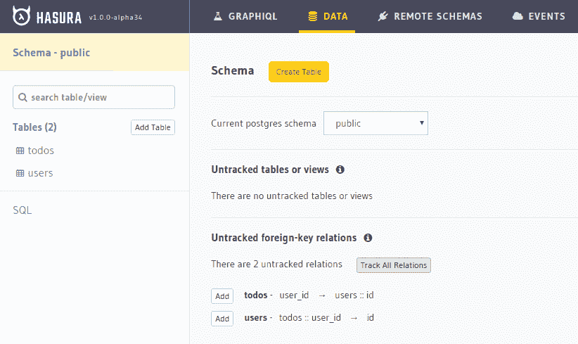
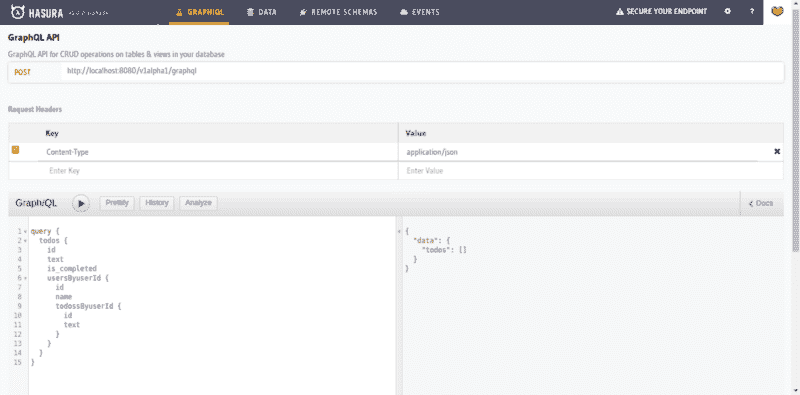
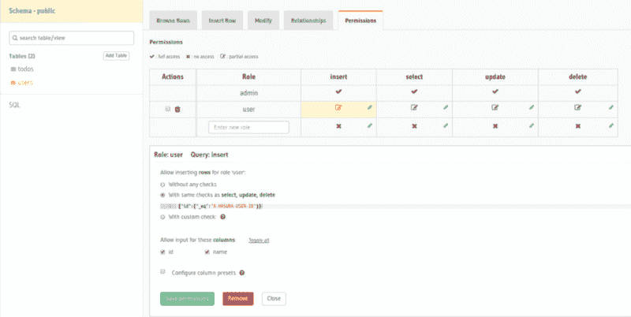

# 教程:full stack React Native with graph QL

> 原文：<https://dev.to/hasurahq/tutorial-fullstack-react-native-with-graphql-5f3o>

### 用 Apollo 新的查询和变异组件构建 React 原生待办应用的教程

*编辑声明:此博文于 2019 年 3 月 1 日更新，更新了已弃用的部分。*

## **概述**

在本教程中，我们将构建一个 React Native to-do 应用程序，帮助我们添加任务、查看任务、标记/取消标记任务完成以及删除任务。

为了构建应用程序，我们将使用:

*   [反应原生](https://facebook.github.io/react-native/)
*   [阿波罗客户端](https://www.apollographql.com/docs/react/)
*   [Hasura GraphQL 引擎](https://hasura.io/)(用于 GraphQL 后端)
*   [验证 0](https://auth0.com/) (用于验证)

*注:我们将使用新的* [*查询*](https://www.apollographql.com/docs/react/essentials/queries.html#basic) *和* [*突变*](https://www.apollographql.com/docs/react/essentials/mutations.html#basic) *组件，即 Apollo 在其 2.1.3 版本中引入的*[*react-Apollo*](https://github.com/apollographql/react-apollo)*。*

## 第 1 部分:部署 GraphQL 后端

我们需要一个 GraphQL 后端，在那里我们可以存储我们的应用程序的状态。我们将使用开源的 Hasura GraphQL 引擎，它可以通过 Postgres 提供即时的 GraphQL。

**部署**

*   只需点击下面的按钮，即可部署 Hasura GraphQL 引擎。

<figure>[](https://heroku.com/deploy?template=https://github.com/hasura/graphql-engine-heroku) 

<figcaption>点击此按钮将 GraphQL 引擎部署到 Heroku</figcaption>

</figure>

*   记下部署的应用程序的 URL。它的形式应该是:`myfancyapppname.herokuapp.com`。这是您的 GraphQL 引擎 URL。

**创建表格**

为了存储用户信息，我们将创建一个`users`表。

```
users
+--------+-----------------------------+
| column |      type                   |
+--------+-----------------------------+
| id     | serial NOT NULL primary key |
| name   | text NOT NULL primary key   |
+--------+-----------------------------+ 
```

Enter fullscreen mode Exit fullscreen mode

* * *

这些列的意义如下:

*   **id** :这是一个唯一的整数，它将标识`users`表中的每个条目。它也是表的主键。
*   **名称:**这是用户的名称

该表的数据将来自 Auth0。

注意:设置 Auth0 并与 Hasura 集成已经完成，这超出了本教程的范围。 [*点击这里*](https://docs.hasura.io/1.0/graphql/manual/auth/jwt.html#auth0) *学习怎么做。*

为了存储我们的待办事项，我们需要一个包含以下字段的`todos`表。

```
todos
+--------------+---------------------------------------------------+
|    column    |         type                                      |
+--------------+---------------------------------------------------+
| id           | serial NOT NULL primary key                       |
| task         | text NOT NULL                                     |
| is_completed | boolean NOT NULL                                  |
| user_id      | integer NOT NULL FOREIGN KEY REFERENCES users(id) |
+--------------+---------------------------------------------------+ 
```

Enter fullscreen mode Exit fullscreen mode

这些列的意义如下:

*   **id** :这是一个唯一的整数，用于标识每个*待办事项*。它也是表的主键。
*   **正文**:这是待办任务。
*   **is_completed** :这是一个布尔标志，将任务标记为*已完成*和*待定。*
*   **用户标识:**这是引用`users`表的`id`的外键。它将待办事项与其作者相关联。

让我们在后端创建上面的表:

*   在浏览器中转到您的 GraphQL 引擎 URL。它打开了一个管理用户界面，你可以在那里管理你的后端。
*   转到顶部的`Data`部分，点击“Create Table ”,添加前面提到的列名和类型。

<figure>[](https://res.cloudinary.com/practicaldev/image/fetch/s--Gj_utnOI--/c_limit%2Cf_auto%2Cfl_progressive%2Cq_auto%2Cw_880/https://blog.hasura.io/conteimg/2019/03/image.png)T5】创建`todos`表</figure>

<figure>[](https://res.cloudinary.com/practicaldev/image/fetch/s--J3S_EcVB--/c_limit%2Cf_auto%2Cfl_progressive%2Cq_auto%2Cw_880/https://blog.hasura.io/conteimg/2019/03/image-1.png)T5】创建`todos`表</figure>

**表格关系**

正如您在上面看到的，在`todos`和`users`之间应该有一个基于外键的关系。让我们添加外键约束和关系。转到顶部的`Data`选项卡，点击`todos`工作台。现在，在修改部分，编辑`user_id`列并使其成为外键。之后，返回到`Data`选项卡并点击`Track all relations`。

<figure>[](https://res.cloudinary.com/practicaldev/image/fetch/s--lRRpEhKf--/c_limit%2Cf_auto%2Cfl_progressive%2Cq_auto%2Cw_880/https://cdn-images-1.medium.com/max/1000/1%2AGFlOoTknXkAA_OYkmbBwNA.png) 

<figcaption>添加外键</figcaption>

</figure>

<figure>[](https://res.cloudinary.com/practicaldev/image/fetch/s--8_rq1-6h--/c_limit%2Cf_auto%2Cfl_progressive%2Cq_auto%2Cw_880/https://cdn-images-1.medium.com/max/1000/1%2AuR2lus1px_M2CpxcNe_HNw.png) 

<figcaption>添加关系</figcaption>

</figure>

一旦跟踪了关系，就可以对`https://myfancyapp.herokuapp.com/v1alpha1/graphql`进行复杂的嵌套 GraphQL 查询。要试用，请转到控制台中的`GraphiQL`选项卡并尝试进行查询。

<figure>[](https://res.cloudinary.com/practicaldev/image/fetch/s--s0iBEy7---/c_limit%2Cf_auto%2Cfl_progressive%2Cq_auto%2Cw_880/https://cdn-images-1.medium.com/max/800/1%2Ah27UvTXOI7rDXQakCZJ7LQ.png) 

<figcaption>图 QL - An API Explorer</figcaption>

</figure>

**表格权限**

在我们的`todos`表中，我们希望用户只 CRUD 他们自己的待办事项。Hasura 提供了一个访问控制层，用于设置将数据限制到特定角色的规则。在这个应用程序中，我们将只有`user`角色。让我们为它设置权限。

在你的 Hasura 控制台中转到`/data/schema/public/tables/user/permissions`，进入角色`user`，只有当`x-hasura-user-id`等于`id`时，才允许`user`表中的 CRUD。这意味着 Hasura 将确保只有当头中 JWT 的`X-Hasura-User-Id`等于被 CRUD 的用户的`id`时，用户才能 CRUD。

<figure>[](https://res.cloudinary.com/practicaldev/image/fetch/s--lTttZEKE--/c_limit%2Cf_auto%2Cfl_progressive%2Cq_auto%2Cw_880/https://cdn-images-1.medium.com/max/800/1%2AuP8hZXyhXMT5NWPQ_Bc7Jg.png) 

<figcaption>为用户设置插入权限表</figcaption>

</figure>

上图显示了`insert`查询的权限条件，为`select`、`update`和`delete`查询添加类似的权限。

同样，用一个条件:`{ 'user_id': 'X-Hasura-User-Id' }`添加对`todos`表的权限。这意味着用户只能 CRUD 他们自己的待办事项。

至此，我们已经建立了我们的后端。让我们现在就开始工作。

### 第 2 部分:设置 React 本地项目

在本教程中，我们将使用 [Expo](http://expo.io) 。通过运行:
开始一个样板项目

```
npm install -g expo-cli
expo init Todo
cd Todo
npm start 
```

Enter fullscreen mode Exit fullscreen mode

这将创建一个空的 React 本地项目，其中`App.js`是入口点。这个`App.js`必须保持一个名为`isLoggedIn`的状态，如果为假，它应该渲染授权屏幕，否则渲染应用程序(目前只有`Hello world`)。它还应该将`login`和`logout`函数分别作为道具传递给 AuthScreen 和 app。`App.js`目前看起来应该是这样的: