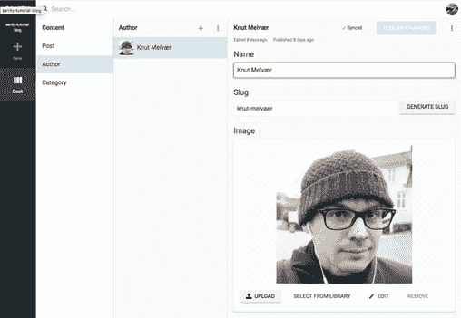
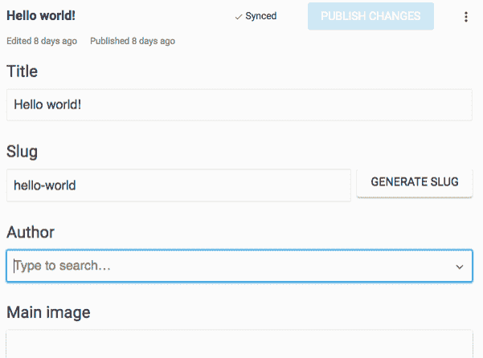
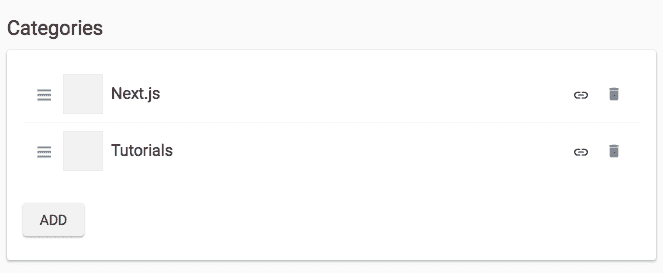
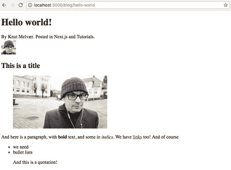

# 教程:用 React 和 Next.js 运行一个健全的博客

> 原文：<https://dev.to/sanity-io/tutorial-run-a-sanity-backed-blog-with-react-and-nextjs-1eek>

有时候你只是需要一个博客。虽然有大量的博客平台，但有很好的理由让你的博客内容与你的其他内容一起存在，无论是文档(就像我们的情况)，产品，投资组合还是其他什么。博客的内容模型，或者说数据模式，也是一个简单的起点，可以让你开始做一些有理智和独立前端的事情。

在本教程中，我们将创建一个以[健全](https://sanity.io/?utm_source=devto&utm_medium=cpc&utm_campaign=rbt)为内容后端的博客，以及用于呈现网页的基于反应的框架 Next.js。

# 1。安装 Sanity 和预配置的博客模式

如果您还没有这样做，请使用 npm 安装 Sanity 命令行(CLI)工具。

```
npm i -g @sanity/cli. 
```

Enter fullscreen mode Exit fullscreen mode

这允许您在项目文件夹中运行`sanity init`命令，事实上，这是下一步。你将被要求在 Google 或 Github 上创建一个账户。之后，您可以创建一个新项目，这时会要求您选择一个项目模板。选择博客模式模板。首先，您需要为您的项目和数据集命名(如果您需要一个数据集用于测试，您可以添加更多的数据集)，并为您想要存储 content studio 文件的位置选择一个路径。

```
$ Select project to use: Create new project
$ Informal name for your project: sanity-tutorial-blog
$ Name of your first data set: production
$ Output path: ~/Sites/sanity-tutorials/blog
$ Select project: template Blog (schema) 
```

Enter fullscreen mode Exit fullscreen mode

安装完成后，您可以运行`sanity start`来启动 Content Studio，在这里您可以开始编辑您的内容。一旦你点击发布，这些内容将立即被同步到云端，并可通过 API 获得。通过运行`sanity deploy`，你将上传这个工作室，并使它在网络上对那些有访问权限的人可用(你可以通过导航到 [manage.sanity.io](https://manage.sanity.io/?utm_source=devto&utm_medium=cpc&utm_campaign=react_blog_tutorial) 来添加用户)。

您可以对存储在项目文件夹中的模式做很多事情，但是这是另一个教程的内容。现在，我们只想让我们的博客运行起来！

# 2。安装 Next.js 并让它运行

(由令人敬畏的公司[开发的)Zeit](https://zeit.co/) 为制作基于 React 的网页提供了一个简洁的设置，可以在第一次请求时进行服务器渲染，以及许多其他有用的功能。如果你已经习惯了 React，或者已经尝试过 create-react-app，它应该不会太难上手。

为您的前端文件创建一个文件夹，并运行`npm init`为您的项目创建一个 package.json 文件。然后用
安装你的 Next.js 依赖项

```
npm install --save next react react-dom 
```

Enter fullscreen mode Exit fullscreen mode

并将以下内容添加到您的 package.json 中:

```
{  "scripts":  {  "dev":  "next",  "build":  "next build",  "start":  "next start"  }  } 
```

Enter fullscreen mode Exit fullscreen mode

Next.js 根据您在文件系统中的位置进行路由。因此，如果你添加一个名为`pages`的文件夹，并在其中添加`index.js`，它将成为你网站的首页。同样，如果你在`/pages`中添加`about.js`，一旦你启动项目，这将显示在`[localhost:3000/about](http://localhost:3000)`上。为了确保一切就绪，尝试将以下代码添加到`pages/index.js`，并在 shell 中键入`npm run dev`:

```
const Index = (props) => <div>Hello world!</div>

export default Index 
```

Enter fullscreen mode Exit fullscreen mode

现在，如果你在浏览器中点击 [localhost:3000](http://localhost:3000) ，你应该会有一个问候。

# 3。制作动态页面模板

到目前为止一切顺利，但现在是有趣的部分:让我们从 Sanity 中获取一些内容，并在 React 中呈现出来。首先安装连接到 Sanity API 所需的依赖项:`npm install @sanity/client --save`。在根前端文件夹中创建一个名为`client.js`的新文件。打开文件，放入以下内容:

```
import sanityClient from '@sanity/client'

export default sanityClient({
  projectId: 'your-project-id', // you can find this in sanity.json
  dataset: 'production', // or the name you chose in step 1
  useCdn: true // `false` if you want to ensure fresh data
}) 
```

Enter fullscreen mode Exit fullscreen mode

为每个新的博客条目添加一个新文件是不切实际的。甚至是一场争论。因此，让我们制作一个页面模板，使我们能够使用来自 Sanity 的 URL slugs。不幸的是，Next.js 没有开箱即用的动态页面。为了解决这个问题，我们必须添加一些服务器代码。让我们重用`nextjs/examples`中的代码，在根文件夹中添加一个`server.js`文件，代码如下:

```
const { createServer } = require('http')
const { parse } = require('url')
const next = require('next')
const pathMatch = require('path-match')

const port = parseInt(process.env.PORT, 10) || 3000
const dev = process.env.NODE_ENV !== 'production'
const app = next({ dev })
const handle = app.getRequestHandler()
const route = pathMatch()
const match = route('/blog/:slug')

app.prepare()
  .then(() => {
    createServer((req, res) => {
      const { pathname, query } = parse(req.url, true)
      const params = match(pathname)
      if (params === false) {
        handle(req, res)
        return
      }
      // assigning `query` into the params means that we still
      // get the query string passed to our application
      // i.e. /blog/foo?show-comments=true
      app.render(req, res, '/blog', Object.assign({}, query, params))
    })
      .listen(port, (err) => {
        if (err) throw err
        console.log(`> Ready on http://localhost:${port}`)
      })
  }) 
```

Enter fullscreen mode Exit fullscreen mode

> *抓到你了*👆
> 如果您对`server.js`或`package.json`进行了更改，您必须重启 npm 运行开发。

您还应该运行`npm install http url path-match --save`以获得必要的依赖项，并将`package.json`中的脚本部分改为:

```
{  "scripts":  {  "dev":  "node server.js",  "build":  "next build",  "start":  "NODE_ENV=production node server.js"  }  } 
```

Enter fullscreen mode Exit fullscreen mode

您的前端文件夹现在应该是这样的:

```
~/blog/frontend
# install tree with homebrew install tree
$ tree -I node_modules
.
├── client.js
├── package-lock.json
├── package.json
└── pages
    ├── blog.js
    └── index.js
├── server.js
1 directory, 6 files 
```

Enter fullscreen mode Exit fullscreen mode

Next.js 附带了一个名为`getInitialProps`的特殊函数，在`/pages`中呈现模板之前，调用该函数并向 react 组件返回道具。这是获取页面所需数据的绝佳位置。

> *抓到你了*👆
> getInitialProps 仅在 pages 文件夹中的文件中工作，并用于路由，即不会为这些页面中包含的 react 组件调用它。[阅读 Next.js 文档中的更多信息](https://github.com/zeit/next.js/#user-content-fetching-data-and-component-lifecycle)。

有很多不同的方法可以编写 react 页面组件，这只是一个简单的例子，可以让你更容易上手。将以下内容放入 blog.js 中。这里我们将 slug 设置为标题，只是为了在添加从 Sanity 获取内容的代码之前测试代码是否有效:

```
const Post = ({ title = 'No title' }) => (
  <div>
    <h1>{title}</h1>
  </div>
)

Post.getInitialProps = ({ query: { slug = '' } }) => { 
  const title = slug
  return { title }
}

export default Post 
```

Enter fullscreen mode Exit fullscreen mode

如果你转到`[localhost:3000/blog/whatever](http://localhost:3000/blog/whatever)`，你现在应该看到“whatever”作为 H1 打印在页面上。

# 4。从理智中获取一些内容

我们现在已经为 Next.js 设置了一个用于首页的模板(index.js)和一个自定义服务器，该服务器使 blog.js 模板可以将/blog/下的 slug 作为查询。现在有趣的部分开始了，让我们给这个混合体添加一些理智:

```
import client from '../client'

const BlogPost = ({ title = 'No title' }) => (
  <div>
    <h1>{title}</h1>
  </div>
)

BlogPost.getInitialProps = async ({ query: { slug } }) => {
  const { title } = await client.fetch('*[_type == "post" && slug.current == $slug][0]', { slug })
  return { title }
}

export default BlogPost 
```

Enter fullscreen mode Exit fullscreen mode

我们使用 async/await，因为我们正在进行异步 API 调用，这使得代码更容易理解。`client.fetch()`有两个参数:一个查询和一个带有参数和值的对象。

> *Pro-tip*
> 本教程中的 GROQ 语法可以这样理解:
> 
> `*`👈选择所有文档
> 
> `[_type == 'post' && slug.current == $slug]`👈将所选内容过滤到类型为“post”的文档，以及那些与我们在参数中拥有的 slug 相同的文档
> 
> `[0]`👈选择列表中的第一个也是唯一一个

为了让前端服务器真正从 Sanity 获取数据，我们必须将其域添加到[CORS-设置](https://www.sanity.io/docs/front-ends/cors?utm_source=devto&utm_medium=cpc&utm_campaign=react_blog_tutorial)。换句话说，我们必须将`localhost:3000`(以及最终你的博客所在的域名)添加到 Sanity 的 CORS 源设置中。如果您在 shell 中输入`sanity manage`,您将在浏览器中看到该项目的设置。导航到设置并添加`http://localhost:3000`作为新的原点。

现在，你可以创建并发布一个至少有一段文字和一个标题的帖子:

[T2】](https://res.cloudinary.com/practicaldev/image/fetch/s--ECcUpiOR--/c_limit%2Cf_auto%2Cfl_progressive%2Cq_auto%2Cw_880/https://cdn.sanity.img/3do82whm/production/01bc987afc3baa6c026f5fe99b74f5d4c2a5c041-1125x316.png%3Fw%3D1000)

转到[http://localhost:3000/Hello-world](http://localhost:3000/hello-world)并确认 H1 拼写为“Hello world！”。现在，您已经成功地将前端与理智连接起来。🎉

# 5。添加作者和类别署名

在 Content Studio 中，您会发现，您可以为作者和类别添加条目。去添加至少一个有图片的作者。

[T2】](https://res.cloudinary.com/practicaldev/image/fetch/s--v-xaX71P--/c_limit%2Cf_auto%2Cfl_progressive%2Cq_auto%2Cw_880/https://cdn.sanity.img/3do82whm/production/070502c8d3fe8a28fab737dd3869be3220363782-1208x833.png%3Fw%3D1000%26h%3D350%26fit%3Dmax)

回到你的博客文章，在作者栏附上这个作者，像这样:

[T2】](https://res.cloudinary.com/practicaldev/image/fetch/s--q_hx07kC--/c_limit%2Cf_auto%2Cfl_progressive%2Cq_66%2Cw_880/https://cdn.sanity.img/3do82whm/production/2da04a862d99dc1a179aaef911857ddb37384c78-601x447.gif%3Fw%3D1000%26h%3D350%26fit%3Dmax)

发布更改，然后回到代码编辑器。我们刚才所做的是引用一位来自博客帖子的作者。引用是健全性的一个强大部分，它使得跨类型连接和重用内容成为可能。如果检查你的块文档(`ctrl + alt/opt + i`)，你会看到这个对象看起来像这样:

```
"author":  {  "_ref":  "fdbf38ad-8ac5-4568-8184-1db8eede5d54",  "_type":  "reference"  } 
```

Enter fullscreen mode Exit fullscreen mode

如果我们现在取出 author-variable ( `const { title, author } = await client.fetch('*[slug.current == $slug][0]',{ slug })`)，这就是我们将得到的内容，在这种情况下这对我们来说不是很有用。这就是 GROQ 中投影派上用场的地方。 [Projections 是 GROQ](https://www.sanity.io/docs/data-store/query-cheat-sheet#object-projections?utm_source=devto&utm_medium=cpc&utm_campaign=react_blog_tutorial) 的一个强大特性，允许我们指定 API-response 来满足我们的需求。

```
import client from '../client'

const BlogPost = ({ title = 'No title', name = 'No name' }) => (
  <div>
    <h1>{title}</h1>
    <span>By {name}</span>
  </div>
)

BlogPost.getInitialProps = async ({ query: { slug } }) => {
  const document = await client.fetch('*[_type == "post" && slug.current == $slug][0]{title, "name": author->name}', { slug })
  return document
}

export default BlogPost 
```

Enter fullscreen mode Exit fullscreen mode

在这里，我将投影`{title, "name": author->name}`添加到我们的查询中。在这里，我指定我希望在 API 调用中返回文档中的什么内容。我们需要为作者名创建一个键，并使用箭头`->`跟踪对作者文档上 name-property 的引用。换句话说，我们要求 Sanity 跟踪`_ref`下的 id，并从该文档返回变量`name`的值。

让我们试着对类别做同样的事情。首先，在 Content Studio 中创建至少两个类别。我给 Next.js 加了一个，给*教程*加了一个。

[T2】](https://res.cloudinary.com/practicaldev/image/fetch/s--yQtjlpGJ--/c_limit%2Cf_auto%2Cfl_progressive%2Cq_auto%2Cw_880/https://cdn.sanity.img/3do82whm/production/39c9adb5a886d2a5fa4fc183cfafe5dc136b8514-663x273.png%3Fw%3D1000%26h%3D350%26fit%3Dmax)

现在我们的博客文章中有了一系列对类别的引用。如果您在文档检查器中取一个峰值，您会看到这些显示为作者条目，带有`_ref` -id 的对象。所以我们也必须使用投影来得到这些。

```
import client from '../client'

const BlogPost = ({ title = 'No title', name = 'No name', categories = [] }) => (
  <div>
    <h1>{title}</h1>
    <span>By {name}.</span>
    {categories && (
      <ul>Posted in
        { categories.map(category => (
          <li key={category}>{category}</li>
        ))}
      </ul>
      )
    }
  </div>
)

BlogPost.getInitialProps = async ({ query: { slug } }) => {
  const document = await client.fetch('*[_type == "post" && slug.current == $slug][0]{title, "name": author->name, "categories": categories[]->title}', { slug })
  return document
}

export default BlogPost 
```

Enter fullscreen mode Exit fullscreen mode

类别的投影与 author 非常相似，唯一的区别是我在关键类别上加了方括号，因为这是一个引用数组。

但是我们也想把作者的照片添加到署名中！Sanity 中的图像和文件资产也是引用，这意味着如果我们要获得作者图像，我们首先必须遵循对作者文档和图像资产的引用。我们可以通过访问`"imageUrl": author->image.asset->url`直接检索 imageUrl，但是这里使用我们制作的[图像 Url 包](https://www.sanity.io/docs/front-ends/presenting-images)更容易。用`npm i --save @sanity/image-url`在前端工程中安装包。它获取图像对象并确定从哪里获取图像，这使得使用焦点特征等变得更加容易。

```
import client from '../client'
import imageUrlBuilder from '@sanity/image-url'
const builder = imageUrlBuilder(client)

function urlFor(source) {
  return builder.image(source)
}

const BlogPost = ({ title = 'No title', name = 'No name', categories = [], authorImage = {} }) => (
  <div>
    <h1>{title}</h1>
    <span>By {name}.</span>
    {categories && (
      <ul>Posted in
        { categories.map(category => (
          <li key={category}>{category}</li>
        ))}
      </ul>
      )
    }
    <div>
      
    </div>
  </div>
)

BlogPost.getInitialProps = async ({ query: { slug } }) => {
  const document = await client.fetch(`*[_type == "post" && slug.current == $slug][0]{
      title,
      "name": author->name,
      "categories": categories[]->title,
      "authorImage": author->image
    }`, { slug })
  return document
}

export default BlogPost 
```

Enter fullscreen mode Exit fullscreen mode

已经为图像 URL 构建器添加了代码行，我们可以在`urlFor()`函数中发送来自 Sanity 的图像对象，并在不同的方法(例如`.width(50)`)后面添加`.url()`-方法。

# 6。添加富文本内容

如果没有对文本内容的强大支持，一个博客就没有意义了。Sanity 中的富文本是以一种允许我们在许多不同的上下文中使用它的方式构建的:从浏览器中的 HTML 到语音界面中的语音实现。关于块内容和它的可扩展性有很多要说的，但在本教程中，我们将只使用包[块内容反应](https://github.com/sanity-io/block-content-to-react)附带的开箱即用功能。用`npm install --save @sanity/block-content-to-react`安装。

```
import BlockContent from '@sanity/block-content-to-react'
import imageUrlBuilder from '@sanity/image-url'
import client from '../client'
const builder = imageUrlBuilder(client)
function urlFor(source) {
  return builder.image(source)
}
const BlogPost = ({ title = 'No title', name = 'No name', categories = [], authorImage = {}, body = [] }) => (
  <div>
    <h1>{title}</h1>
    <span>By {name}.</span>
    {categories && (
      <ul>Posted in
        { categories.map(category => (
          <li key={category}>{category}</li>
        ))}
      </ul>
      )
    }
    <div>
      
    </div>
    <BlockContent
      blocks={body}
      imageOptions={{w: 320, h: 240, fit: 'max'}}
      projectId={client.clientConfig.projectId}
      dataset={client.clientConfig.dataset}
    />
  </div>
)

BlogPost.getInitialProps = async ({ query: { slug } }) => {
  const document = await client.fetch(`*[_type == "post" && slug.current == $slug][0]{
      title,
      "name": author->name,
      "categories": categories[]->title,
      "authorImage": author->image,
      body
    }`, { slug })
  return document
}

export default BlogPost 
```

Enter fullscreen mode Exit fullscreen mode

我们将 react-component 作为`BlockContent`导入，并从 post-document 获取主体。我们将主体作为`blocks-prop`发送，并添加`projectID`和来自`client-config`的数据集，以便让`BlockContent`组件知道从哪里获取可能出现在富文本字段中的图像。

我还加了一个叫`imageOptions`的道具，控制图像的默认输出。就是这样！您可以[定制不同元素的输出，甚至通过发送我们称之为“序列化器”的东西来添加您自己的定制块类型](https://github.com/sanity-io/block-content-to-react)——我们将在另一篇博客文章中介绍这些。

[T2】](https://res.cloudinary.com/practicaldev/image/fetch/s--zCxJjr1e--/c_limit%2Cf_auto%2Cfl_progressive%2Cq_auto%2Cw_880/https://cdn.sanity.img/3do82whm/production/0897b09dd01278a99a7386611e943f652076efe1-785x578.png%3Fw%3D1000%26h%3D350%26fit%3Dmax)

本教程到此结束！当谈到为一个非常常见的内容设置编写前端层时，我们现在已经涉及了很多内容，但是仅仅涉及了我们可以通过结合使用 Sanity 和 React 来完成的功能和漂亮的事情的冰山一角。

你可以从 GitHub 下载[示例项目，也可以在](https://github.com/sanity-io/sanity-blog-tutorial) [Gitter](https://gitter.im/sanity-io/sanity) 或[上随意向我们提问，不过你也可以找到我们](https://twitter.com/sanity_io)。