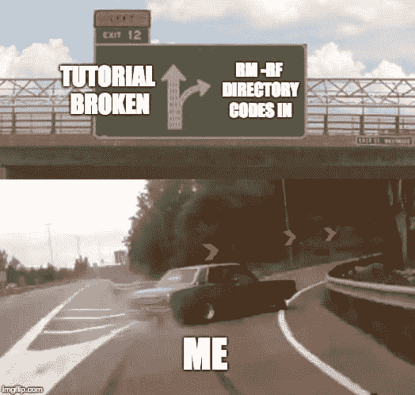

# 教程和到期日期

> 原文：<https://dev.to/mepda/tutorials-and-expiration-dates-501p>

在过去的半年左右的时间里，我很幸运地在 ASP.NET 的一个项目上工作，安全地满足了客户的明确要求，并得到了一位资深程序员的指导。以这种方式学习是很棒的，知道任何可怕的问题都可以通过与我的导师/老板交谈或直接与客户交谈来澄清，我感到很安慰。这就像在一场持续的暴风雨中呆在一个隔热的加热露台上，啤酒和零食都准备好了。

[T2】](https://res.cloudinary.com/practicaldev/image/fetch/s--8PonMC4i--/c_limit%2Cf_auto%2Cfl_progressive%2Cq_auto%2Cw_880/https://thepracticaldev.s3.amazonaws.com/i/nbpb0u50n69ijzee8ek6.jpg)

在互联网上学习更像是被扔进一个巨大的市场，有时人们试图向你推销他们的教程或说明，这些教程或说明可能是四年前写的，带有红色的安全缺陷。其他人可能有吸引人的标题和录制的演示，但一个小时后，您会发现他们的代码缺少关键部分，或者其他依赖项已经更新，导致了重大更改。我把这种问题称为有效期问题，这是我在野外学习 Angular 7 时的经验。

### 如何筛选教程和指南才能获得更好的体验，少浪费时间？

有这么多令人敬畏的教程，它可以压倒一切。那么，如何筛选教程和指南才能获得更好的体验，少浪费时间呢？我说的没错。滤镜和常识是你最好的两个芽。在 YouTube 上看的时候，过滤掉一个月或者不到一个月前创建的教程。至于常识，考虑一下你在语言上是什么水平。你是初学者吗？然后，一个 6 分钟的视频声称要创建一个卑鄙的社交网络应用程序，可能会加快速度，或者只是强调你需要知道的概念性的东西，而不是一步一步地让你习惯语言/框架。上传的 1 小时 10 分钟关于 CRUD 操作的视频可能是更好的方法。接下来检查评论(也是常识)。是否有很多人注意到，如果没有上传者或其他同行的任何解决方案，他们就无法让应用程序工作？这是一个足够大的红旗扔它。最后，检查日期。网络技术发展如此之快，以至于 6 个月前的东西可能已经完全不用了，或者完全变得不可用了。我的经验是，把它当成牛奶乘以 4。如果是一个月的，那就好。再多的话，你就得寸进尺了。

### TL；DR-检查教程评论部分/长度(如果是视频)并从常识中得出结论-如果超过一个月，它完全有可能不会工作

我的网络爱好者伙伴们，请保持警惕