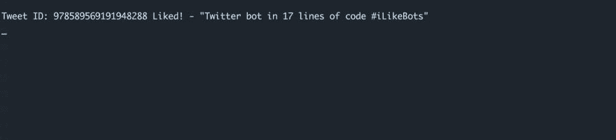

# 17 行代码的 Twitter bot

> 原文：<https://dev.to/notfakedev/twitter-bot-in-17-lines-of-code-100m>

[T2】](https://res.cloudinary.com/practicaldev/image/fetch/s--IbAwyiW7--/c_limit%2Cf_auto%2Cfl_progressive%2Cq_auto%2Cw_880/https://thepracticaldev.s3.amazonaws.com/i/shrt9f0psvek1kemo38p.png)

几个月前，我发布了如何[“在 3 分钟内创建一个 twitter 机器人”](https://dev.to/notfakedev/create-a-twitter-bot-in-3-minutes)。从那以后，Twitter API 发生了变化，所以我决定是时候更新了。我还看到了@omarhashimoto - [的一个帖子“如何用 17 行代码构建一个简单的 Twitter 机器人”](https://dev.to/omarhashimoto/how-to-build-a-simple-twitter-bot-in-17-lines-ofcode-2aan)这促使我将代码减少到最多 17 行，我可以通过不显示错误信息来存档 13 行代码，但事实是，有时代码越多越好。好了，该开始了！

#### 我们在编码什么？

我们想创建一个 Twitter 机器人，它会自动喜欢所有包含我们指定的关键字的推文。我们将使用流 API，这意味着所有的喜欢和听力将实时发生。

#### 你需要什么？

*   [Node.js](https://nodejs.org/en/)
*   [node . js 的 Twitter】](https://github.com/desmondmorris/node-twitter)
*   [推特应用](https://apps.twitter.com)

#### 设置

完成 Node.js 安装后，打开“终端”并导航到您的项目文件夹。

键入`npm init`并完成设置。下一步是安装我们的依赖项，我们使用 Twitter for Node.js，所以输入`npm i twitter --save`。我们最不需要的是 Twitter 应用程序，你可以通过访问 https://apps.twitter.com 的[来创建你的 Twitter 应用程序。一旦你创建了你的应用程序，你所需要的就是 4 个键，你要用它们来连接应用程序和你的代码:](https://apps.twitter.com)

*   消费者密钥
*   消费者秘密
*   访问令牌密钥
*   访问令牌秘密

现在创建新的 JavaScript 文件，`touch bot.js`

#### 编码

首先，我们希望导入我们的 Twitter 库，然后我们必须设置与我们的应用程序的连接。您应该从您的 Twitter 应用程序输入密钥。

```
const Twitter = require('twitter');
const client = new Twitter({
  consumer_key: '',
  consumer_secret: '',
  access_token_key: '',
  access_token_secret: ''
}); 
```

Enter fullscreen mode Exit fullscreen mode

现在，我们需要指定我们的流监听首选项，正如您可以看到的，我添加了两个想要跟踪的关键字“#IlikeBots”和“keyword2”。你可以随心所欲地添加，也可以使用标签或者普通的单词，这并不重要。很高兴知道 Twitter 会限制你每小时的赞数，所以添加非常受欢迎的关键词会很快耗尽你的限制。

```
const stream = client.stream('statuses/filter', {track:'#IlikeBots, keyword2'}); 
```

Enter fullscreen mode Exit fullscreen mode

所有神奇的事情都发生在这里，我们从数据流中接收“数据”对象，每一个“数据”对象都包含与我们的关键字匹配的推文的所有信息。中间部分是我们做类似操作的地方，我们所需要的是 tweet id，它是从我们的“数据”对象中获取的。一旦发生类似情况，我们将打印推文的 ID 和内容。如果出错，我们将抛出错误。

```
stream.on('data', (event) => {

  client.post('favorites/create', {id:event.id_str}, (error, response) => {
    if(error) throw error;
    console.log('Tweet ID: '+response.id_str+' Liked! - "'+response.text+'"')
  });

}); 
```

Enter fullscreen mode Exit fullscreen mode

在我们开始阅读和喜欢推文之前，我们想确保我们可以阅读错误代码，这非常重要，因为在不知道问题是什么的情况下修复某些东西纯粹是浪费我们的时间。例如，如果我们得到错误代码 429，我们就会知道我们的应用程序工作正常，真正的问题只是 Twitter API 限制。你可以看看 [Twitter API 文档中的所有错误代码。](https://developer.twitter.com/en/docs/basics/response-codes)。

```
stream.on('error', (error) => {
  throw error;
}); 
```

Enter fullscreen mode Exit fullscreen mode

更新由 [@mrm8488](https://dev.to/mrm8488) 来自评论区:
*处理错误就好了:“stream . on(' error '……”。如果您抛出错误，因为它是上层函数，错误将到达事件循环，应用程序将崩溃。
一个快捷的解决方法是:*

```
stream.on("error", error => console.error(error)); 
```

Enter fullscreen mode Exit fullscreen mode

是时候运行我们的代码了，在终端键入`node bot.js`。用你的关键词发微博，你应该能在终端看到反馈。

[T2】](https://res.cloudinary.com/practicaldev/image/fetch/s--gGImDmJD--/c_limit%2Cf_auto%2Cfl_progressive%2Cq_auto%2Cw_880/https://thepracticaldev.s3.amazonaws.com/i/9os29nnd1h4ykoj6ficn.jpg)

[T2】](https://res.cloudinary.com/practicaldev/image/fetch/s--IbAwyiW7--/c_limit%2Cf_auto%2Cfl_progressive%2Cq_auto%2Cw_880/https://thepracticaldev.s3.amazonaws.com/i/shrt9f0psvek1kemo38p.png)

[T2】](https://res.cloudinary.com/practicaldev/image/fetch/s--M_s_UwvD--/c_limit%2Cf_auto%2Cfl_progressive%2Cq_auto%2Cw_880/https://thepracticaldev.s3.amazonaws.com/i/dz2hdkpjor0i90habdpo.jpg)

#### 最终代码

```
const Twitter = require('twitter');
const client = new Twitter({
  consumer_key: '',
  consumer_secret: '',
  access_token_key: '',
  access_token_secret: ''
});

const stream = client.stream('statuses/filter', {track:'#IlikeBots, #keyword2'});

stream.on('data', (event) => {
  client.post('favorites/create', {id:event.id_str}, (error, response) => {
    if(error) throw error;
    console.log('Tweet ID: '+response.id_str+' Liked! - "'+response.text+'"')
  });
});

stream.on('error', (error) => {
  throw error;
}); 
```

Enter fullscreen mode Exit fullscreen mode