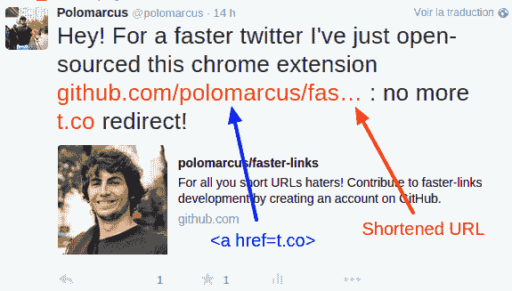
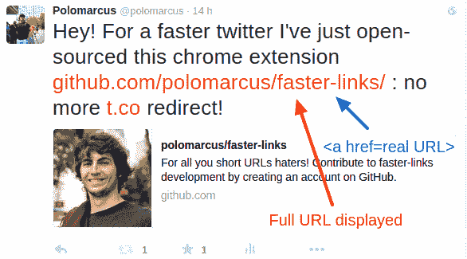

# 没有短链接的 Twitter

> 原文：<https://dev.to/paulleclercq/twitter-without-short-links--1cig>

作为 [dev.to](https://chrome.google.com/webstore/detail/devtwitter/fhlipionhojfohecgljcljbpblojlaef?hl=en-US) ，我创建了自己的 Chrome 扩展(抱歉是 Firefox)，我厌倦了看不到一条推文的完整 URL。我觉得有权知道我将在哪里着陆。还有，很多信息可以在一个 URL 中找到([URL 可以是 UI](https://www.nngroup.com/articles/url-as-ui/) )，我的点击可以依赖于它们。示例:

[T2】](https://res.cloudinary.com/practicaldev/image/fetch/s--tu-spQlk--/c_limit%2Cf_auto%2Cfl_progressive%2Cq_auto%2Cw_880/https://raw.githubusercontent.com/polomarcus/faster-links/master/aimg/TweetWithoutFasterLink.png)

*What's the complete name of the repo?*

I've been using my extension, called **[fasterLinks](https://chrome.google.com/webstore/detail/fasterlinks/ojggkiabpbjlckhpaphgdhhojgcpimah)** (worst name ever?), for **3 years now**, and even now I have trouble to use Twitter without it. So I wanted to share it with my favorite online community.! It replaces every short URLs (bitly, etc.) and display long, for twitter, URLs at their full length. 

*fasterLinks!*

营销人员喜欢添加几个 UTM 来跟踪推文的表现，因为它们是视觉污染，扩展也删除了它们。

**fasterLinks** 是免费的，[开源](https://github.com/polomarcus/faster-links)，它不包含任何追踪器，除了一个用来统计活跃用户(28！！)上 Chrome 商店。

分叉它[https://github.com/polomarcus/faster-links](https://github.com/polomarcus/faster-links)和/或尝试它[https://chrome . Google . com/web store/detail/faster links/ojggkiabbjlckhpaphgdhhojgcpimah](https://chrome.google.com/webstore/detail/fasterlinks/ojggkiabpbjlckhpaphgdhhojgcpimah)