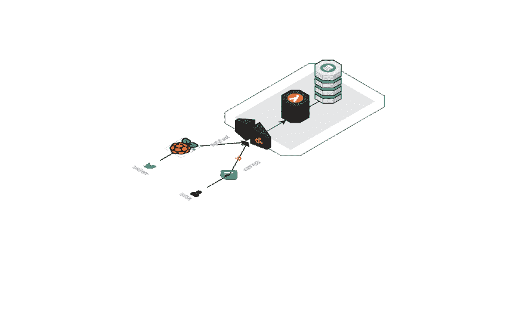
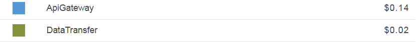
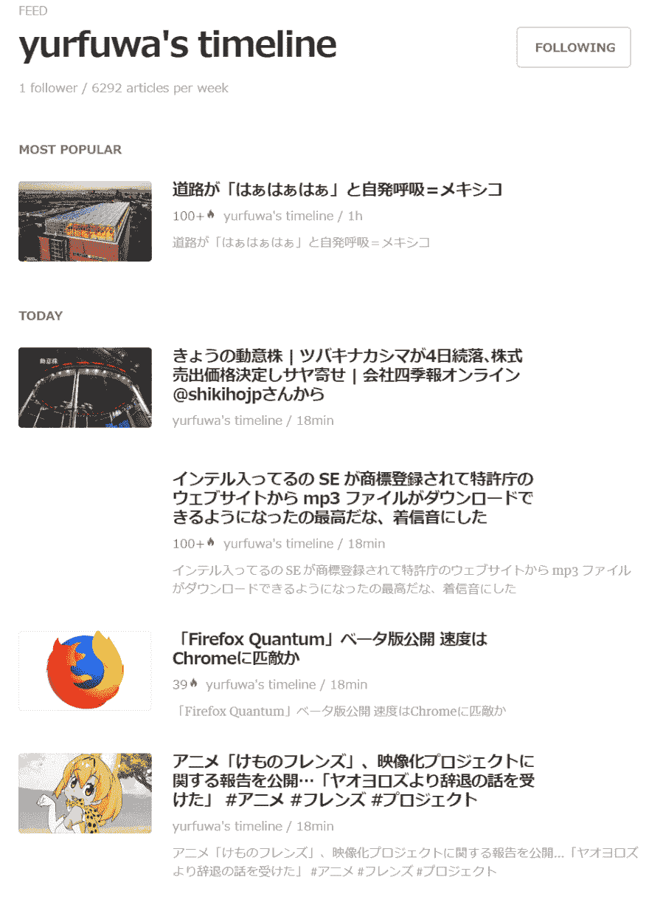

# 从 Twitter 的时间轴中提取 URL，作为 RSS 用 Feedly 读取

> 原文：<https://dev.to/yurfuwa/twitterurlrssfeedly-3b67>

最近在附近，LDR 和 live dwango reader ( ex.livedoor reader )的服务结束成为了话题。
自己在 RSS reader 上长期使用 Feedly Pro，没有使用过 LDR，所以没有什么感慨。

## 饲料地

关于 Feedly 想简单说明一下。
Feedly 是一种使用方便、简单的 RSS 阅读器，也有 mobile app。 使用 PRO 的话，检索性会大幅提高，最重要的是总结一下流行的报道，总结一下今天应该看的类别也很方便。
此外，像在 j 中报道移动、在 v 中报道移动、在 gg 中类别移动这样，也很高兴成为像 vim 一样的快捷方式配置。 虽然可能不能说比 LDR 更轻，但看起来很容易，设计也很时髦。 我觉得花很多时间的东西是值得付钱的。

## 电子拖拽

那么，回到话题
说起来，最近的网络有被动选择信息的倾向。 Twitter 和 Facebook 等社交媒体横行霸道，信息几乎被 SNS 共享。
使用 RSS 阅读器的已经到了老害的地步，吐 RSS 的网站也减少了很多。 虽然很可悲，但只有这个是没办法的。

相对来说，看 Twitter 的时间变长了的人也很多吧。 在具有流速的时间线上，需要瞬间进行信息的取舍选择。 信息不一定是有益的。 与其说，几乎所有的推文都像噪音一样，会暂时像毒品一样刺激大脑，浪费时间。 Twitter 可以说是电子毒品一点也不过分。

## 捡砂金

但是里面也夹杂着美好的信息。 确实，鱼龙混杂地存在着能够积累自己感兴趣的知识，满足自己对知识的好奇心的信息共享。
Twitter 就是一种筹款。 而且对于自己来说，那个砂金比短文还在 URL 之前。

因此，我决定从大量的沙子中分出砂金，集中到皮革袋里。 也就是说，从 Twitter 上播放的文章中提取 URL，总结成 RSS，输入到平时使用的 Feedly 中。

体系结构就是这样。

[T2】](https://res.cloudinary.com/practicaldev/image/fetch/s--WoOiHl_h--/c_limit%2Cf_auto%2Cfl_progressive%2Cq_auto%2Cw_880/https://steemitimages.com/DQmTW9vy1qmCCAVm8dJaU1TvT2KiY8AADYifqoAnHMsbjAJ/Twlclw.png)

重点是

*   无 AWS API 网关+ lambda + dynamo db 服务器运行。
*   通过 Twitter API 连接到 strem，提取并扔出 URL
*   APIGateway 准备端点，在 GET 中返回 RSS，在 POST 中积累数据
*   twitterのclientにを树莓酱使う

## 在无 AWS APIGateway + Lambda + Dynamodb 服务器的情况下运用。

这次尝试了无服务器的结构。
首先想从输出侧开始考虑。
Dynamodb 的表格如下

```
url
timestamp
created_at
expired_at (TTL)
text 
```

Enter fullscreen mode Exit fullscreen mode

通过使用 TTL，定期删除被 dynamodb 无限嵌入的数据。 这里是注册两个小时后。 Feedly 大约间隔 30 分钟，快的话 10 分钟就来取得 RSS。 如果被吸收了的话，RSS 中也可以没有信息。 因此，有 2 小时的消费期限就足够了，之后就不需要了，所以关掉。
Dynamodb 存储数据也要花钱，批量删除一个又一个也很麻烦。 使用 TTL 的话，注册时会在指定的时间消失。
表仅用应该始终显示的 RSS 的数据来完成。 据此，在 Lambda 中，如果 GET 来到 lambda_handler，只需扫描桌子并放到 json 中即可。

```
def respond(err, res=None):
    return {
        'statusCode': '400' if err else '200',
        'body': '{}' if err or not res else json.dumps(res,cls=DecimalEncoder),
        'headers': {
            'Content-Type': 'application/json',
        },
    }

def lambda_handler(event, context):

    operations = {
        'DELETE': lambda table, x: table.delete_item(**x),
        'GET': lambda table, x: table.scan(),
        'POST': lambda table, x: table.put_item(Item=x),
        'PUT': lambda table, x: table.update_item(**x),
    }

    operation = event['httpMethod']
    if operation in operations:
        payload = None if operation == 'GET' else json.loads(event['body'])
        return respond(None, operations[operation](table, payload))
    else:
        return respond(ValueError('Unsupported method "{}"'.format(operation))) 
```

Enter fullscreen mode Exit fullscreen mode

## 使用 APIGateway 定义端点。

在 GET 的集成响应中指定 application/rss+xml，在本分映射模板中注册:
因此，在 Lambda 侧处理的 JSON 可以被映射到 RSS。 Lambda 只需考虑数据处理即可，APIGateway 控制着最终发货。

```
#set($inputRoot = $util.parseJson($input.path('$.body')))
<?xml version='1.0' encoding='UTF-8'?>
<rss version='2.0'>
    <channel>
        yurfuwa's twitter
        <link>http://twitter.com/yurfuwa</link>
        <description>extract timeline-share-links</description>
        #foreach($item in $inputRoot.Items)
        <item>
            $item.text
            <link>$item.url</link>
            <description>$item.text</description>
            <pubDate>$item.created_at</pubDate>
        </item>
        #end

    </channel>
</rss> 
```

Enter fullscreen mode Exit fullscreen mode

这样，只要敲击从 AWS 发行的 URL 的端点，就可以输出 dynamodb 中登录的数据的 RSS。 因为只是个人使用，所以也不需要获取域。

## 用 Raspberry pi 做 Twitter 的客户端

我早就抛弃了自己的家庭服务器。 而是使用 Raspberry pi。 虽然也可以考虑 EC2，但是 AWS 很富豪。 最多在 EC2 上为个人的时间线监视付钱是很痛苦的。 个人用的 Slack bot 什么的也在 Raspberry pi 上做。

在这里，虽然不做特别难的事情，但是在 Lambda 中使用了 python3，但是 Client 是 node。
连接 Twitter 的流后，看是否包含 expanded_url。 如果包含，排除指定的 URL，整形后通过 POST 扔向用 APIGateway 制作的端点。
刚才的 Lambda 已经在 POST 上来的话就 put_item 到 Dynamodb 的表中，这样就完成了。

```
var twitter = require('twitter');
var client = new twitter( {...})
var request = new require('request');
const urlRegex = require('url-regex');

var stream = client.stream('user', {with : 'followings'});

stream.on('data', function(event) {
    var media = event.entities.media;
    var url = event.entities.urls[0];
    if(event.lang == 'ja' && url && url.expanded_url && !(
        /instagram.com|twitter.com|twitpic.com|ift.tt|swarmapp.com|nico.ms|pixiv.net|bit.ly|this.kiji.is|nhknews.jp|fb.me|tenki.jp|j.mp|melonbooks|ask.fm/.test(url.expanded_url)
    )){

        var options = {
            uri: process.env.NODE_TWEET_SHARE_ENDPOINT,
            method: 'POST',
            json: {
                "url": url.expanded_url,
                "text": event.text.replace(/RT \@[A-z|a-z|0-9|\-|\_]+\:\ /,'').replace(urlRegex(),''),
                "created_at": event.created_at,
                "timestamp" : parseInt( Date.now() / 1000 ),
                "expired_at" : parseInt( Date.now() / 1000 ) + 7200
            }
        };

        request(options, function (error, response, body) {
              if (!error && response.statusCode == 200) {
                      console.log(body)
              }
        });

    }
}); 
```

Enter fullscreen mode Exit fullscreen mode

## Operating fee

那么，因为使用了 AWS 的服务，所以很在意一个月的价格。

[T2】](https://res.cloudinary.com/practicaldev/image/fetch/s--sFCQgioV--/c_limit%2Cf_auto%2Cfl_progressive%2Cq_auto%2Cw_880/https://steemitimages.com/DQmSXnAv7YJWA3LRmGdGWUEScEkV7k8x7wYrKKXYFctYLE5/billing.PNG)

就是这样的感觉。 在 EC2 中不能这样做。 Dynamodb 可以放在免费框的范围内。
不设定 TTL 的话会爆死，Twitter 的粉丝有 1 万人之类的人不知道。

## 试着用 Feedly 显示

[T2】](https://res.cloudinary.com/practicaldev/image/fetch/s--dV-N0Q5X--/c_limit%2Cf_auto%2Cfl_progressive%2Cq_auto%2Cw_880/https://steemitimages.com/0x0/https://steemitimages.com/DQmWrWcBFo8FjvQubzbkexQRvGuBeDzETjAdSqdQavWiRsd/feedly.PNG)

实际运用起来很棒，很好。
Feedly 会随意优先考虑似乎是话题的 URL，所以即使无限地插入 URL，也会从应该看的东西开始显示。
漠然浏览 Twitter 的时间减少了，而且 RSS 每隔 10 分钟更新一次，所以对速报类的新闻也很擅长。

最终在深度学习中聚类来自 Twitter 的源，按类别吐出 RSS 的话会更好。 教师数据使用已经有类别化的 RSS 的源就可以了。