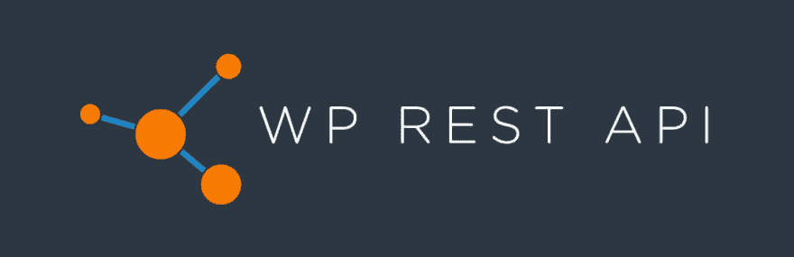

# 如何使用 WordPress 和 React 构建一个现代化的 Web 应用程序

> 原文：<https://dev.to/couellet/tying-a-react-spa-to-wordpress-as-a-backend-w-wp-rest-api-45nd>

[T2】](https://res.cloudinary.com/practicaldev/image/fetch/s--FX425N4w--/c_limit%2Cf_auto%2Cfl_progressive%2Cq_auto%2Cw_880/https://snipcart.com/media/204844/wordpress-react.png)

当我们在 2017 年第一次写道使用 WordPress 作为无头 CMS 和 WP REST API 时，这对我们 JAMstack 爱好者来说是一件非常重要的事情。

我的意思是，像“无头 CMS”这样的概念才刚刚开始制造噪音，WordPress 接受它是一个巨大的声明。

这是值得的。

web 开发的前景是不断变化的，现代前端技术的承诺正在实现。

[T2】](https://res.cloudinary.com/practicaldev/image/fetch/s--PqYHi2Lt--/c_limit%2Cf_auto%2Cfl_progressive%2Cq_auto%2Cw_880/https://snipcart.com/media/203587/wp-rest-api.jpg)

每个开发者和他们的狗都有关于 WordPress 的话要说，而且不总是奉承。远非如此。然而，即使是最狂热的批评者也不得不注意到这个特性，因为它已经改变了我们使用流行的 CMS 的方式。

对于希望将 React ( [或 Vue.js](https://snipcart.com/blog/wordpress-vue-headless) )等 JavaScript 框架的功能与 WordPress 结合起来的前端开发人员来说，WordPress REST API 是一个巨大的进步。

这正是我今天想做的，在工作中演示 WordPress REST API。

我将使用 WordPress 作为后端，使用 REST API 将数据输入 React 应用程序。

更准确地说，您将学习如何:

*   从您的前端访问 WP REST API
*   添加一个定制的 post 类型，并将其公开给 API
*   构建由该 API 支持的 React 应用程序
*   处理 React 挂钩(并创建一个自定义挂钩)

在我们开始之前，让我们看看什么是 WordPress 的 REST API，以及为什么你应该关心它。

## 什么是 WordPress REST API？

WordPress 本身不需要任何介绍，但是让我们仔细看看最近的 WP REST API。

阅读这篇文章的其余部分&技术教程[在这里](https://snipcart.com/blog/reactjs-wordpress-rest-api-example)