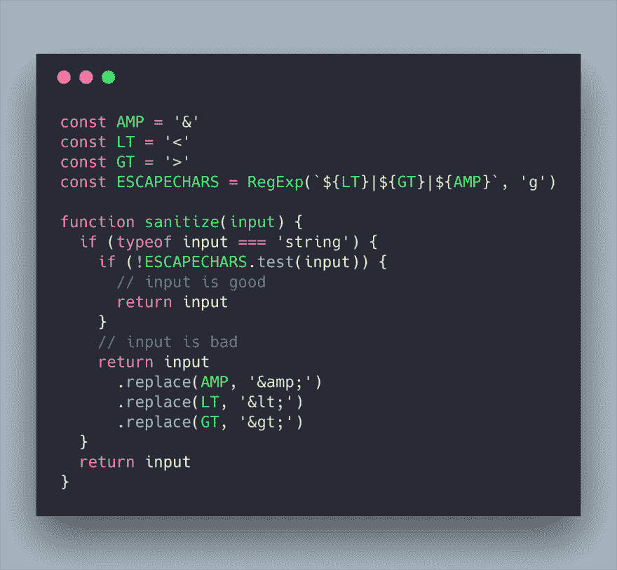

# 类型操作漏洞

> 原文：<https://dev.to/petermbenjamin/type-manipulation-vulnerabilities-2fcg>

[T2】](https://res.cloudinary.com/practicaldev/image/fetch/s--ajIh7vjO--/c_limit%2Cf_auto%2Cfl_progressive%2Cq_auto%2Cw_880/https://thepracticaldev.s3.amazonaws.com/i/8veyic2a3wf7b2rbqr5j.png)

最近，我读了一篇[类型操纵漏洞文章](https://snyk.io/blog/type-manipulation)，引起了我的兴趣。因此，我开始更好地理解它，并把一些知识带回社区。

## 目录

*   [简介](#introduction)
*   [消毒](#the-sanitisation)
*   [操纵](#the-manipulation)
*   [潜在解决方案](#potential-solutions)
*   [吸取的经验教训](#lessons-learned)
*   [链接](#links)

## 

在非常高的层次上，所有编程语言都需要有**类型**结构，以便解释器或编译器将人类可读的代码翻译成机器代码。动态语言、静态语言、解释语言、编译语言都需要类型。

下面是一些例子:

```
let firstName = "Peter";
typeof firstName; // returns 'string' 
```

```
# python firstName = "Peter"
type(firstName) # returns <type 'str'> 
```

```
# ruby
first_name = "Peter"
first_name.class # returns String 
```

```
// go
firstName := "Peter"
reflect.TypeOf(firstName) // returns string 
```

太好了，编程语言有类型！那么，有什么问题呢？

好吧，假设您想要获取一些用户提供的输入，并将其发送到服务器进行一些处理，这包括`eval`输入(服务器端呈现/模板引擎的常见场景)。

所以，你对自己说:“只要我对用户输入的字符进行杀毒，让它们能够在我的服务器上逃逸或运行任意代码，那就好了，对吗？”

对，但是让我们考虑下面的场景...

## 

对于这个虚构的例子，让我们检查并清除用户输入中的 3 个已知的“坏”字符:

*   `<`应编码为`&lt;`
*   `>`应编码为`&gt;`
*   `&`应编码为`&amp;`

所以，我们写这个函数:

```
const AMP = "&";
const LT = "<";
const GT = ">";

const ESCAPECHARS = RegExp(`${AMP}|${LT}|${GT}`, "g");

function sanitise(input) {
  if (typeof input === "string") {
    if (!ESCAPECHARS.test(input)) {
      // input is good
      return input;
    }
    // input is bad, sanitise...
    return input
      .replace(AMP, "&amp;")
      .replace(LT, "&lt;")
      .replace(GT, "&gt;");
  }
  return input;
}

sanitize('good input');                             // returns 'good input'
sanitize('<script>alert("bad input")</script>');    // returns '&lt;script&gt;...' 
```

如果我们接受来自客户端应用程序的输入，它可能看起来像:

```
// server.js
const http = require("http");
const url = require("url");
const querystring = require("querystring");

// sanitise logic here...

const requestHandler = (req, resp) => {
  let parsedURL = url.parse(req.url);
  let userInput = querystring.parse(parsedURL.query);
  let sanitised = sanitise(userInput.foo);
  resp.end(JSON.stringify(sanitised));
};

const server = http.createServer(requestHandler);

const PORT = 3000;

server.listen(PORT, err => {
  if (err) return console.log(`server failed: ${err}`);
  console.log(`server listening on ${PORT}`);
}); 
```

用`$ node server.js` &运行它，浏览到`localhost:3000`
得到的响应将是一个空页面。

关于:`localhost:3000/?foo=bar`
回应:

```
"bar" 
```

好的。现在关键时刻:`localhost:3000/?foo=<bar>`
回应:

```
"&lt;bar&gt;" 
```

在这一点上，你可能对我们的消毒很有信心。

## 

但是，`localhost:3000/?foo=bar&foo=<script>alert(1)</script>`呢
回应:

```
[
  "bar",
  "<script>alert(1)</script>"
] 
```

啊哦！我们完全绕过了净化逻辑，因为我们只在运行时检查`typeof input === 'string'`。

有趣的是，如果这些数据是在客户端使用的(例如向用户显示`document.location.href`的内容)，这将构成一种[基于 DOM 的跨站点脚本攻击](https://www.owasp.org/index.php/DOM_Based_XSS)(简称 DOM-XSS)，但这是另一篇文章的主题。

但是，如果要在服务器上处理这些数据，或者甚至`eval`编辑这些数据(例如，服务器端渲染)，那么攻击者就可以突破您的逻辑，在您的服务器上运行任意代码，比如:

```
require("child_process").exec(/* steal API tokens, SSH keys, secrets/passwords ...etc */); 
```

如果你对如何利用感兴趣，这篇[文章](https://snyk.io/blog/type-manipulation)将深入探讨如何利用这一点。

在动态语言中，有几种方法可以减轻和防御这种类型的错误。让我们检查一下...

## 潜在方案

您的直觉可能是通过检查`if`语句中的`Array`对象类型来解决这个问题，您可能是对的，但是让我们检查几个其他选项。

*   你可以考虑**不允许**非字符串类型。在我们的场景中，这可能看起来像:

```
function sanitise(input) {
  if (typeof input !== 'string') {
    throw new Error('TypeError: sanitise input is not a string.')
  }
    ...
} 
```

*   你可以考虑**规范化**所有的数据类型。在我们的场景中，这可能看起来像:

```
function sanitize(input) {
  if (input.isArray) { ... }
  if (typeof input === 'number') { ... }
  if (typeof input === 'string') { ... }
  // ... so on
} 
```

*   你可以考虑一种混合的方法，你可以**禁止**一些类型，而处理一些其他类型。这可以说是最脆弱的方法。

## 

*   这个错误的核心是不正确地处理/清理用户输入。
*   在动态语言中，比如 Javascript，我们声明函数而不指定变量的数据类型，这意味着我们，软件开发人员和工程师，有责任确保我们在任何时候都处理正确的数据类型，以防止类似这样的边缘情况。
*   单元测试和同行评审至关重要。
*   静态类型语言在编译时在某种程度上缓解了这些类型的错误，但是它们仍然容易受到这种错误的变种的攻击，通常被称为*反序列化漏洞*。

## 

*   [此概念验证的源代码🐙](https://github.com/petermbenjamin/poc-type-manipulation)
*   [Javascript 模板库中的类型操作](https://snyk.io/blog/type-manipulation)
*   [在 PHP 中键入杂耍漏洞利用](https://www.owasp.oimg/6/6b/PHPMagicTricks-TypeJuggling.pdf)
*   Ruby-on-Rails 中的类型操纵漏洞& YAML
*   [基于 DOM 的跨站脚本攻击](https://www.owasp.org/index.php/DOM_Based_XSS)
*   [反序列化漏洞](https://www.owasp.org/index.php/Deserialization_of_untrusted_data)