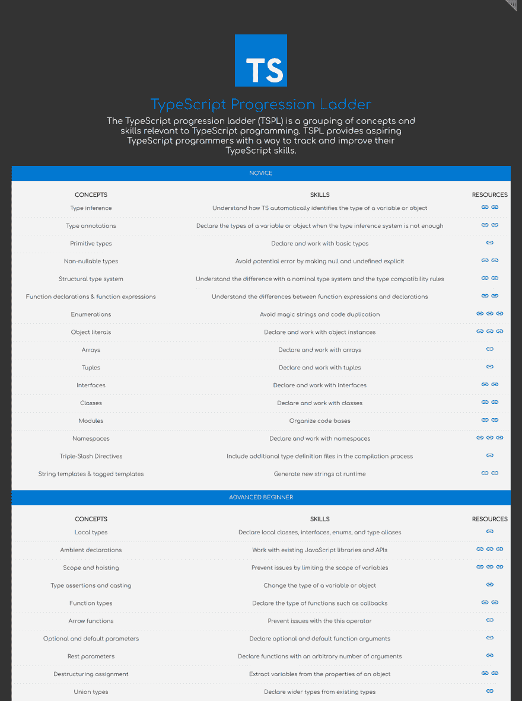

# 打字稿进展阶梯

> 原文：<https://dev.to/remojansen/typescript-progression-ladder-3106>

TypeScript progression ladder(TSPL)是一组与 TypeScript 编程相关的概念和技能。

[T2】](https://res.cloudinary.com/practicaldev/image/fetch/s--NAXrA3I---/c_limit%2Cf_auto%2Cfl_progressive%2Cq_auto%2Cw_880/https://thepracticaldev.s3.amazonaws.com/i/2uyvav06edia0mtqfjlb.png)

TSPL 为有抱负的打字程序员提供了一种跟踪和提高打字技能的方法。

请在[http://ladder.ts.training/](http://ladder.ts.training/)查看，并在 Github 上帮我改进！

**更新**:主要反馈之一是人们希望在其他编程语言中看到类似的概念，所以我创建了一个升级版本，允许人们贡献更多的列表。请到 http://www.techladder.io/[的](http://www.techladder.io/)处查看