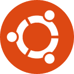
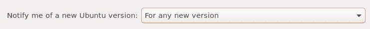
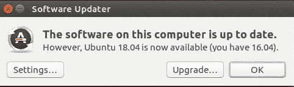
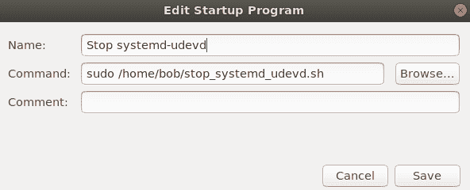

# Ubuntu 18.04 升级问题解决方案

> 原文：<https://dev.to/bobnadler/ubuntu-1804-upgrade-problem-resolutions-1ni0>

原帖: [Ubuntu 18.04 升级问题解决方案](https://bobonmedicaldevicesoftware.com/blog/2018/08/04/ubuntu-18-04-upgrade-problem-resolutions/)

[](https://www.ubuntu.com) 我最近把我用了 3 年的联想 X1 Carbon 从 Ubuntu 16.04 TLS 升级到了 18.04 LTS。我想我遇到了两个最常见的升级问题，由于这两个问题都很突出，我认为值得分享一下对我有效的解决方案。

这里有两个问题:

1.  **“登录循环”**:在登录屏幕上进行有效认证后，显示屏暂时变黑，然后返回登录屏幕。
2.  **systemd-udevd CPU 使用率**:在我的系统上，它消耗了大约 20%的 CPU。我了解到在其他系统上它可以更高(比如 100%)。

### 升级

简单:从*软件&更新*的更新选项卡上，选择“对于任何新版本”:

[T2】](https://res.cloudinary.com/practicaldev/image/fetch/s--WUtRB3sp--/c_limit%2Cf_auto%2Cfl_progressive%2Cq_auto%2Cw_880/https://bobonmedicaldevicesoftware.com/blog/wp-content/uploads/2018/08/anynewversion.png)

下次更新后，*软件更新程序*将提供 18.04 升级选项。

[T2】](https://res.cloudinary.com/practicaldev/image/fetch/s--Kjr8Vaqb--/c_limit%2Cf_auto%2Cfl_progressive%2Cq_auto%2Cw_880/https://bobonmedicaldevicesoftware.com/blog/wp-content/uploads/2018/08/upgradeto1804.png)

只需点击`Upgrade...`按钮，然后按照指示进行操作。

### 登录循环

升级完成后，这个问题会阻止你登录 Gnome 桌面。使用 Alt-Ctrl-F2 切换到终端并登录。执行以下操作:

```
$ sudo apt-get purge gdm*
$ sudo apt-get purge lightdm
$ sudo apt-get install lightdm
$ sudo apt-get install nvidia-352
```

Just removing `gdm` and re-installing `lightdm` was not sufficient to resolve this issue for me. Installation of the Nvidia driver (line 4) was the key. Later versions than nvidia-352 (like nvidia-384) will also probably work.

### 系统-udevd CPU 使用情况

Now that you can login to your desktop, you may notice high CPU usage. If `top` or `htop` show that systemd-udevd is the culprit, confirm that UDEV events are being generated with `udevadm`. For me the output looked like this:

```
$ udevadm monitor
monitor will print the received events for:
UDEV - the event which udev sends out after rule processing
KERNEL - the kernel uevent

KERNEL[33.704228] add      /module/nvidia (module)
KERNEL[33.704784] add      /kernel/slab/:0012288 (slab)
KERNEL[33.705062] remove   /kernel/slab/:0012288 (slab)
UDEV  [33.705332] add      /kernel/slab/:0012288 (slab)
UDEV  [33.705659] remove   /kernel/slab/:0012288 (slab)
KERNEL[33.724214] remove   /module/nvidia (module)
KERNEL[33.755768] add      /module/nvidia (module)
KERNEL[33.756482] add      /kernel/slab/:0012288 (slab)
KERNEL[33.756764] remove   /kernel/slab/:0012288 (slab)
UDEV  [33.757642] add      /kernel/slab/:0012288 (slab)
UDEV  [33.757981] remove   /kernel/slab/:0012288 (slab)
KERNEL[33.772269] remove   /module/nvidia (module)
UDEV  [33.792191] add      /module/nvidia (module)
UDEV  [33.807097] remove   /module/nvidia (module)
KERNEL[33.830290] add      /module/nvidia (module)
...

```

这可以通过停止 systemd-udevd 服务来解决:

```
$ sudo systemctl stop systemd-udevd systemd-udevd-control.socket systemd-udevd-kernel.socket
```

CPU 使用率将下降，并且`udevadm`停止报告事件。

如果需要，可以再次启动 systemd-udevd 服务:

```
$ sudo systemctl start systemd-udevd systemd-udevd-control.socket systemd-udevd-kernel.socket
```

我发现服务重启后，CPU 问题没有**而不是**再次出现。

#### 启动更改

这很好，但是您不希望每次登录系统时都必须手动运行命令。下面是如何在启动时自动执行这个命令。

首先，您需要能够以 root 身份执行`systemctl`命令，而无需输入密码。

创建脚本并设置正确的权限，如下所示:

```
$ echo 'systemctl stop systemd-udevd systemd-udevd-control.socket systemd-udevd-kernel.socket' > stop_systemd_udevd.sh
$ sudo chown root.root stop_systemd_udevd.sh
$ sudo chmod 4755 stop_systemd_udevd.sh
```

接下来，运行:

```
$ sudo visudo
```

并在`/etc/sudoers`文件的底部(这很重要)添加下面一行**。**

```
bob ALL=(root) NOPASSWD: /home/bob/stop_systemd_udevd.sh
```

当然，根据需要更改 bob 和/home/bob。

现在你应该能跑了

```
$ sudo ./stop_systemd_udevd.sh
```

而不提示输入密码。

最后一步是在系统启动时添加这个脚本的执行。使用*启动应用程序首选项*并添加以下选项(当然是 change /home/bob)。

[T2】](https://res.cloudinary.com/practicaldev/image/fetch/s--KJY0zYfW--/c_limit%2Cf_auto%2Cfl_progressive%2Cq_auto%2Cw_880/https://bobonmedicaldevicesoftware.com/blog/wp-content/uploads/2018/08/startup-application.png)

应该可以了！重新启动系统，systemd-udevd 服务应该不会运行。

希望这有所帮助。尽情享受吧！