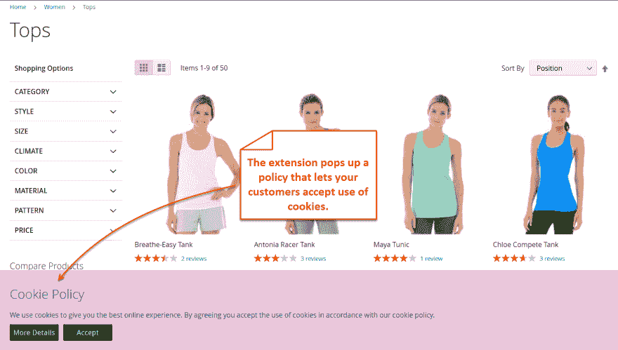
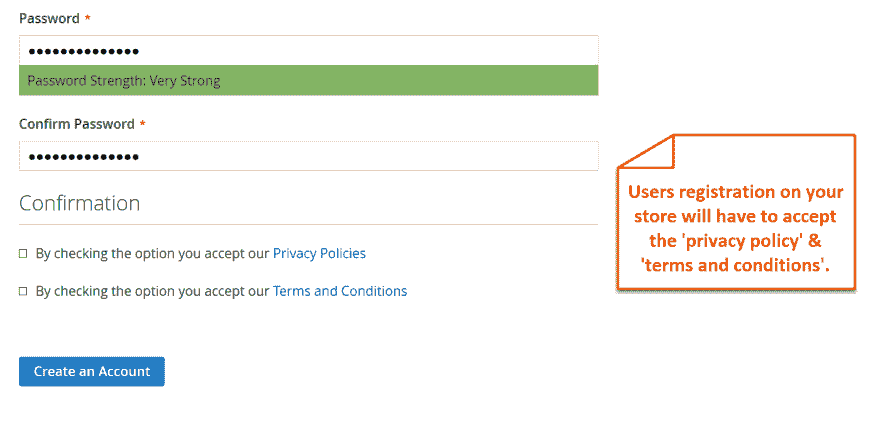
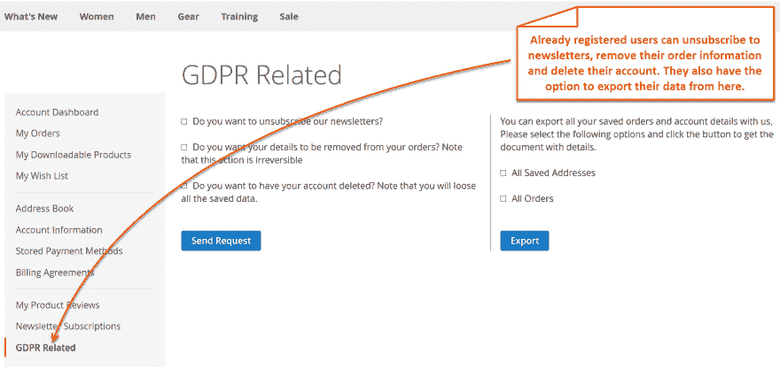

# 终极 GDPR Magento 2 扩展

> 原文：<https://dev.to/simonwalkerfme/ultimate-gdpr-magento-2-extension-44ao>

 有了终极 GDPR Magento 2 合规扩展，您可以显示 cookie 的同意，以保留信息。客户可以删除订单的所有细节，或者将数据导出到 PDF 文件中。管理员可以轻松地管理用户提交的所有请求，以删除帐户或订单。
**特点**:

*   显示 Cookie 同意
*   允许用户删除帐户或导出数据
*   保留订单数据的选项
*   取消订阅时事通讯
*   展示条款和条件以及隐私政策
*   配置电子邮件通知
*   启用 DPO 联系人表单以实现快速沟通

更多详情和演示- [GDPR Magento 2 扩展](https://www.fmeextensions.com/gdpr-compliance-extension-magento-2.html)

**截图**:

