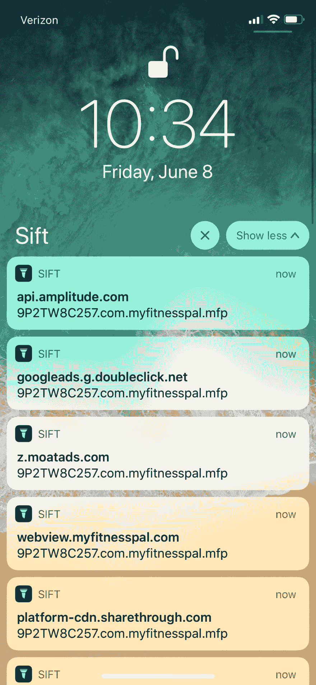
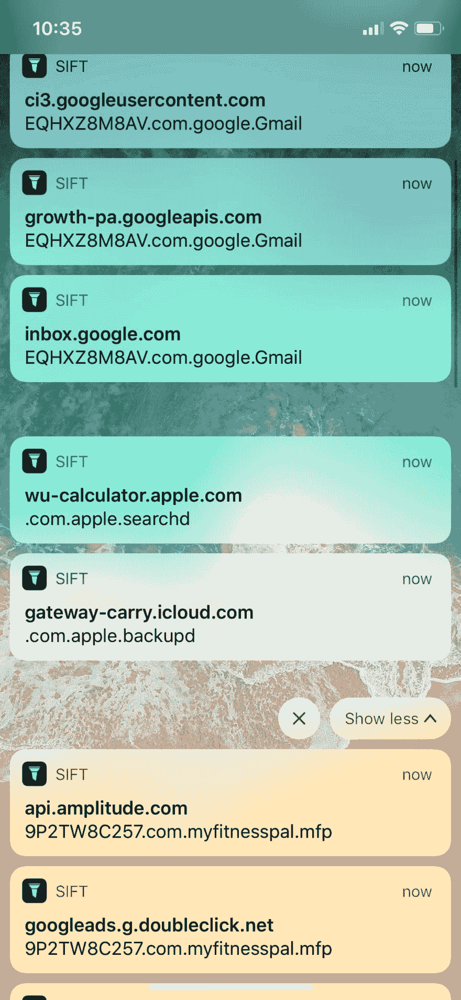
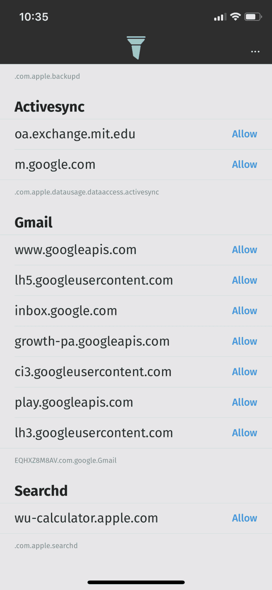

# 发现手机上的不良网络流量

> 原文：<https://dev.to/agrinman/uncover-bad-network-traffic-on-your-phone-4f17>

## 阿格里曼 / [ sift-ios](https://github.com/agrinman/sift-ios)

### 发现手机上每个应用程序的实时网络流量

<article class="markdown-body entry-content container-lg" itemprop="text">

[T2】](https://raw.githubusercontent.com/agrinman/sift-ios/master/Artwork/rounded_icon.png)

# 移位应用程序

Sift 向你展示了你手机上的每个应用真正在做什么。发现手机上每个应用程序的实时网络流量。创建规则来阻止广告和跟踪页面等网站。

*   检查网络流量
*   监控后台活动
*   阻止不良网站和跟踪页面
*   iOS 开发者:调试你的实时应用中的网络

## 关于

Sift 可以回答这样的问题:即使我禁用了分析，应用程序还会跟踪我吗？app 有恶意吗？他们是否连接到陌生的网址？他们在后台做网络活动吗？

**检查手机上任何应用程序的网络流量**。使用推送通知，Sift 向您显示其他应用程序发出的实时网络请求。

**监控后台活动**。Sift 甚至可以向你展示应用程序在后台发出的网络请求。

**创建规则来阻止跟踪网站、广告等 urls】。使用 Sift 屏蔽任何你不喜欢的网站，每…**

</article>

[View on GitHub](https://github.com/agrinman/sift-ios)

Sift 向你展示了你手机上的每个应用真正在做什么。发现手机上每个应用程序的实时网络流量。创建规则来阻止广告和跟踪页面等网站。

*   检查网络流量
*   监控后台活动
*   阻止不良网站和跟踪页面
*   iOS 开发者:调试你的实时应用中的网络

## 关于

Sift 可以回答这样的问题:即使我禁用了分析，应用程序还会跟踪我吗？app 有恶意吗？他们是否连接到陌生的网址？他们在后台做网络活动吗？

**检查手机上任何应用程序的网络流量**。使用推送通知，Sift 向您显示其他应用程序发出的实时网络请求。

**监控后台活动**。Sift 甚至可以向你展示应用程序在后台发出的网络请求。

**创建规则来阻止跟踪网站、广告等 urls】。用 Sift 为手机上的每个应用屏蔽掉任何你不喜欢的网站。**

**开发人员的调试工具**使用 Sift 为您的生产应用程序调试网络流量:检查后台活动，查看您的应用程序如何处理某些站点的连接故障等。

**Sift 是完全私有的** Sift 从不在任何地方分享或发送您的网络流量数据。Sift 收集的数据永远不会离开你的手机。

## 常见问题

### 为什么 Sift 不在 App Store 上？

事实证明，网络内容过滤器不允许用于常规的 app store 应用程序(它只在受监督的设备模式下工作)。所以我决定发布源代码——非常感谢任何捐赠:)

### 我如何使用/安装？

确定您已经安装了 XCode。克隆代码，打开。xcodeproj，插上你的 iPhone，点击运行。您可能需要授权 XCode 部署到您的手机/在 XCode 中登录 iCloud。

### 有 XCode 10 支持吗？

是的——切换到`xcode-10`分支。