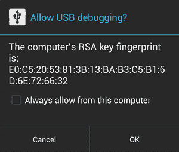

# 了解 Android 调试桥

> 原文：<https://dev.to/subbramanil/understanding-android-device-bridge-3i2c>

# 留心亚行

当我回答这篇文章中的问题时，

[](/exadra37) [## Android 设备出厂时启用了 TCP 端口 5555

### 保罗·雷纳托 10 月 2 日 182 分钟阅读

#android #securiy #mobile #cyberattacks](/exadra37/android-devices-being-shipped-with-tcp-port-5555-enabled-1ig5)I realized, I couldn't summarize my answer into comments. So I figured I would write a separate blog.

其目的是强调原始[文章](https://doublepulsar.com/root-bridge-how-thousands-of-internet-connected-android-devices-now-have-no-security-and-are-b46a68cb0f20)中关于通过亚行进行攻击的被忽略的一点。虽然这篇文章声称的可能是真的，但我觉得它有点误导。在特定地区(以根设备/自定义 android 映像闻名)下研究 android 设备，这篇文章似乎概括了这个问题。它确实提到了，

> 同样明显的是，一些人也不放心使用他们的设备。

但似乎并没有强调它是主要问题。我完全同意供应商的错误，在设备上安装“ADB”功能，设备运行一个根深蒂固的定制 android 的场景将问题升级到另一个层次。

仅仅看标题&花哨的技术术语，一个 android 新手用户如果不担心自己的隐私，就会感到害怕。如今，黑客攻击似乎几乎每天都在发生，当他们听到“安卓”和“黑客”这两个词在一起，感到害怕或担心他们的隐私时，我不会责怪任何人。我希望人们了解“亚行”工具是如何工作的，以便他们在听到有关亚行的问题时能够更好地理解，并做出明智的决定，而不是妄下结论。

**注**:

1.  请注意，我并不是说 Android 是安全的。它有多层保护；但是和其他系统一样，它也不能免受攻击。
2.  Android 中的安全性是一个很大的话题，我将根据我的经验尽可能多地涉及这个话题。如果有任何错误，请随时添加更多的信息和纠正。

根据最初的[文章](https://www.securityweek.com/many-android-devices-ship-adb-enabled)，它声称几个供应商(特定于一个地区)都提供支持 ADB 的 Android。这使得黑客能够通过 TCP(Wifi/以太网)连接，攻击设备并窃取用户信息。的确，当在设备上启用“ADB”时，如果您知道设备的 IP 地址，通过 TCP 连接到设备是非常容易的。但是，一旦黑客获得了设备的访问权限，他能做多少事情取决于 android 是根设备还是非根设备。

## 对设备进行根操作时要小心

当通过 ADB 在根 android 设备(即运行自定义 android 映像而非出厂默认映像的设备)上连接时，用户拥有提升的“root”权限。因此黑客有可能运行危及用户安全/隐私的命令。因此，人们应该注意手机上闪烁的自定义图像。该映像可能默认启用了“USB 调试”，甚至更糟，通过 5555 或任何其他端口“启用了 TCP 上的 USB 调试”。它基本上为黑客打开了方便之门，让他们可以随心所欲地使用手机。

在非根 Android 设备的情况下，“ADB 访问”在默认情况下是禁用的，必须通过一个过程来启用。虽然过程并不复杂，但也不是一般人能偶然发现的。我很快会走过这些步骤。这里还有一点需要注意的是，*即使你从 PC 连接时在非根 Android 设备中启用了 ADB 连接，你也不会在 shell* 中拥有“根”访问权限。

### 一个普通用户熟悉什么

当您将 Android 设备连接到 PC 时，它通常以 MTP(媒体传输协议)模式连接。您可以在设备和 PC 之间传输文件/照片/音乐。大多数制造商提供的软件都是通过这种模式连接的。例如，[三星智能开关](https://www.samsung.com/us/smart-switch/)，[安卓文件传输](https://www.android.com/filetransfer/)。

### 亚行如何运作

在我们的练习中，你需要一个 android 设备(或者一个仿真的 Android 设备)，一根 micro-USB 线& ADB，我们正在讨论的开发工具。我用的是仿真 Nexus 5。

“Android Debug Bridge-ADB”是一个帮助设备和 PC 之间通信的工具，可以通过安装[平台工具](https://developer.android.com/studio/releases/platform-tools)获得。关于‘亚行’的更多细节，你可以阅读这篇来自 developer.android.com[的](https://developer.android.com/)[文章](https://developer.android.com/studio/command-line/adb)。

#### 练习 1:启用 ADB 访问

如果要启用‘ADB’，首先要启用‘开发者设置’，其实是隐藏在设置里的。

1.  在 Android 设备中打开设置
2.  在“关于手机”中找到“内部版本号”并点击“7”次。它将显示一个通知“开发者设置”现在已启用。
3.  按 back 返回设置，你会看到“开发者设置”。
4.  打开“开发者设置”，向下滚动到“USB 调试”并启用它。

现在，您将拥有 ADB 访问设备的权限。

**注意**:如果你喜欢通过 Wifi 启用 ADB 连接，来自 developer.android.com 的同一篇[文章](https://developer.android.com/studio/command-line/adb)也涵盖了如何做到这一点。对于我们的练习，无论您是通过 WiFi 还是 micro-USB 连接都没有关系。

Android 增加了另一层安全性。启用 ADB 后，当您将设备连接到 PC 时，它会询问“信任计算机”的权限。

[T2】](https://res.cloudinary.com/practicaldev/image/fetch/s--nmgQImYB--/c_limit%2Cf_auto%2Cfl_progressive%2Cq_auto%2Cw_880/https://www.embarcadero.com/starthere/xe5/mobdevsetup/android/en/300px-AndroidEnableUSBDebuggingDialog.png)

[T2】](https://res.cloudinary.com/practicaldev/image/fetch/s--3RIa7lP8--/c_limit%2Cf_auto%2Cfl_progressive%2Cq_auto%2Cw_880/https://s3-us-west-2.amazonaws.com/my-blogresources/screenshots/Info%2Bfrom%2BAndroid%2BDeveloper%2BWebsite.png)

#### 练习-2:了解安卓外壳&沟通的方法

简而言之，“shell”只是一个让您与底层操作系统对话的接口。Android 有一个可以与底层内核对话的 Unix 外壳。根据可用的工具集，命令列表可能会有所不同。ADB 只是一个把你的命令传达给 android shell 的工具。

在我们开始实际解释之前。您可以用两种方式执行命令。为了前任。“ls”是一个 shell 命令，它列出了当前路径中的文件和目录。

1.  从你的个人电脑，进入外壳并启动' ls '命令。

```
> adb shell
> $ ls 
```

Enter fullscreen mode Exit fullscreen mode

你火了，‘亚行壳’，就钻进安卓的壳。键入，' *exit* '从 android shell 退出到 PC。

1.  从您的 PC 上，通过 shell 启动“ls”命令。你将留在你的电脑外壳里。

```
> adb shell ls 
```

Enter fullscreen mode Exit fullscreen mode

**注**:在本文中，我目前使用‘ADB’连接 android 外壳。“ADB”有更多的命令，可以让你安装、卸载、查询应用程序等等。

#### 练习 3:了解亚行用户

在标准的非 rooted android 设备上，您将无法获得“root”访问权限。您只能运行有限的一组 UNIX 命令。

*   在非根设备上，

```
▶ adb shell
generic_x86:/ $ pwd
/
generic_x86:/ $ ls
ls: ./ueventd.rc: Permission denied
ls: ./ueventd.ranchu.rc: Permission denied
ls: ./init.zygote32.rc: Permission denied
ls: ./init.usb.rc: Permission denied
ls: ./init.usb.configfs.rc: Permission denied
ls: ./init.rc: Permission denied
ls: ./init.ranchu.rc: Permission denied
ls: ./init.environ.rc: Permission denied
ls: ./init: Permission denied
ls: ./fstab.ranchu.early: Permission denied
ls: ./fstab.ranchu: Permission denied
acct bugreports cache charger config d data default.prop dev etc mnt oem proc root sbin sdcard storage sys system var vendor 
```

Enter fullscreen mode Exit fullscreen mode

请注意“$”符号。这意味着您以普通用户身份登录。您将拥有运行命令的有限权限。

*   在根设备上，

```
root@xxxx:/ # ls
acct
bin
cache
charger
config
d
data
default.prop
dev
device
etc
file_contexts
fstab.freescale
init
init.environ.rc
init.xxxx.rc
init.xxxx.usb.rc
init.rc
init.trace.rc
init.usb.rc
mnt
proc
property_contexts
res
root
sbin
sdcard
seapp_contexts
sepolicy
storage
sys
system
ueventd.xxxx.rc
ueventd.rc
vendor 
```

Enter fullscreen mode Exit fullscreen mode

请注意“#”号。这意味着您以 root/admin 用户身份登录。你有提升的权限。

这是安全的一个层次。除非你有一个根 android 设备，否则当你通过“ADB”连接时，无论是通过 Wifi 还是微型 USB，你都不会获得“root”权限。同样基于 Android 设备中可用的工具集( [busybox](https://busybox.net/about.html) 、[工具箱](https://elinux.org/Android_toolbox))，根用户可用的命令列表也会有所不同。当然，一旦你有了根用户，你可以安装更多的命令。

再举一个例子，Android 中有一个分区'/data '，应用程序在那里存储它们的数据。

*   在典型的非根 android 设备中，

```
generic_x86:/ $ ls /data
ls: /data: Permission denied 
```

Enter fullscreen mode Exit fullscreen mode

默认情况下，禁用“/data”分区

*   在一个根深蒂固的 android 设备中

```
root@xxxx:/ # ls /data
anr
app
app-asec
app-lib
app-private
backup
bugreports
cron
dalvik-cache
data
dontpanic
drm
local lost+found
media
mediadrm
misc
network
property
resource-cache
security
ssh
system
tombstones
user 
```

Enter fullscreen mode Exit fullscreen mode

#### 练习 4:了解 App 级安全性

Android 上的所有应用程序都运行在一个应用程序沙箱中。默认情况下，Android 应用程序只能访问有限范围的系统资源。对系统资源的访问受提供给应用程序的权限保护。

所以任何时候当你安装一个应用程序的时候，在你安装一个应用程序的时候，检查权限。随着最近的 android 版本，Android 开始推出每次当应用程序试图访问系统资源(如相机)时单独询问权限。

每个应用程序都运行在自己的沙箱上，它不能访问其他应用程序的“数据”部分。我们之前看到，在非根设备中，对“/data”部分的访问是禁用的。

有一个例外。如果你通过“ADB”安装一个应用程序，你可以访问该应用程序的“数据”部分。注意，该应用程序必须为调试而设计，更具体地说，它应该是一个用于调试的 apk。

```
generic_x86:/ $ run-as com.xxx.androidarchroom ls com.xxx.androidarchroom
ls: com.xxx.androidarchroom: No such file or directory
generic_x86:/ $ run-as com.xxx.androidarchroom ls /data/com.xxx.androidarchroom
ls: /data/com.xxx.androidarchroom: No such file or directory
generic_x86:/ $ run-as com.xxx.androidarchroom ls -ls /data/data/com.xxx.androidarchroom
total 12
4 drwxrws--x 2 u0_a85 u0_a85_cache 4096 2018-09-27 13:02 cache
4 drwxrws--x 2 u0_a85 u0_a85_cache 4096 2018-09-27 13:02 code_cache
4 drwxrwx--x 2 u0_a85 u0_a85       4096 2018-09-27 13:02 databases 
```

Enter fullscreen mode Exit fullscreen mode

请注意，应用程序“androidarchroom”的用户 id 为“u0_a85”。还要注意，它只能访问自己的数据文件夹。

再比如，

```
generic_x86:/ $ run-as com.xxx.voicemails ls -la /data/data/com.xxx.voicemails
total 20
drwx------   4 u0_a79 u0_a79       4096 2018-10-04 04:54 .
drwxrwx--x 103 system system       4096 2018-10-04 04:54 ..
drwxrws--x   2 u0_a79 u0_a79_cache 4096 2018-10-04 04:54 cache
drwxrws--x   2 u0_a79 u0_a79_cache 4096 2018-10-04 04:54 code_cache

generic_x86:/ $ run-as com.esi.androidarchroom ls /data/data/com.esi_estech.voicemails
ls: /data/data/com.esi_estech.voicemails: Permission denied 
```

Enter fullscreen mode Exit fullscreen mode

这里，“语音邮件”应用程序的用户 id 为“u0_a79”。请注意，“androidarchroom”应用程序无法访问“语音邮件”应用程序的“数据”。这两个应用程序都运行在自己的沙箱上，控制权限的用户是不同的。

以上两个应用都是我的开发应用，我运行的是调试 apk。您从 play store 获得的 apk 属于“发布”类型，无法调试。让我们看看当我在 play store 预装/安装的应用程序上运行时会发生什么。

```
generic_x86:/ $ run-as com.google.android.youtube ls /data/data/com.google.android.youtube
run-as: package not debuggable: com.google.android.youtube 
```

Enter fullscreen mode Exit fullscreen mode

所以我无法访问 youtube 应用程序的数据。

在非根设备的情况下，上述例子是真实的。在根设备的情况下，你几乎可以访问任何应用程序的“数据”部分。

**注意**:使用过 Unix 机器的人都很熟悉安全概念' [DAC](https://en.wikipedia.org/wiki/Discretionary_access_control) ，它也在 Android 中使用。

## 势如破竹

好了，现在在解释了 android 的一部分安全措施后，让我们来看看通过 adb 入侵非根 Android 设备的潜在选项是什么。

### 外壳命令

如果您理解 UNIX 命令，那么有一组基本的命令可供您使用，您可以通过这些命令查找有关设备的信息。即使作为普通用户，您也可以在某些目录下运行基本命令。为了前任。，

```
generic_x86:/ $ ls
ls: ./ueventd.rc: Permission denied
ls: ./ueventd.ranchu.rc: Permission denied
ls: ./init.zygote32.rc: Permission denied
ls: ./init.usb.rc: Permission denied
ls: ./init.usb.configfs.rc: Permission denied
ls: ./init.rc: Permission denied
ls: ./init.ranchu.rc: Permission denied
ls: ./init.environ.rc: Permission denied
ls: ./init: Permission denied
ls: ./fstab.ranchu.early: Permission denied
ls: ./fstab.ranchu: Permission denied
acct bugreports cache charger config d data default.prop dev etc mnt oem proc root sbin sdcard storage sys system var vendor 
```

Enter fullscreen mode Exit fullscreen mode

您可以使用不同的 UNIX 命令，尽管命令集是有限的。

## 安卓工具

Android 在 UNIX shell 之上增加了一套工具，可以用来了解用户拥有的应用列表，并启动应用。

为了前任。，' pm' [包管理器](https://developer.android.com/studio/command-line/adb#pm)是一个可以查询包的工具。

```
generic_x86:/ $ pm list packages -f
package:/system/priv-app/CtsShimPrivPrebuilt/CtsShimPrivPrebuilt.apk=com.android.cts.priv.ctsshim
package:/system/app/YouTube/YouTube.apk=com.google.android.youtube
package:/system/priv-app/GoogleExtServices/GoogleExtServices.apk=com.google.android.ext.services
package:/system/priv-app/TelephonyProvider/TelephonyProvider.apk=com.android.providers.telephony
... 
```

Enter fullscreen mode Exit fullscreen mode

通过理解可用包的列表，您可以进一步执行更多的操作。比如清除一个 app 的数据。

```
130|generic_x86:/ $ pm clear com.google.android.youtube
Success 
```

Enter fullscreen mode Exit fullscreen mode

从命令行启动应用程序，

```
generic_x86:/ $ pm dump com.android.calculator2 | grep -A 1 MAIN
    android.intent.action.MAIN:
      b91fd0a com.android.calculator2/.Calculator filter 84c5cb
        Action: "android.intent.action.MAIN"
        Category: "android.intent.category.LAUNCHER"
generic_x86:/ $ am start -n com.android.calculator2/.Calculator
Starting: Intent { cmp=com.android.calculator2/.Calculator } 
```

Enter fullscreen mode Exit fullscreen mode

### 分析日志

“Logcat”是一个打印已安装应用程序(包括系统应用程序)日志的工具。虽然这是一个单调乏味的过程，但人们可以查看日志中潜在的用户相关信息。例如，

```
generic_x86:/ $ logcat | grep http
10-04 05:30:41.470  7966  7998 W GAv4: AnalyticsReceiver is not registered or is disabled. Register the receiver for reliable dispatching on non-Google Play devices. See http://goo.gl/8Rd3yj for instructions.
10-04 05:30:41.478  7966  7998 W GAv4: CampaignTrackingReceiver is not registered, not exported or is disabled. Installation campaign tracking is not possible. See http://goo.gl/8Rd3yj for instructions.
10-04 05:30:41.479  7966  7998 W GAv4: AnalyticsService not registered in the app manifest. Hits might not be delivered reliably. See http://goo.gl/8Rd3yj for instructions. 
```

Enter fullscreen mode Exit fullscreen mode

### App 漏洞

通过 play store 发布的应用程序不会有任何“调试”日志，日志仅限于“错误”。但是这并不能阻止开发人员在错误日志中打印敏感信息。此外，谷歌在发布之前会扫描上传的应用程序，应用程序中可能存在潜在的漏洞。恶意用户可以利用该应用程序漏洞窃取用户信息。

总的来说，

> 小心你刷新的系统映像，如果你启动了你的 android 设备，也要小心。*   Be wary of applications that you install in a non-standard way (download them from other websites and share them through links).*   When installing an application from the play store, please pay attention to the permissions requested by the application.*   Do not enable ADB access unless it is developed. Rather, when you start ADB, I will stay awake.T9】

在我看来，ADB 和其他工具的存在是为了调试、解决和开发更好的应用程序。如果这些工具被用于恶意目的，这不是它们的错。通常是我们这些用户为潜在的攻击打开了大门。